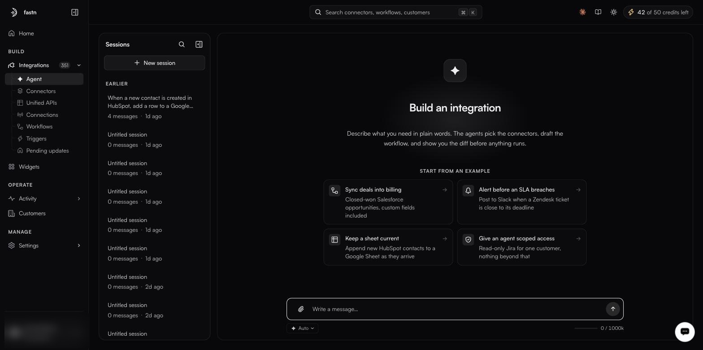
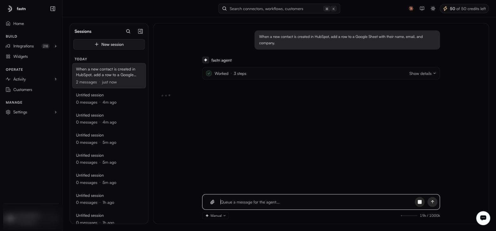

# Agent

**Integrations → Agent** (`/agent`), or the **What do you want to build?** prompt on Home

<figure><figcaption><strong>Agent</strong> is the first item under Integrations in the sidebar. Home's prompt box opens the same place.</figcaption></figure>

The agent is the primary way integrations get built in fastn, and there are two ways in: the **Agent** item in the sidebar, directly under **Integrations**, or the **What do you want to build?** prompt on Home. Both land on the same screen, headed **Build an integration**, which states its own contract:

> Describe what you need in plain words. The agents pick the connectors, draft the workflow, and show you the diff before anything runs.

What it drafts is JavaScript — a `<slug>.js` module exporting `export default async function(ctx)`, opened in the [workflow editor](../workflows/README.md) for you to read, test and publish.

### Sessions

<figure><figcaption>A session in progress. The rail on the left is your history; every session keeps its full conversation.</figcaption></figure>

The left rail, headed **Sessions**, holds your session history. Each session keeps its full conversation, so you can come back to an integration weeks later and continue where you left off rather than re-explaining it. Before you start anything it reads *No sessions yet. Click New session to start.*

* **New session** starts a fresh build.
* **Search sessions** (⌘K) filters the rail by name.
* **Collapse sessions sidebar** widens the workspace when you are reading a long diff.

### Starting from an example

Four cards sit under **START FROM AN EXAMPLE**, each pairing a goal with the concrete detail that makes it buildable:

| Card | What it asks for |
| ---- | ---------------- |
| **Sync deals into billing** | Closed-won Salesforce opportunities, custom fields included |
| **Alert before an SLA breaches** | Post to Slack when a Zendesk ticket is close to its deadline |
| **Keep a sheet current** | Append new HubSpot contacts to a Google Sheet as they arrive |
| **Give an agent scoped access** | Read-only Jira for one customer, nothing beyond that |

They are written in the shape a good first message takes — a system, a trigger, and the specific thing that moves — and are worth reading before you write your own.


Do not confuse these with the suggestion chips on **Home**, which are seeded per workspace and differ between them. The four cards above are the agent screen's own examples.


### Writing a good first message

The agent handles ambiguity by asking, but you get a better first draft by being specific about four things:

| Say                         | Example                                                     |
| --------------------------- | ------------------------------------------------------------ |
| **The systems**             | "HubSpot", "Cin7 Core", not "our CRM"                        |
| **What starts it**          | "when a deal is closed-won", "every night at 2am"            |
| **What moves**              | "the company name, the deal amount, and the line items"      |
| **The rules**               | "skip anything under $500", "only the EU warehouse"          |

The composer carries **Attach a file**, the message box (*Write a message…*) and **Send**.

### What it does

The product's own summary is the reliable one: the agents pick the connectors, draft the workflow, and show you the diff before anything runs. In practice that means working out which systems are involved, reusing connectors that already exist and creating the ones that do not, handling authentication in the chat — inline API-key fields, or an OAuth form with client ID, secret and pre-filled scopes — and then writing the workflow code and opening it in the editor.

Generated test cases land on the editor's **Test cases** tab, grouped as `happy-path`, `pagination`, `fields`, `edge-cases` and `error-handling`, each row badged `LIVE` or `MOCK`.

### The integration plan

Before building, the agent writes an **Integration Plan** — an actual markdown document (named for the integration, such as `plan-hubspot-to-sheets.md`) that opens in a side panel. It sets out the trigger, the actions and connectors involved, a field-mapping table with a worked example per row, and a tenancy section. Its header has a **download** button, so the plan can be reviewed or circulated before anything is created.

Read it. It is the cheapest place to catch a wrong assumption — correcting a mapping here costs a sentence; correcting it after the workflow is generated costs a rebuild.

### Build progress

Alongside the plan, a **BUILD PROGRESS** panel tracks the work as a step count (`0/6`, `2/6`, …) across four phases:

| Phase | What happens |
| ----- | ------------ |
| **1. Use cases** | Plan and confirm the integration with you |
| **2. Connectors** | Create and authorise the connectors it needs |
| **3. Workflows** | Approve mappings and test cases, build and test the workflow, bind the trigger |
| **4. Embed** | Expose the finished integration as a widget |

Each phase expands to its named substeps, a completed one collapses to a green check and **Complete**, and the one in flight shows a spinner against the current substep. Phase counts vary with the integration — a build with no customer-facing surface will not have an Embed phase.

### Clarifying questions

Where your brief is ambiguous, the agent asks rather than guesses, rendering the question as selectable answer cards — each with a title and a sentence explaining what choosing it means. Every question also offers **Other…** for a free-form answer, so you are never limited to the options it drafted. Typical questions cover sync scope (ongoing only, versus an initial backfill first) and tenancy (internal, versus per-customer multi-tenant).

### Reading what it did

The agent's tool calls collapse into a single summary line in the chat — **Worked · 3 steps**, with **Show details** to expand the individual calls. Documents it produces appear as artifact chips (for example *Field Mappings & Connectors*) that reopen the full panel.

Two counters are worth watching: the **context meter** beside the composer (`19k / 1000k`) shows how much of the session's context window the conversation has consumed, and **AI credits** in the top bar show what is left of your quota.

### Iterating

Follow-up messages refine what exists rather than starting over:

* "Add error handling for when the API is down"
* "Filter out records without an email address"
* "Change the schedule to hourly"
* "Notify Slack on failure"

The agent updates code, mappings and test cases together, so they do not drift apart.

### Attachments

**Attach a file** accepts an API spec, a sample payload, a field-mapping spreadsheet. Giving the agent a real payload is the single fastest way to get accurate mappings.


Agent usage draws on the AI credits shown in the top bar — click it for the balance, an org total, and the reset date. Quota resets at the start of each calendar month, UTC. The popover also breaks usage down **By agent**, naming the ones doing this work: *Orchestrator V2 Orchestrator*, *Docs Agent*, *Error Diagnosis* and *Orchestrator V2 Title*. Plan and quota detail live under [Billing](../../manage/billing.md), which is visible to Owners and Admins.



Using the AI assistant is gated by role rather than by an individual permission, so a role that cannot use it cannot be granted access to it one permission at a time.


### In this section

* [Approval mode](approval-mode.md)
* [Worked example](worked-example.md)
