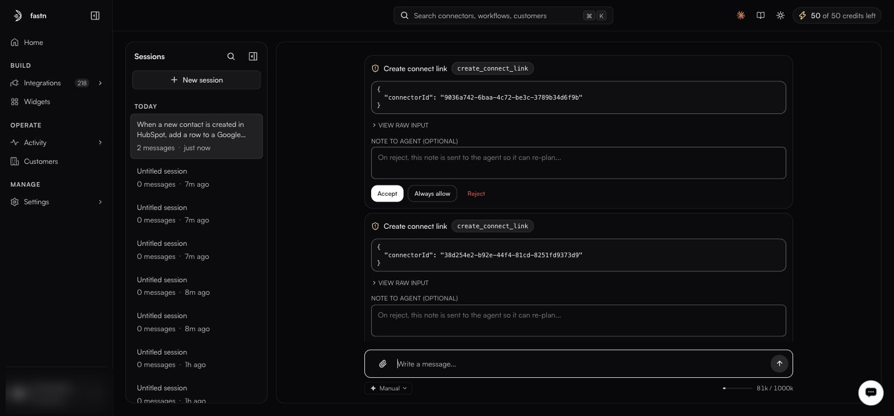
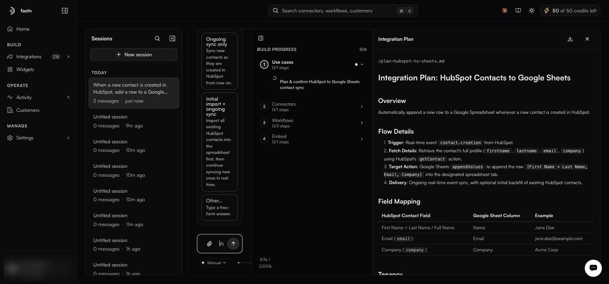
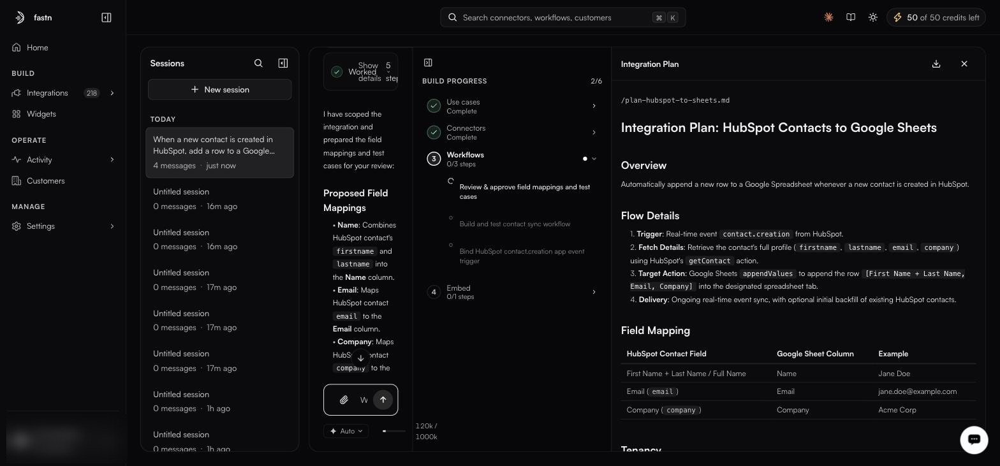

# Using the agent: a worked example

This is an actual run, screen by screen. The request was one sentence:

> When a new contact is created in HubSpot, add a row to a Google Sheet with their name, email, and company.

Everything below is what the agent did with it.



#### Describe it in plain words

Type the whole thing into **What do you want to build?** on Home and send it. There is no need to name connectors, pick a trigger, or know what a workflow is yet.

<figure><figcaption>The session opens with your message at the top. The agent's tool runs collapse into <strong>Worked · 3 steps</strong> — <strong>Show details</strong> expands them.</figcaption></figure>

The session is added to the **Sessions** rail on the left, named after your prompt, so you can leave and come back to it.

Three things on this screen are worth knowing before you go further:

* **The approval-mode chip** sits under the composer — here set to **Manual**. It decides whether the agent pauses before acting. See [Approval mode](approval-mode.md).
* **The context meter** on the right (`19k / 1000k`) shows how much of the session's context window the conversation has used.
* **AI credits** in the top bar (`50 of 50 credits left`) are what agent runs draw down.



#### It asks before acting — because Manual mode was on

The agent needed to create connect links for the two systems. In **Manual** mode it does not just do that; it stops and shows you each call.

<figure><figcaption>A Manual-mode approval gate. One card per pending call, each showing the exact tool and payload.</figcaption></figure>

Every gate shows you the same five things:

| On the card | What it is |
| ----------- | ---------- |
| **Create connect link** | The action in plain language |
| `create_connect_link` | The literal tool being called |
| The JSON body | The exact arguments — here the `connectorId` it is acting on |
| **VIEW RAW INPUT** | Expands the untruncated payload |
| **NOTE TO AGENT (OPTIONAL)** | Free text — *"On reject, this note is sent to the agent so it can re-plan…"* |

And three ways out: **Accept** runs this one call, **Always allow** stops asking for that tool for the rest of the session, and **Reject** refuses it — with your note attached, so the agent re-plans rather than simply retrying.


The note is the useful part of rejecting. *"Use the sandbox sheet, not the production one"* gets you a corrected plan; a bare reject just gets you a stuck agent.




#### It asks what you actually meant

Rather than guessing at the ambiguous parts, the agent puts the question back to you as selectable cards. This run got two.

**How much should it sync?**

* **Ongoing sync only** — *Sync new contacts as they are created in HubSpot from now on.*
* **Initial import + ongoing sync** — *Import all existing HubSpot contacts into the spreadsheet first, then continue syncing new ones in real time.*
* **Other…** — *Type a free-form answer.*

**Who is it for?** — the tenancy question, answered here with **For customers (Multi-tenant)**.

Those two answers change the generated code materially, which is exactly why it asks instead of assuming. Every question also offers **Other…**, so you are never boxed into the options it drafted.



#### It writes a plan you can read before anything is built

The agent produces an **Integration Plan** — a real markdown document, here `/plan-hubspot-to-sheets.md` — in a side panel, and a **BUILD PROGRESS** tracker beside it.

<figure><figcaption>The plan (right) and the build tracker (middle). Nothing has been built yet — the counter reads <code>0/6</code>.</figcaption></figure>

The plan spells out the mechanism, not just the intent:

1. **Trigger** — the real-time `contact.creation` event from HubSpot.
2. **Fetch details** — retrieve the contact's full profile (`firstname`, `lastname`, `email`, `company`) using HubSpot's `getContact` action.
3. **Target action** — Google Sheets `appendValues`, appending `[First Name + Last Name, Email, Company]` to the designated tab.
4. **Delivery** — ongoing real-time sync, with an optional initial backfill of existing contacts.

Below that sits a **Field Mapping** table with a worked example per row, and a **Tenancy** section reflecting the multi-tenant answer:

| HubSpot contact field | Google Sheet column | Example |
| --------------------- | ------------------- | ------- |
| First Name + Last Name / Full Name | Name | Jane Doe |
| Email (`email`) | Email | jane.doe@example.com |
| Company (`company`) | Company | Acme Corp |

The panel header carries a **download** button — the plan is a portable artifact, useful for review before you let it build.



#### It builds in tracked phases

**BUILD PROGRESS** is the honest view of what is happening. It counts completed steps against the total (`0/6` → `2/6` → …) across four phases, each expandable into named substeps.

<figure><figcaption>Two phases complete. <strong>Workflows</strong> is mid-flight, its three substeps named. Note the chip now reads <strong>Auto</strong>.</figcaption></figure>

| Phase | Substeps in this run |
| ----- | -------------------- |
| **1. Use cases** | Plan & confirm HubSpot to Google Sheets contact sync |
| **2. Connectors** | Create and authorise the two connectors |
| **3. Workflows** | Review & approve field mappings and test cases · Build and test contact sync workflow · Bind HubSpot `contact.creation` app event trigger |
| **4. Embed** | Expose the integration as a widget |

A completed phase collapses to a green check and **Complete**. The one in flight shows a spinner against the current substep, so you always know which of the six things it is doing.

Notice that the last substep of **Workflows** is binding the trigger. The agent does not stop at generated code — it wires the thing that makes it run.



#### It brings the mappings back for approval

Before writing the workflow, the agent posted its **Proposed Field Mappings** into the chat, with a **Field Mappings & Connectors** artifact chip that reopens the full document:

* **Name** — combines the HubSpot contact's `firstname` and `lastname` into the Name column.
* **Email** — maps the contact's `email` to the Email column.
* **Company** — maps the contact's `company` to the Company column.

This is the moment to correct it. Replying *"put first and last name in separate columns"* here is far cheaper than editing generated code afterwards — and the agent updates the code, the mappings and the test cases together, so they cannot drift apart.



#### Then test and publish as usual

What the agent hands over is an ordinary workflow. It opens in the [workflow editor](../workflows/README.md) as a `<slug>.js` module, its generated scenarios sit on the **Test cases** tab, and you run it from the **Test** tab. Publishing a snapshot and deploying it are the same steps as for anything you wrote by hand — see [Lifecycle](../workflows/lifecycle.md).



### What this run tells you about the agent

* **It asks rather than assumes.** Two ambiguities in a one-sentence brief became two explicit questions, each with an **Other…** escape hatch.
* **It plans in writing first.** The Integration Plan is readable, downloadable, and exists before any building starts.
* **It shows its work.** Six tracked steps across four named phases — not a spinner and a promise.
* **It finishes the job.** Binding the app-event trigger is part of the build, not homework left for you.
* **Manual mode is a real gate.** Every call surfaced its exact tool name and payload, with a note field that turns a rejection into a re-plan.


Manual mode is worth the extra clicks the first few times, purely because the approval cards show you which tools the agent reaches for. Once the shape is familiar, switch to **Auto** — as this run did partway through — and let it work.

