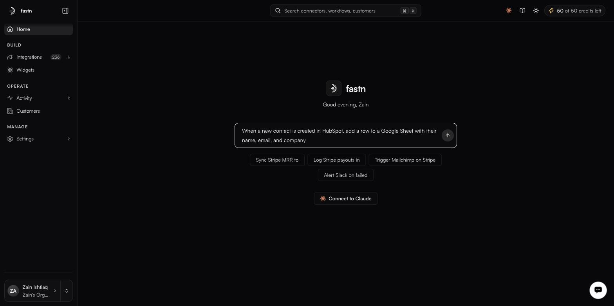

# Using the agent: a worked example

<figure><figcaption>Describe the integration in plain words on Home; the agent plans the connectors and drafts the workflow.</figcaption></figure>

Say you want this: *when a new contact is created in HubSpot, add a row to a Google Sheet with their name, email and company.* Here is how that request becomes a running integration.



#### Describe it in plain words

On Home, type the whole thing into **What do you want to build?** and press **Send** — there is no need to name connectors or pick a trigger yourself:

> When a new contact is created in HubSpot, add a row to a Google Sheet with their name, email, and company.

The prompt opens the agent's **Build an integration** pane and starts a session.



#### The agent picks the connectors

It works out the systems involved — HubSpot as the source, Google Sheets as the destination — reusing connectors that already exist and creating any that do not. Where a system needs authorising, it handles that in the chat: an inline API-key field, or an OAuth form with client ID, secret and pre-filled scopes.



#### It drafts the workflow and shows a diff

The agent writes the workflow — a `<slug>.js` module — with the trigger (a new HubSpot contact), the field mapping (name, email, company) and the Google Sheets write. It then **shows you the diff before anything runs**: nothing is created or changed until you have seen what it proposes.



#### You review — Approval mode decides how much it did unattended

The **Approval mode** chip governs how far it goes on its own. **Auto**, the default, acts without asking — quickest for exploring. **Manual** asks before any create, update or delete — the mode to use when it is touching live data. Read the diff, then accept it or reply with a correction.



#### Test and publish

The draft opens in the [workflow editor](../workflows/README.md), where the generated scenarios sit on the **Test cases** tab. Run it from the **Test** tab, then **Publish** when it does what you meant.



From here you refine it in the same conversation rather than starting over, as the next section covers.
