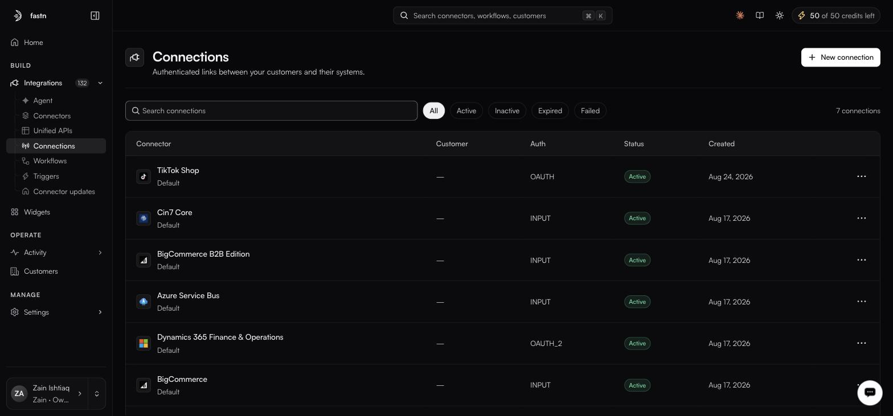

# Connections

**Integrations → Connections** · `/integrations?tab=connections`

<figure><figcaption>The Auth column shows the raw internal values: OAUTH, INPUT, OAUTH_2.</figcaption></figure>

A connection is one customer's authorised link to one connector. It holds the credential — encrypted, never displayed — and records how it was obtained.

### How connections work

A connection is an authenticated link between one of your customers and one connector — the stored, encrypted result of that customer authorising access once, which every later API call reuses so nobody signs in again. A few properties are worth holding in mind before the detail below:

* **Who it belongs to — Scope.** Most connections belong to a single customer (one tenant). Some belong to your organisation instead: those read `Account level` on the detail page, meaning the link is shared across the workspace rather than tied to one customer.
* **How you address it — the connection ID.** Every connection has an id of the form `ucl:org_<org>:<env>:<connectorId>:<authId>:<tenant>`. You pass it to the API to act as that customer, and it is what routes a call to the right credential.
* **Whether it still works — Status.** A connection is `Active`, `Inactive`, `Expired` or `Failed`. Active needs nothing; the other three need attention.
* **Fixing or ending one — Reconnect / Disconnect.** Every row's `⋯` menu offers **Reconnect** (re-run authorisation to restore a broken link) and **Disconnect** (syncing stops and the credential is deleted).
* **Making one yourself — the picker.** **New connection** opens the full-screen **Connect a system** picker; customer connections should instead come through your embedded widget.

The rest of this page is the detail behind each of those.

### The table

| Column        | What it tells you                                                                 |
| ------------- | ----------------------------------------------------------------------------------- |
| **Connector** | The system, with the tenant key on the second line.                                |
| **Customer**  | Which customer owns it.                                                            |
| **Auth**      | How it was authorised.                                                             |
| **Status**    | Active, Inactive, Expired or Failed.                                               |
| **Created**   | When the customer authorised it.                                                   |
| **⋯**         | **Reconnect** and **Disconnect**.                                                  |

The table pages at 10 rows. Filter chips above it — **All**, **Active**, **Inactive**, **Expired**, **Failed** — are not kept in the URL, so a filtered view cannot be linked.


The `Active`, `Inactive`, `Expired` and `Failed` chips currently return nothing, even when every row in the unfiltered table shows `Active`. Until that is fixed, triage from the full list rather than the chips.


### In this section

* [Statuses](statuses.md)
* [Auth types](auth-types.md)
* [Inside a connection](inside-a-connection.md)
* [Creating a connection](creating-a-connection.md)
