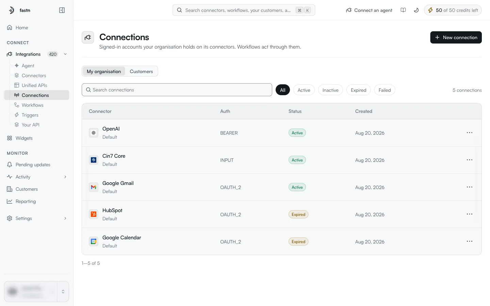
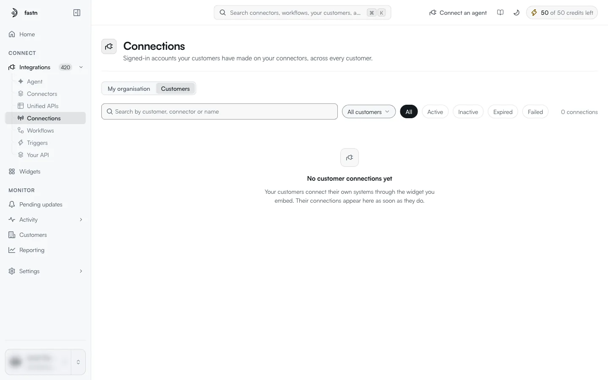
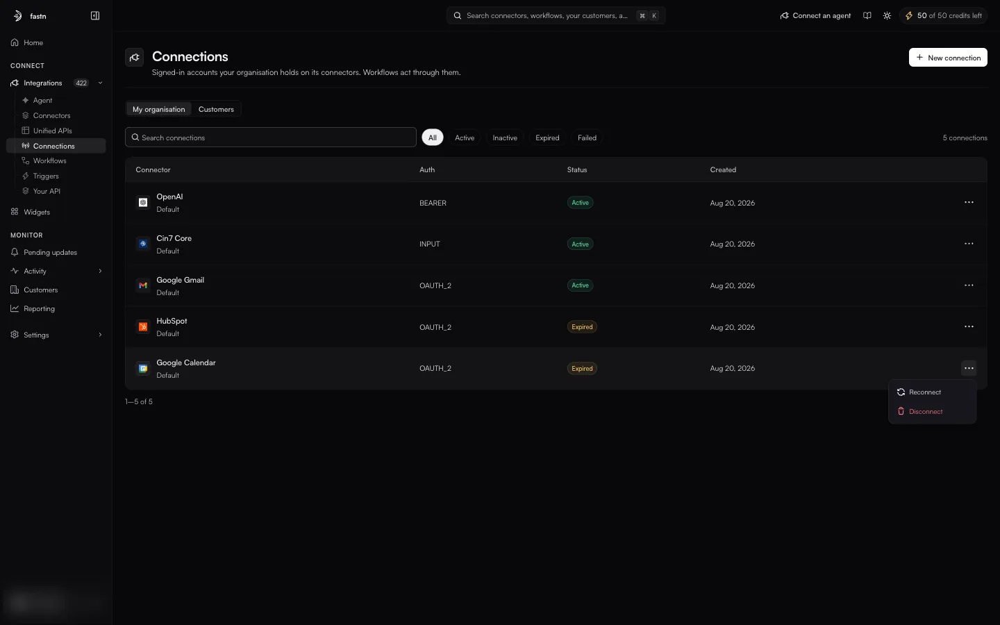

# Connections

**Integrations → Connections** · `/integrations?tab=connections`

<figure><figcaption>The <strong>My organisation</strong> view.</figcaption></figure>

A **connection** is one signed-in account on one connector: the stored, encrypted result of someone authorising access once. Every later call reuses it, so nobody signs in again. Workflows act through connections.

A [connector](../connectors/README.md) is the definition of an app; a connection is a credential for it. One connector can have many connections: one for your organisation and one for each customer who connects.

### How connections work

* **Who it belongs to.** A connection belongs either to your organisation (made by someone on your team) or to one of your customers (made through your embedded widget). The two are shown in separate views on this page.
* **How it is addressed.** Every connection has a connection ID. It starts with `ucl:`, followed by your organisation, the environment (for example `default`), the connector's ID and an identifier for the credential, separated by colons. Pass it to the API to act as that account.
* **Whether it still works.** Each connection has a status: `Active`, `Inactive`, `Expired` or `Failed`. See [Statuses](statuses.md).
* **How it is kept alive.** For OAuth connections, fastn refreshes the access token before it runs out.
* **Fixing or ending one.** **Reconnect** signs in again to repair a broken connection. **Disconnect** stops all syncing and deletes the credential.

### My organisation and Customers

The toggle at the top switches between two views.

| View | Shows | Page subtitle |
| --- | --- | --- |
| **My organisation** | Connections your team made. | *Signed-in accounts your organisation holds on its connectors. Workflows act through them.* |
| **Customers** | Connections your customers made through the widget, across every customer. | *Signed-in accounts your customers have made on your connectors, across every customer.* |

<figure><figcaption>The <strong>Customers</strong> view, empty until a customer connects through the widget.</figcaption></figure>

The **Customers** view adds an **All customers** selector to show one customer's connections, and its search box also matches customer names.

### Finding a connection

* **Search connections** matches the connector and connection name (and the customer, in the Customers view).
* The status chips **All**, **Active**, **Inactive**, **Expired** and **Failed** show only connections in that state.
* The count on the right shows how many connections match, for example *5 connections*.

If nothing matches, the page reads *No connections yet* · *Connect a system and its authenticated link appears here.* with a **Connect a system** button.

### The table

| Column | Meaning |
| --- | --- |
| **Connector** | The app, with the connection's name underneath (`Default` unless it was named). |
| **Auth** | The auth type the connection was made with, as stored: for example `OAUTH_2`, `BEARER`, `INPUT`. See [Auth types](auth-types.md). |
| **Status** | `Active`, `Inactive`, `Expired` or `Failed`. See [Statuses](statuses.md). |
| **Created** | When the connection was made. |
| **⋯** | **Reconnect** and **Disconnect**. |

<figure><figcaption>Each row's menu.</figcaption></figure>

Click a row to open its detail page. See [Inside a connection](inside-a-connection.md).

**New connection** (top right) connects a new app for your organisation. See [Creating a connection](creating-a-connection.md).

### In this section

* [Statuses](statuses.md): what each status means and what to do about it.
* [Auth types](auth-types.md): the values in the Auth column.
* [Inside a connection](inside-a-connection.md): the detail page, Reconnect and Disconnect.
* [Creating a connection](creating-a-connection.md): New connection and the connect dialog.
