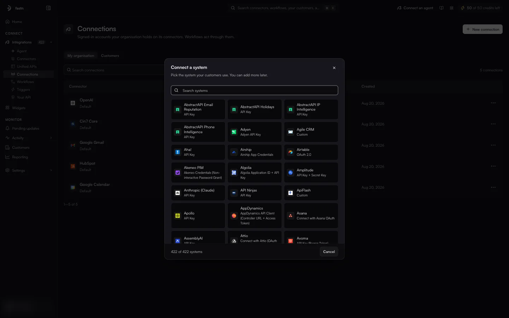
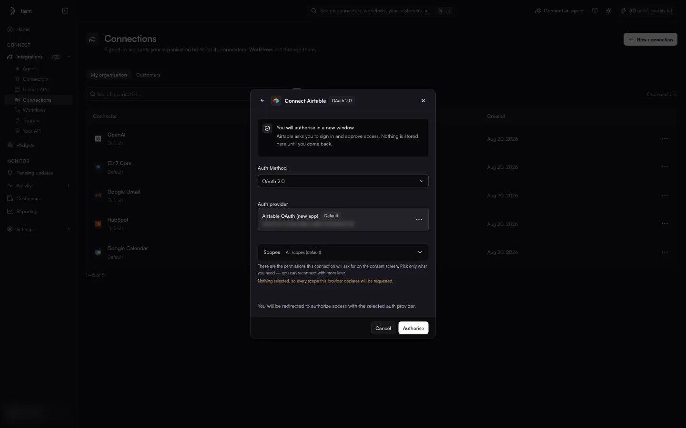
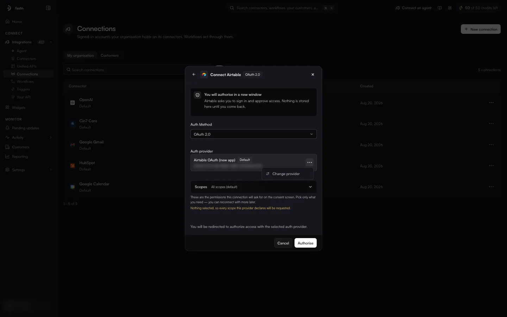
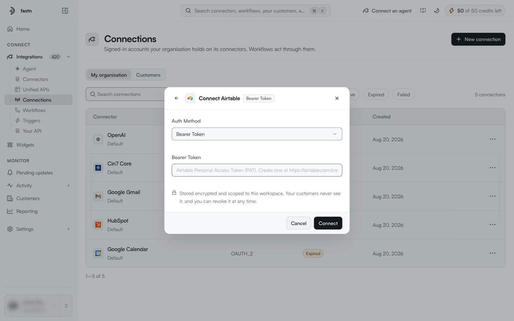

# Creating a connection

**New connection** on the Connections page connects an app for **your organisation**. Use it for accounts your organisation owns, such as your own Slack workspace or data warehouse, which your workflows then use. It is also the quickest way to test a connector end to end.

Your **customers'** connections should not be made here. Customers connect their own accounts through the [widget](../../embed/README.md) you embed, which keeps their credentials theirs.

### 1. Pick the system

**New connection** opens **Connect a system** · *Pick the system your customers use. You can add more later.*

<figure><figcaption>Every connector in the catalogue, with the label of its default auth method.</figcaption></figure>

Type in **Search systems** to narrow the grid, then click the system. The footer counts how many systems match. The list can take a few seconds to load (*Loading systems...*).

### 2. Give the credential

The dialog changes to **Connect &lt;system&gt;**, tagged with the selected auth method. **←** goes back to the picker.

#### Keys and tokens

For API key, bearer token, basic auth and custom methods, the dialog shows the fields the connector asks for. The placeholder usually says where to find the value.

<figure><figcaption>An API key method.</figcaption></figure>

Fill them in and click **Connect**.

#### Connecting with OAuth

<figure><figcaption>OAuth: the dialog shows the provider and the scopes it will request.</figcaption></figure>

| Part | Meaning |
| --- | --- |
| **Auth Method** | Shown when the connector offers more than one method. Starts on the default. |
| **Auth provider** | The OAuth app that sends you to the consent screen. **Default** marks the connector's preferred provider. If there are several, **⋯ → Change provider** picks another. See [Auth methods and providers](../connectors/auth-methods.md). |
| **Scopes** | *These are the permissions this connection will ask for on the consent screen. Pick only what you need — you can reconnect with more later.* With nothing selected (**All scopes (default)**), every scope the provider declares is requested. |

<figure><figcaption><strong>Change provider</strong> on the provider card.</figcaption></figure>

Click **Authorise**. A new window opens on the app's sign-in and consent page. Sign in, approve access, and the window returns to fastn. *Nothing is stored here until you come back.*

#### Switching method

If the connector offers more than one method, changing **Auth Method** changes the form. For example, Airtable's **Bearer Token** method replaces the OAuth sign-in with a single **Bearer Token** field.

<figure><figcaption>The same connector with its Bearer Token method selected.</figcaption></figure>

### 3. Check the result

The new connection appears in the **My organisation** view and on the connector's **Connections** tab with the status `Active`.


Every credential is *Stored encrypted and scoped to this workspace. Your customers never see it, and you can revoke it at any time.* To revoke it, open the connection and click **Disconnect**.

