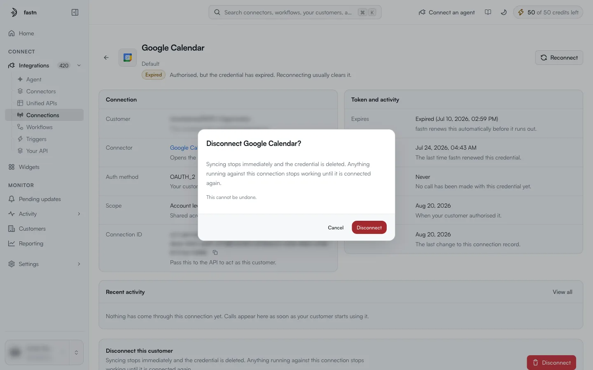

# Inside a connection

`/integrations/connections/<connection-id>`. Click a row on the [Connections](README.md) page to open it.

<figure><figcaption>A connection whose OAuth credential has expired.</figcaption></figure>

### Header

The connector's name and icon, the connection's name (for example `Default`), its **status** badge and a one-line explanation of the status, for example *Authorised, but the credential has expired. Reconnecting usually clears it.* **Reconnect** (top right) repairs the connection. The **←** arrow returns to the list.

### Connection

| Field | Meaning |
| --- | --- |
| **Customer** | *The customer this credential belongs to.* For your own connections, this is your organisation. |
| **Connector** | *Opens the connector this connection uses.* Click it to go to the [connector detail page](../connectors/inside-a-connector.md). |
| **Auth method** | How the connection was authorised, for example `OAUTH_2` (*Your customer signed in and approved access.*). See [Auth types](auth-types.md). |
| **Scope** | **Account level**: *Shared across your whole workspace rather than one project.* |
| **Connection ID** | *Pass this to the API to act as this customer.* The copy button copies it. |

### Token and activity

| Field | Meaning |
| --- | --- |
| **Expires** | When the current credential expires. *fastn renews this automatically before it runs out.* If renewal failed, it reads *Expired* with the date. |
| **Last refreshed** | *The last time fastn renewed this credential.* |
| **Last used** | When a call last went through this connection, or *Never*. |
| **Created** | *When your customer authorised it.* |
| **Updated** | *The last change to this connection record.* |

Use this panel to tell whether a refresh is still succeeding. An **Expires** date in the past together with an old **Last refreshed** date means fastn could no longer renew the token, and the account has to sign in again.

### Recent activity

The latest calls made through this connection. **View all** opens the full list in Activity. Until something has run, it reads *Nothing has come through this connection yet. Calls appear here as soon as your customer starts using it.*

### Reconnect

**Reconnect** (in the header, or in the row's **⋯** menu on the Connections page) runs the sign-in again for the same connector and replaces the stored credential. Use it for `Expired` and `Failed` connections, or after the account's password or key changed.

### Disconnect

The last panel, **Disconnect this customer**, reads:

> Syncing stops immediately and the credential is deleted. Anything running against this connection stops working until it is connected again.

**Disconnect** asks for confirmation first:

<figure><figcaption>Disconnecting cannot be undone.</figcaption></figure>

Confirm only when the connection is no longer needed. Workflows and triggers that use it stop working until someone connects again. To fix a broken connection, use **Reconnect** instead.
