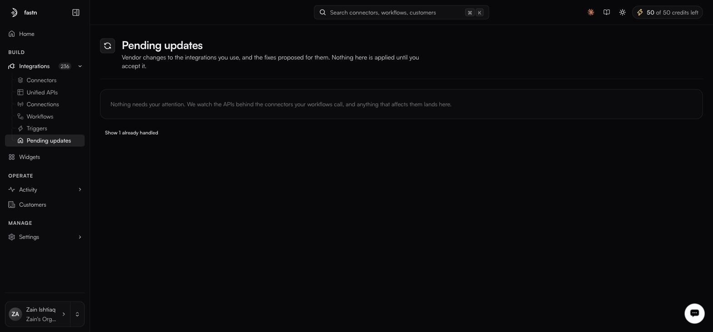
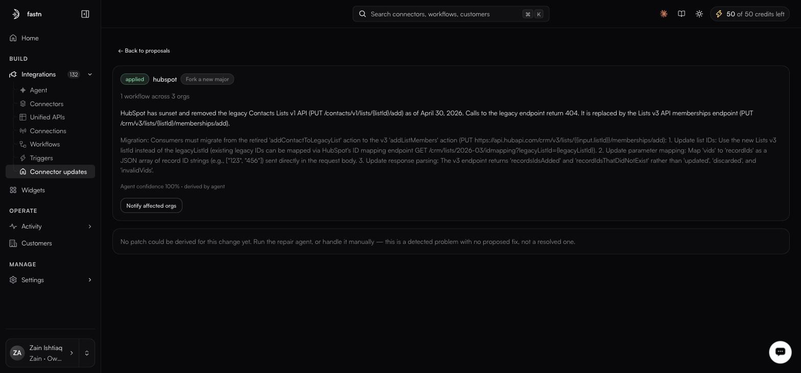

# Connector updates

**Integrations → Connector updates** · `/integrations/updates`

<figure><figcaption></figcaption></figure>

Vendors deprecate endpoints, change parameter names and alter response shapes. Normally you find out when a sync starts failing. fastn watches for these changes, works out what the fix is, and files a proposal here. The page states its own promise:

> Fixes proposed for upstream API changes. Nothing here is applied until you accept it.

Two tabs: **Connector fixes**, the default, holding proposals against managed connectors; and **My workflows**, which reads *None of your workflows need changes right now.* until one of yours is affected.

### Reading a proposal

Each card carries a status word, the connector slug, the proposed strategy — *Fork a new major*, for example — the blast radius, such as *1 workflow across 3 orgs*, and a description. **Review** opens the detail.

<figure><figcaption></figcaption></figure>

The detail view opens with **← Back to proposals** and contains:

* **What changed upstream**, with the specific endpoints involved.
* A **Migration:** block — the fix as numbered steps: updated IDs, remapped parameters, changed response parsing.
* A confidence line in the form `Agent confidence 100% · derived by agent`.

### Acting on one

**Notify affected orgs** tells the organisations running the affected workflows that a change is coming, before anything moves.

Where a proposal cannot be turned into a patch, the footer says so — and that distinction is the one to read carefully, because an unpatched proposal is still a live problem, not a resolved one.


A proposal's status badge and its footer can disagree: a proposal badged `applied` has been observed alongside a footer stating that no patch could be derived. Read the footer before assuming the connector has actually been changed, and check the connector's own **Versions** section on [Connectors](connectors.md) to confirm.


### Why nothing auto-applies

Because a connector change can alter behaviour your workflows depend on. A parameter rename is safe; a response shape that drops a field your mapping reads is not. fastn does the diagnosis and the drafting, and leaves the decision with you.


Version pins on a connector let you hold specific customers on the old version while you migrate the rest — remembering that a version set in code still wins over a pin. See [Connectors](connectors.md).

