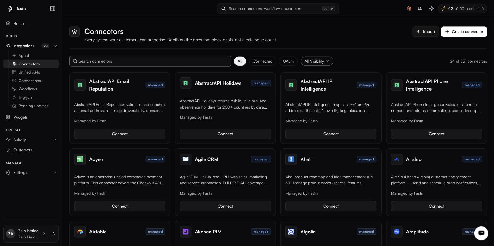

# Connectors

**Integrations → Connectors** · `/integrations?tab=connectors`

<figure><figcaption>Import and Create connector sit top-right; the chips filter by All, Connected, OAuth and visibility.</figcaption></figure>

A connector is the definition of one external system: its actions, its authentication methods, its webhook configuration and its versions. It is not a credential — that is a [connection](../connections/README.md).

### In this section

* [The catalogue](the-catalogue.md)
* [Inside a connector](inside-a-connector.md)
* [Connect a system](connect-a-system.md)
* [Action detail](action-detail.md)
* [Creating a connector](creating-a-connector.md)
* [Importing and exporting](importing-and-exporting.md)
