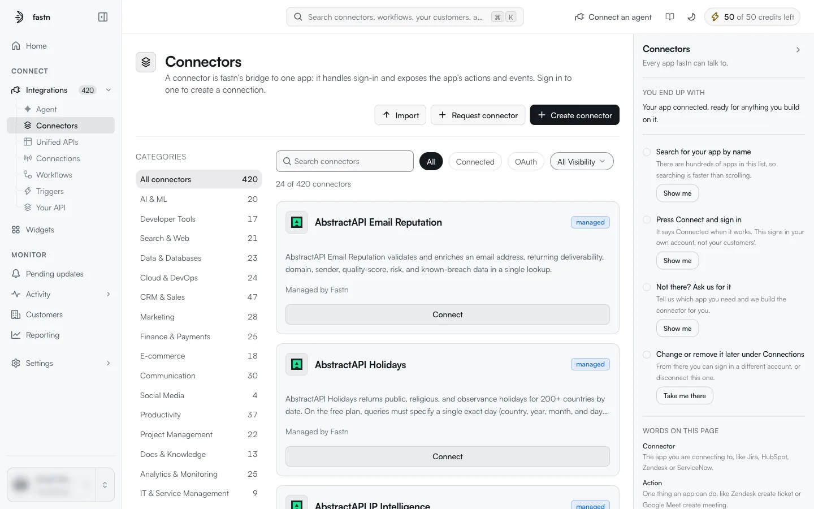

# Connectors

**Integrations → Connectors** · `/integrations?tab=connectors`

<figure><figcaption>The Connectors catalogue with the guide panel open.</figcaption></figure>

A **connector** is fastn's bridge to one external app, such as HubSpot, Jira or Stripe. The page describes it in one line:

> A connector is fastn's bridge to one app: it handles sign-in and exposes the app's actions and events. Sign in to one to create a connection.

A connector is a **definition**. It holds no credentials. Credentials live on a [connection](../connections/README.md), which is created when someone signs in to the connector.

### The parts of a connector

| Part | What it is | Where you see it |
| --- | --- | --- |
| **Actions** | One operation the app can perform, such as *Create Contact* or *List Owners*. Each action is an HTTP request with an input schema and an output schema. | The action list on the connector's detail page. See [Actions](action-detail.md). |
| **Auth methods** | How a customer proves who they are to the app: OAuth 2.0, API key, bearer token, basic auth and so on. A connector can offer several; one is the default. | The **Auth** tab. See [Auth methods and providers](auth-methods.md). |
| **Auth providers** | For OAuth methods, the OAuth app (client ID and secret) that fastn uses to send people to the app's consent screen. | **Auth → View providers**. |
| **Webhook config** | Instructions for subscribing to the app's events on behalf of each customer, so an [app event trigger](../triggers/app-events.md) can fire. | The **Webhook config** tab. See [Webhook config](webhook-config.md). |
| **Versions** | Every change to a connector produces a version. Versions live in **Test** until they are published to **Live**. | **Overview → Versions**, and the **Version pins** tab. |
| **Connections** | Signed-in accounts that use this connector. | The **Connections** tab, and the workspace-wide [Connections](../connections/README.md) page. |

### Managed and custom connectors

Every card carries a badge that says who maintains it.

* **managed**: built and maintained by fastn. The card reads *Managed by Fastn*. You can view every part of it, connect to it, export its actions and run them, but you cannot edit, delete or publish it. To suggest a change to one of its actions, use **Propose an update**. Fastn reviews it, and vendor changes reach you as proposals under [Pending updates](../connector-updates.md).
* **Custom**: created in your workspace with **Create connector** or **Import**. Your workspace owns it, so you can edit it, add actions, set up its webhook config, publish versions and delete it.

When a connector has at least one connection, its badge changes to **Connected**.

### How the pieces work together



#### Pick or build a connector

Find the app in the [catalogue](the-catalogue.md). If it is not there, [request it](creating-a-connector.md#request-a-connector) or [create it](creating-a-connector.md).



#### Connect

**Connect** opens a dialog that asks for the credential the default auth method needs (an API key, or an OAuth sign-in). The result is a connection. See [Connect a system](connect-a-system.md).



#### Use the actions

Workflows, the Agent and the MCP gateway call the connector's actions through that connection. The connection decides whose account the call runs as.



#### Receive events (optional)

If the connector has a webhook config, fastn runs its subscription code for each new connection, so that events from that account reach fastn and an app event trigger can start a workflow.




**Connect** on this page signs in *your own* account. Your customers sign in their own accounts through the widget you embed. The guide panel on the page says the same: *Connecting here signs in your account. Your customers sign in their own, through the widget.*


### In this section

* [The catalogue](the-catalogue.md): searching, filtering and reading the connector cards.
* [Creating a connector](creating-a-connector.md): the Create connector dialog, every protocol and auth type, and Request connector.
* [Inside a connector](inside-a-connector.md): the detail page, its Overview, Connections and Version pins tabs, and versions.
* [Auth methods and providers](auth-methods.md): the Auth tab and the OAuth apps behind it.
* [Actions](action-detail.md): the action list and the action editor with its seven tabs.
* [Webhook config](webhook-config.md): how fastn subscribes to an app's events.
* [Editing, publishing and deleting](editing-and-deleting.md): what you can change on a connector your workspace owns.
* [Importing and exporting](importing-and-exporting.md): moving connectors and actions in and out as JSON.
* [Connect a system](connect-a-system.md): making a connection, step by step.
