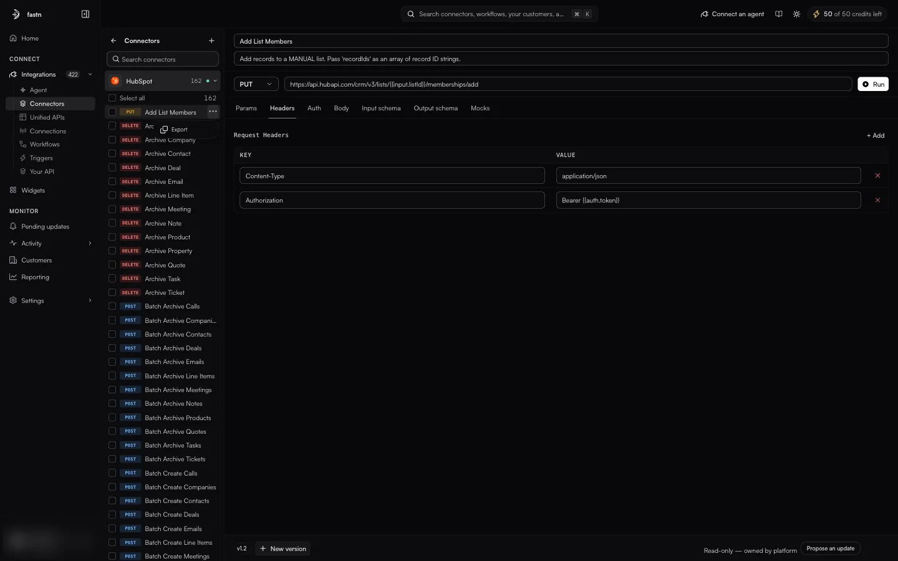
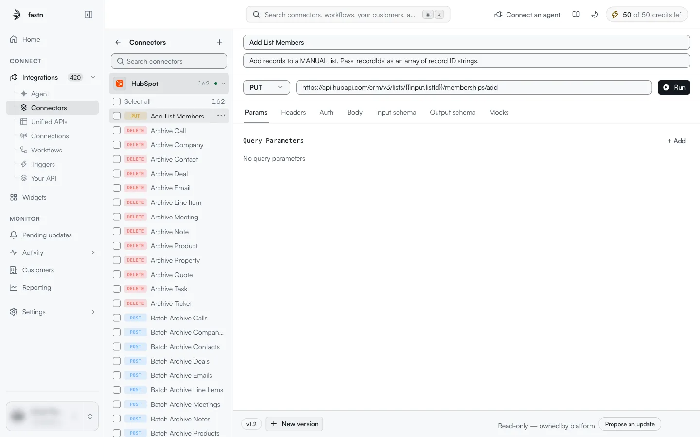
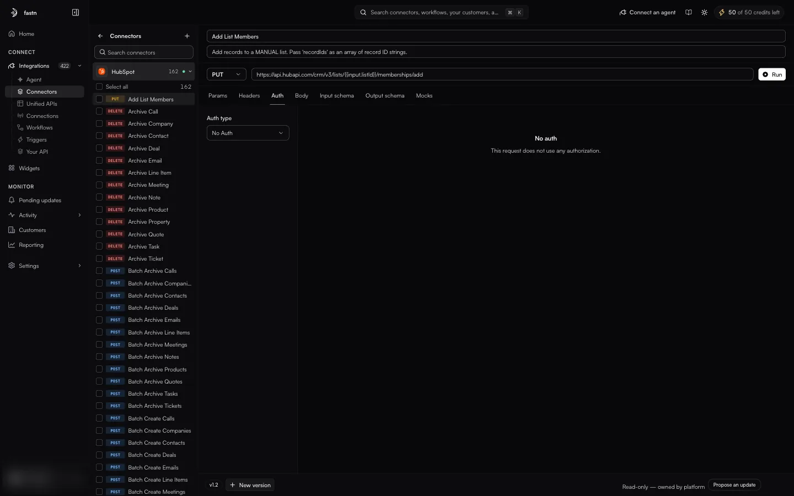
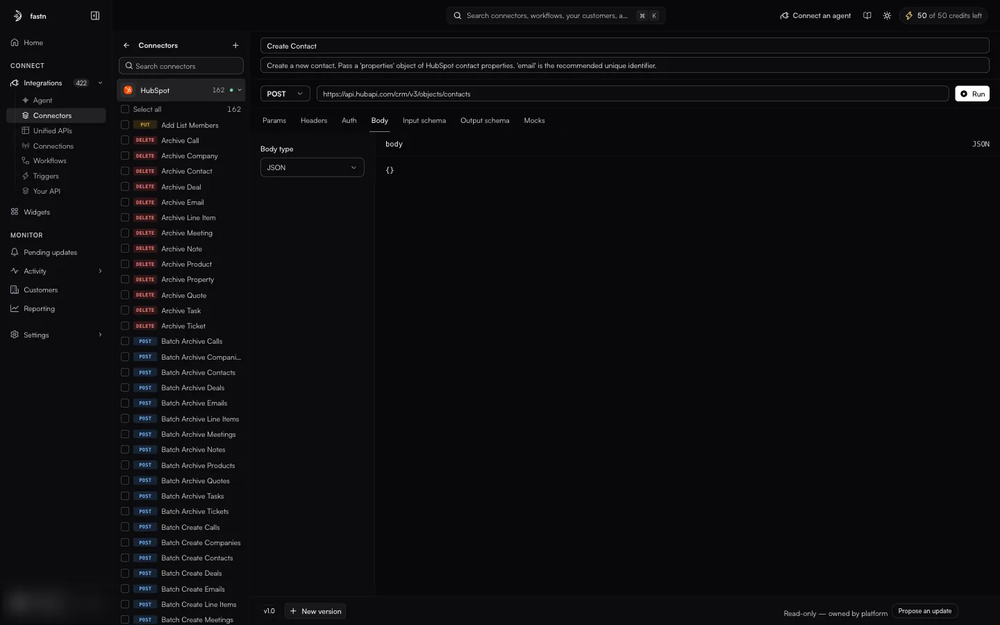
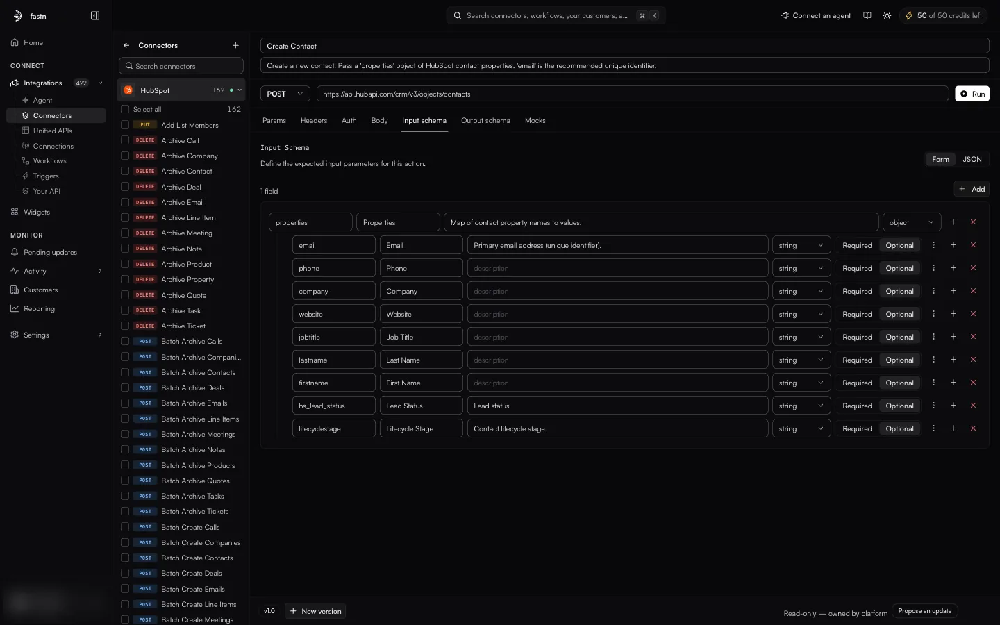
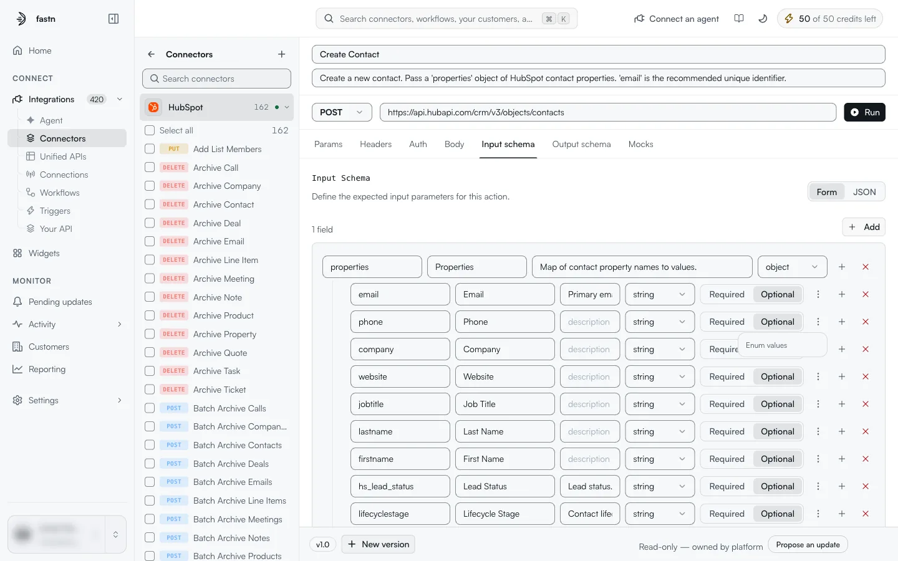
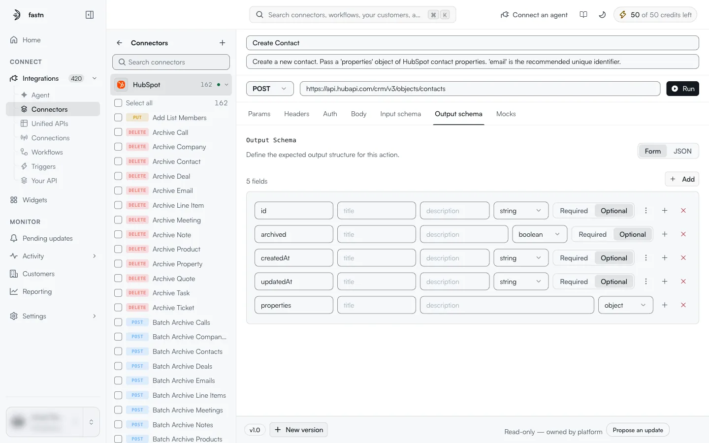
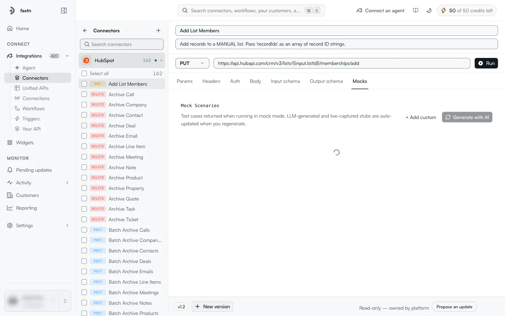
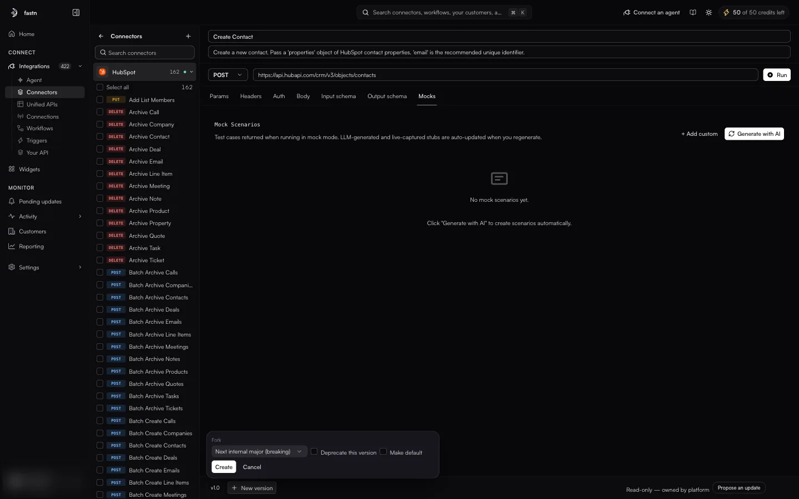
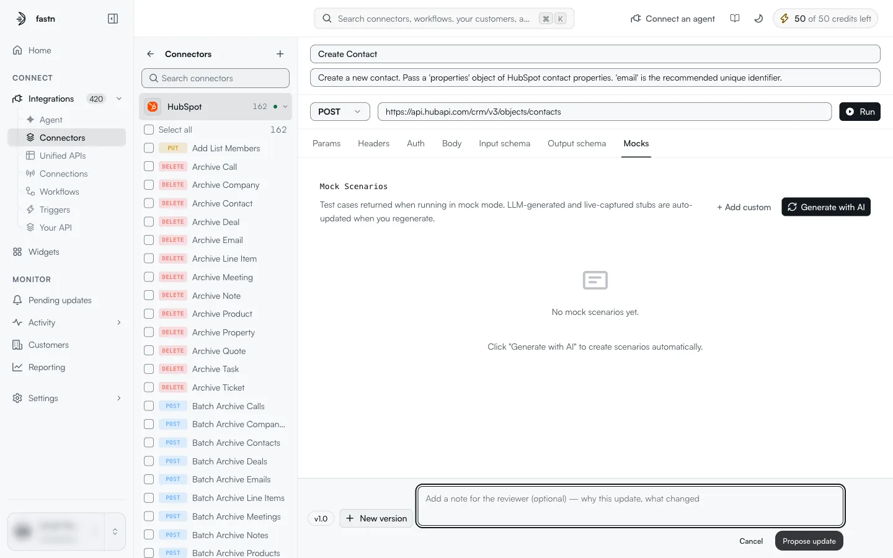

# Actions

An **action** is one operation a connector can perform, such as *Create Contact* or *List Owners*. Under the hood it is one HTTP request (method, URL, headers, body) plus two schemas: the input it accepts and the output it returns. Workflows, the Agent and the MCP gateway call actions; they never call the vendor's API directly.

### The action list

On the [connector detail page](inside-a-connector.md), the connector rail lists every action of the open connector with its method chip (`GET`, `POST`, `PUT`, `PATCH`, `DELETE`).

* Click an action to open it in the editor. The URL becomes `/integrations/connectors/<connector-slug>/<action-slug>`.
* Hover an action and click **⋯** for its menu. On a managed connector it holds **Export**.
* Tick actions (or **Select all**) to act on several at once. The rail then shows *n selected* and an **Export** button.

<figure><figcaption>Selecting actions shows the bulk <strong>Export</strong>.</figcaption></figure>

<figure><figcaption>The menu on a single action.</figcaption></figure>

On a connector your workspace owns, the rail also offers **Add action**, and each action can be edited and deleted.

### The action editor

<figure><figcaption>The editor for one action. <code>{{input.listId}}</code> in the URL is filled in from the action's input when it runs.</figcaption></figure>

The top of the editor holds:

| Element | Meaning |
| --- | --- |
| **Name** | The action's display name. |
| **Description** | What the action does and how to call it. The Agent reads this, so it should say which inputs matter. |
| **Method** | `GET`, `POST`, `PUT`, `PATCH` or `DELETE`. |
| **URL** | The endpoint. Parts in double braces are filled in when the action runs: `{{input.<field>}}` takes a value from the action's input. |
| **Run** | Runs the action using your own connection to this connector, so you can check the request before a workflow uses it. |

#### Placeholders

Anywhere in the URL, headers, query parameters or body, values in double braces are filled in at run time:

* `{{input.<field>}}`: a field from the action's input, as defined in **Input schema**.
* `{{auth.token}}`: the credential from the connection, for example in an `Authorization: Bearer {{auth.token}}` header.

#### The seven tabs

| Tab | What you set there |
| --- | --- |
| **Params** | Query parameters (**Query Parameters**, **+ Add**). Each one is a key and a value; the value can be a placeholder. |
| **Headers** | Request headers (**Request Headers**, **+ Add**), as **KEY** / **VALUE** pairs. |
| **Auth** | How this request is authorised. **Auth type**: `No Auth`, `Basic Auth`, `Bearer Token`, `JWT Bearer`, `AWS Signature`, `OAuth 1.0`, `OAuth 2.0` or `API Key`. `No auth` (*This request does not use any authorization.*) is the usual choice when the credential is already sent in a header, as in the HubSpot example below. |
| **Body** | **Body type**: `JSON`, `Form Data`, `Raw`, `GraphQL` or `Form URL Encoded`, and the body itself. |
| **Input schema** | The inputs the action accepts. See below. |
| **Output schema** | The shape of the response the action returns. Same editor as the input schema. |
| **Mocks** | Canned responses used in mock mode. See below. |

<figure><figcaption>The connection's token goes into the <code>Authorization</code> header through <code>{{auth.token}}</code>.</figcaption></figure>

<figure><figcaption>The Auth tab. Here the credential is sent in a header instead.</figcaption></figure>

<figure><figcaption>The Body tab with <strong>JSON</strong> selected.</figcaption></figure>

#### Input schema and output schema

> Define the expected input parameters for this action.

<figure><figcaption>An object field (<code>properties</code>) with nested string fields.</figcaption></figure>

Switch between **Form** and **JSON**. In Form view each field is one row:

| Part | Meaning |
| --- | --- |
| Key | The field name used in placeholders, for example `email`. |
| Label | A readable name, for example *Email*. |
| Description | What the field is for. |
| Type | `string`, `number`, `boolean`, `object` or `array`. |
| **Required** / **Optional** | Whether the caller must send it. |
| **⋮** (More options) | **Enum values**: limit the field to a fixed list of values. |
| **+** | Adds a nested field (*Convert to object and add nested field* on a non-object field). |
| **✕** | Removes the field. |

**Add** (top right) adds a top-level field. The count (for example *1 field*) shows how many top-level fields there are.

<figure><figcaption><strong>More options</strong> on a field.</figcaption></figure>

The **Output schema** tab (*Define the expected output structure for this action.*) uses the same editor. Workflows and the Agent read it to know which fields a response contains.

<figure><figcaption>The fields Create Contact returns.</figcaption></figure>

#### Mocks

> Test cases returned when running in mock mode. LLM-generated and live-captured stubs are auto-updated when you regenerate.

<figure><figcaption>Two custom mock scenarios on Add List Members.</figcaption></figure>

A mock is a stored response for this action. When a workflow runs in mock mode, the action returns the mock instead of calling the vendor, so you can test a workflow without touching real data.

* **+ Add custom** adds a scenario you write yourself.
* **Generate with AI** has the AI write scenarios for the action. Generated scenarios are replaced when you generate again.
* Each scenario shows its source (`CUSTOM` for hand-written ones), its name and a description. The bin icon deletes it.

### Versions

The footer shows the action's version, for example `v1.2`. **New version** opens a small form:

<figure><figcaption>Creating a new version of an action.</figcaption></figure>

| Field | Meaning |
| --- | --- |
| **Fork** | **Next internal major (breaking)**: a new major version of this action, for a change that would break existing callers. **New external version**: a version tied to a different version of the vendor's API. External versions are what [version pins](inside-a-connector.md#version-pins) work with. |
| **Deprecate this version** | Marks the current version as deprecated. |
| **Make default** | Makes the new version the one used when a caller does not ask for a specific version. |

**Create** makes the version; **Cancel** closes the form.

### Platform-owned actions and Propose an update

Actions on a managed connector belong to fastn. Their footer reads *Read-only — owned by platform*, and you cannot save changes to them. You can still read every tab, run the action, and export it.

If an action is wrong or missing something, click **Propose an update**:

<figure><figcaption>A proposal goes to fastn for review.</figcaption></figure>

1. Make your changes in the editor tabs.
2. Click **Propose an update** and add a note for the reviewer: why the update is needed and what changed.
3. Click **Propose update**.

Fastn reviews the proposal. Nothing changes on the connector until it is accepted.
