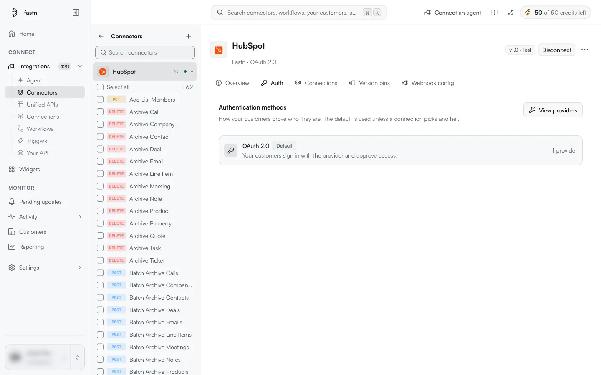
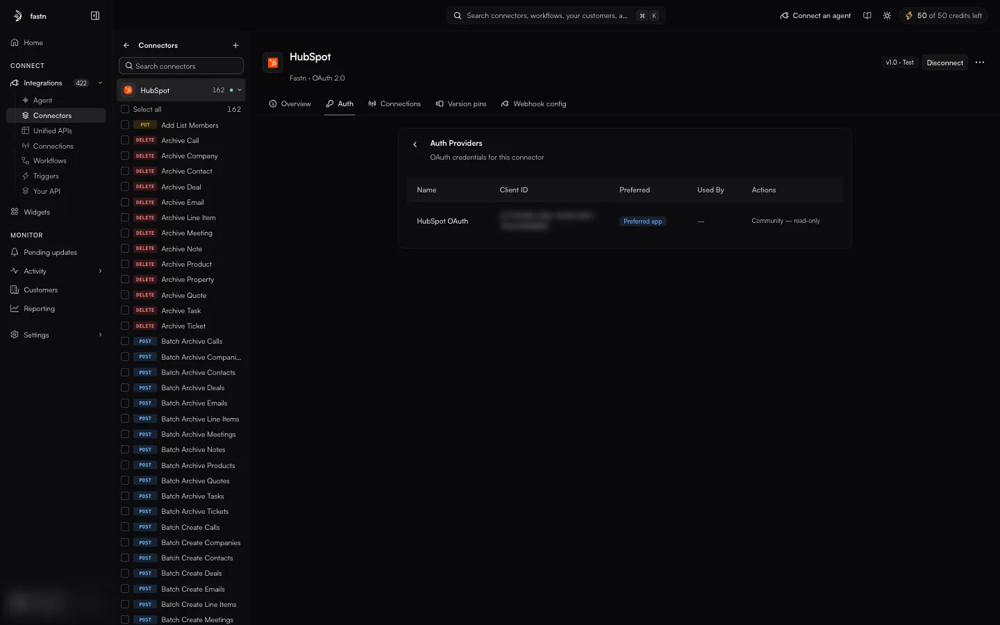

# Auth methods and providers

An **auth method** is one way a customer can prove who they are to the app: sign in with OAuth, paste an API key, enter a username and password. An **auth provider** is the OAuth app (a client ID and client secret registered with the vendor) that an OAuth method uses to send people to the vendor's consent screen.

### The Auth tab

<figure><figcaption>HubSpot offers one method, OAuth 2.0, backed by one provider.</figcaption></figure>

> How your customers prove who they are. The default is used unless a connection picks another.

One row per method. Each row shows:

* the method's **name**, for example *OAuth 2.0* or *API Key (Bearer)*;
* **Default** on the default method;
* a plain-language description of what the customer does:
  * OAuth: *Your customers sign in with the provider and approve access.*
  * Keys and tokens: *Your customers paste a key they generate themselves.*
* for OAuth methods, how many providers it has, for example *1 provider*.

The method types, and the fields each one asks for, are listed in [Creating a connector → Authentication](creating-a-connector.md#authentication). The value stored for each type (`OAUTH_2`, `API_KEY`, `BEARER`, `BASIC`, `DIGEST`, `INPUT`, `NO_AUTH`) is what the header line and the [Connections](../connections/README.md) page show.

### Auth providers

**View providers** lists the OAuth apps behind the connector's OAuth methods.

<figure><figcaption>A managed connector's provider is fastn's own OAuth app, so its row is read-only.</figcaption></figure>

| Column | Meaning |
| --- | --- |
| **Name** | The provider's name, for example *HubSpot OAuth*. |
| **Client ID** | The OAuth client ID registered with the vendor. The client secret is never shown. |
| **Preferred** | **Preferred app** marks the provider the connect dialog uses by default. |
| **Used By** | Which connections use this provider. |
| **Actions** | What you can do with it. *Community, read-only* means the provider belongs to fastn's shared catalogue and cannot be changed from your workspace. |

The **‹** arrow returns to the method list.

#### Using your own OAuth app

On a managed connector, fastn's OAuth app is the provider, and only fastn can add providers there. On a connector your workspace owns, you can register your own OAuth app as a provider, so that the consent screen shows your company's name instead of fastn's.

When someone connects, the connect dialog shows the provider it will use and lets them pick another with **⋯ → Change provider**. See [Creating a connection](../connections/creating-a-connection.md).

### How the default method is chosen

* The connect dialog opens with the **default** method selected.
* If the connector offers more than one method, the dialog has an **Auth Method** selector, so the person connecting can choose another (for example Airtable offers *OAuth 2.0* and *Bearer Token*).
* The method chosen is saved on the connection. You see it in the **Auth** column on the [Connections](../connections/README.md) page.
