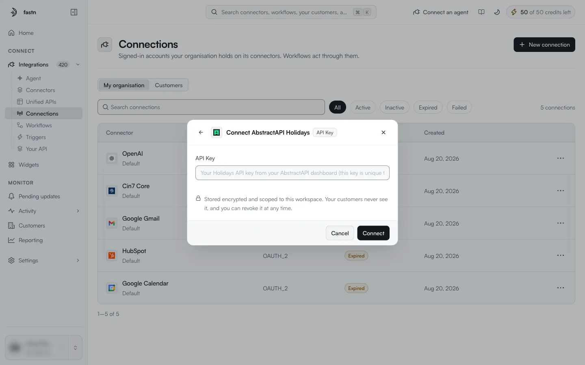
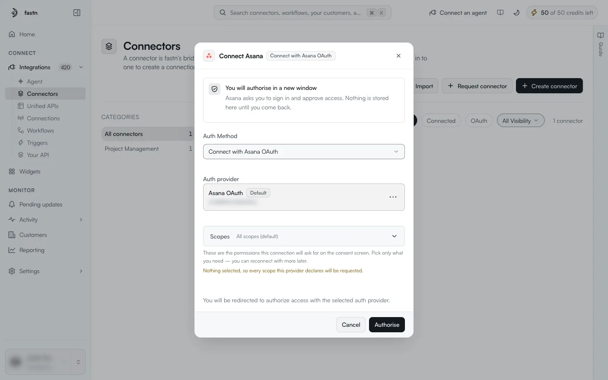

# Connect a system, step by step

A connection is what lets a connector call an app as a specific account. Connecting here signs in **your own** account, for your organisation's workflows and for testing. Your customers connect their own accounts through the [widget](../../embed/README.md) you embed.

These all open the same connect dialog:

* **Connect** on a connector's card in the [catalogue](the-catalogue.md);
* **Add another connection** on a card that is already connected;
* **Connect** in the header, or on the **Connections** tab, of the [connector detail page](inside-a-connector.md);
* **New connection** on the [Connections](../connections/README.md) page, then pick the app.
* **⋯ → Connect** on the connector's row in the rail, for a connector your workspace owns.



#### Open the connect dialog

Use any of the entry points above. The dialog is titled **Connect &lt;app&gt;**, with the chosen auth method shown next to the name.



#### Choose the auth method

If the connector offers more than one method, an **Auth Method** selector appears. It starts on the connector's default method. Pick another if you need to, for example a personal access token instead of OAuth.



#### Give the credential

What the dialog asks for depends on the method.

**API key, bearer token and other keyed methods**: the dialog shows one field per credential, for example **API Key**. Paste the value and click **Connect**.

<figure><figcaption>An API key method needs one field.</figcaption></figure>

**OAuth 2.0**: the dialog shows *You will authorise in a new window*, the **Auth provider** it will use, and **Scopes**. Click **Authorise**, sign in to the app in the new window and approve access.

<figure><figcaption>An OAuth method. Nothing is stored until you come back from the app.</figcaption></figure>

The scope and provider options are explained in [Creating a connection](../connections/creating-a-connection.md#connecting-with-oauth).



#### Check that it worked

The card's badge changes to **Connected** and its button to **Add another connection**. The connection appears on the connector's **Connections** tab and on the [Connections](../connections/README.md) page with the status `Active`.




Every credential is *Stored encrypted and scoped to this workspace. Your customers never see it, and you can revoke it at any time.* To revoke it, disconnect the connection; see [Inside a connection](../connections/inside-a-connection.md).

