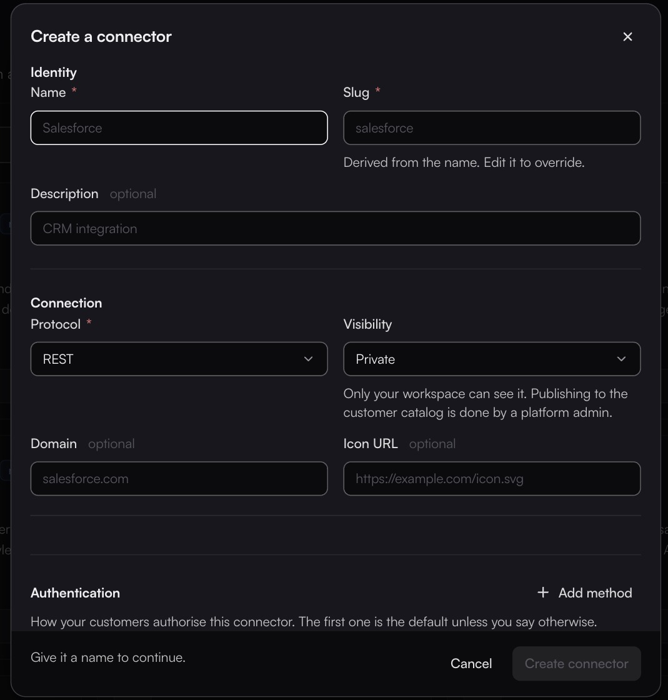

# Creating a connector

**Create connector** opens a dialog with three sections: **Identity**, **Connection** and **Authentication**.

<figure><figcaption></figcaption></figure>

| Field           | Type   | Notes                                                                        |
| --------------- | ------ | ------------------------------------------------------------------------------ |
| **Name**        | text   | Required. What people see. Placeholder `Salesforce`.                          |
| **Slug**        | text   | Required. *Derived from the name. Edit it to override.* Used in API paths and code. |
| **Description** | text   | Optional, but the agent reads it when deciding what a connector is for.       |
| **Protocol**    | select | Required. `REST` (default), `MCP`, `FTP`, `Database`, `REDIS`.                |
| **Visibility**  | select | Offers only `Private` — publishing a connector publicly is a platform-admin action. |
| **Domain**      | text   | Optional. The vendor's domain, e.g. `salesforce.com`.                         |
| **Icon URL**    | text   | Optional. Shown on the card and in the widget.                                |

Authentication is set up **in the same dialog**, not afterwards. **Add method** adds one; each method has a type:

| Type            | Internal value |
| --------------- | -------------- |
| No Auth         | `NO_AUTH`      |
| Basic Auth      | `BASIC`        |
| Digest Auth     | `DIGEST`       |
| Bearer Token    | `BEARER`       |
| API Key         | `API_KEY`      |
| OAuth 2.0 (default) | `OAUTH_2`  |
| Custom          | `INPUT`        |

Those internal values are worth knowing because some of them surface raw in the `Auth` column on [Connections](../connections/README.md).

Each method also carries a **Set as default** radio, an **Authentication docs URL(optional)** field, a **Use Dynamic Client Registration (DCR)** checkbox (RFC 7591), and an **Additional OAuth Config(optional)** key/value repeater. Choosing Basic Auth or API Key swaps in a **Configuration** section with a `Form` / `JSON` toggle and a key/value repeater.

The dialog footer will not let you save until the connector is named — the hint reads *Give it a name to continue.*


You rarely need to do this by hand. Describe the system to the [Agent](../agent/README.md) and give it a spec URL or an OpenAPI file — it will discover the actions, build the connector, and test it.

