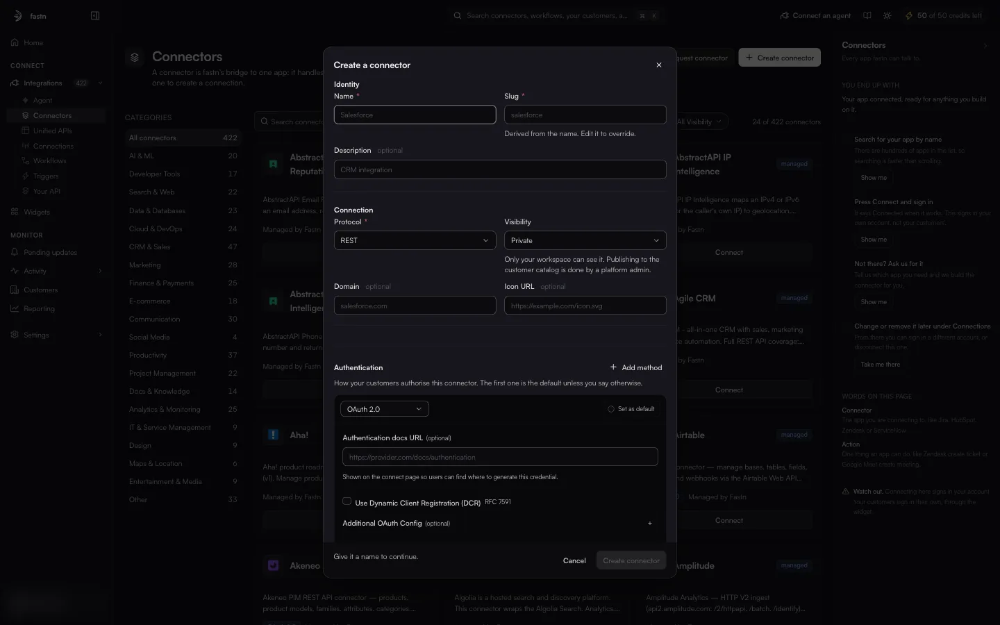
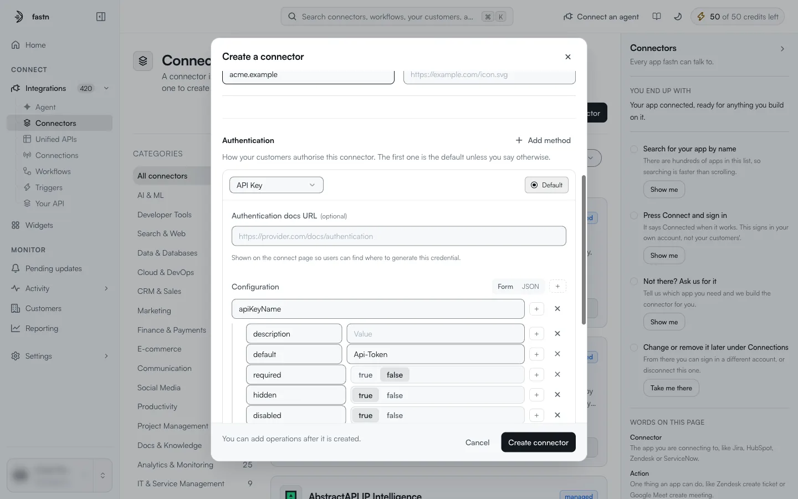
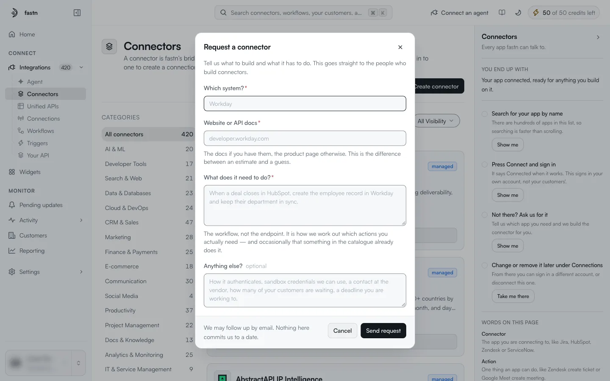

# Creating a connector

**Create connector** (top right of the catalogue, or **+** at the top of the connector rail on a detail page) opens the **Create a connector** dialog. It has three sections: **Identity**, **Connection** and **Authentication**. You add actions after the connector exists. The dialog footer says so: *You can add operations after it is created.*

<figure><figcaption>The dialog as it opens. <strong>Create connector</strong> stays disabled until the connector has a name.</figcaption></figure>


You rarely need to build a connector by hand. Describe the app to the [Agent](../agent/README.md) and give it the vendor's API docs or an OpenAPI file. It creates the connector, its actions and its auth method, then tests them.


### Identity

| Field | Required | Notes |
| --- | --- | --- |
| **Name** | Yes | What people see on the card and in the widget. Placeholder: `Salesforce`. |
| **Slug** | Yes | The identifier used in API paths and in workflow code. *Derived from the name. Edit it to override.* Use lowercase letters, numbers and hyphens, for example `acme-crm`. |
| **Description** | No | Shown on the card. The Agent also reads it to decide what the connector is for, so describe what the app does and which parts of its API the connector covers. |

### Connection

| Field | Notes |
| --- | --- |
| **Protocol** | How fastn talks to the app: `REST` (default), `MCP`, `FTP`, `Database` or `REDIS`. The choice changes the rest of the dialog; see below. |
| **Visibility** | Always `Private`: *Only your workspace can see it. Publishing to the customer catalog is done by a platform admin.* |
| **Domain** | Optional. The vendor's domain, for example `salesforce.com`. Used to find the connector's icon. |
| **Icon URL** | Optional. An image URL to use as the icon instead. |

What each protocol adds:

| Protocol | Extra fields in the dialog | Authentication section |
| --- | --- | --- |
| **REST** | None. | Shown. |
| **MCP** | **MCP Server URL**: the address of the MCP server the connector talks to. | Shown. |
| **FTP** | **Transfer Protocol**: `SFTP`, `FTP` or `FTPS`. A **Connection Fields** list shows what users enter when they connect: **Host**, **Port**, **Username**, and either **Password** or **SSH Private Key (PEM)**. | Replaced by Connection Fields. |
| **Database** | **Connection Fields**: **Database Type** (`postgres`, `mysql`, `mssql`, `redshift` or `mongodb`), **Host**, **Port**, **Database**, **Username**, **Password**, **SSL Mode** (`disable`, `prefer`, `require` or `verify-full`). | Replaced by Connection Fields. |
| **REDIS** | **Connection Fields**: **Host**, **Port**, **Password**, **TLS** (default off) and **Database** (a number from 0 to 15, default 0). | Replaced by Connection Fields. |

For FTP, Database and REDIS the dialog notes that the host, port and credentials are entered when someone adds a connection, not here.

### Authentication

> How your customers authorise this connector. The first one is the default unless you say otherwise.

<figure><figcaption>An API Key method. The Configuration editor lists the fields a user fills in when connecting.</figcaption></figure>

Each method is one block. **Add method** adds another block, so one connector can offer, for example, both OAuth and an API key. Each block has:

* a **type** selector;
* **Set as default**: the default method is the one the connect dialog opens with;
* **Authentication docs URL** (optional): *Shown on the connect page so users can find where to generate this credential.*;
* settings that depend on the type (below).

| Type | Stored as | Type-specific settings |
| --- | --- | --- |
| **No Auth** | `NO_AUTH` | None. Requests go out without credentials. |
| **Basic Auth** | `BASIC` | A Configuration with `username` and `password`. |
| **Digest Auth** | `DIGEST` | A Configuration with `username` and `password`. |
| **Bearer Token** | `BEARER` | A Configuration with `bearerToken` and a hidden `expires_in`. |
| **API Key** | `API_KEY` | A Configuration with `apiKeyName` (the header name, default `Api-Token`, hidden from users), `apiKeyValue` (the key) and a hidden `expires_in`. |
| **OAuth 2.0** (default) | `OAUTH_2` | **Use Dynamic Client Registration (DCR)** (RFC 7591), and **Additional OAuth Config**, a list of extra key/value settings sent with the OAuth flow. The OAuth app itself (client ID and secret) is added afterwards as an [auth provider](auth-methods.md). |
| **Custom** | `INPUT` | An empty Configuration. You define every field the user must enter, for example an account subdomain plus a token. |

The **Stored as** value is what appears in the **Auth** column on the [Connections](../connections/README.md) page and on the connector's header line.

#### The Configuration editor

The Configuration lists the fields a user fills in on the connect form. Switch between **Form** and **JSON** to edit it either way. In JSON, each field is a key with these properties:

| Property | Meaning |
| --- | --- |
| `description` | The label shown to the user. |
| `required` | `"true"` if the user must fill it in. |
| `type` | `password` masks the input. `number` expects a number. |
| `default` | A value used when the user enters nothing. |
| `hidden` | `"true"` hides the field from the user. Use it together with `default` for fixed values. |
| `disabled` | `"true"` makes the field read-only. |

This is the default Configuration for **API Key**:

```json
{
  "apiKeyName": {
    "description": "",
    "default": "Api-Token",
    "required": "false",
    "hidden": "true",
    "disabled": "true"
  },
  "apiKeyValue": {
    "description": "Api Key",
    "required": "true",
    "type": "password"
  },
  "expires_in": {
    "type": "number",
    "default": "100000",
    "hidden": "true",
    "disabled": "true"
  }
}
```

Change `apiKeyName`'s `default` to the header the vendor expects, for example `X-API-Key`.

### Saving

The footer reads *Give it a name to continue.* until **Name** is filled in. **Create connector** then creates the connector as a private connector owned by your workspace. Add its actions from the connector's detail page; see [Actions](action-detail.md).

### Request a connector

If you would rather fastn built the connector, use **Request connector** on the catalogue page.

<figure><figcaption>The request goes to the team that builds connectors.</figcaption></figure>

| Field | Required | What to write |
| --- | --- | --- |
| **Which system?** | Yes | The app's name. |
| **Website or API docs** | Yes | *The docs if you have them, the product page otherwise. This is the difference between an estimate and a guess.* |
| **What does it need to do?** | Yes | *The workflow, not the endpoint.* For example: *When a deal closes in HubSpot, create the employee record in Workday and keep their department in sync.* This tells the team which actions you need, and sometimes shows that an existing connector already does it. |
| **Anything else?** | No | How it authenticates, sandbox credentials, a vendor contact, how many customers are waiting, a deadline. |

**Send request** submits it. *We may follow up by email. Nothing here commits us to a date.*
