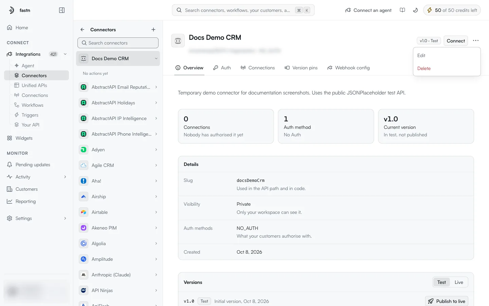
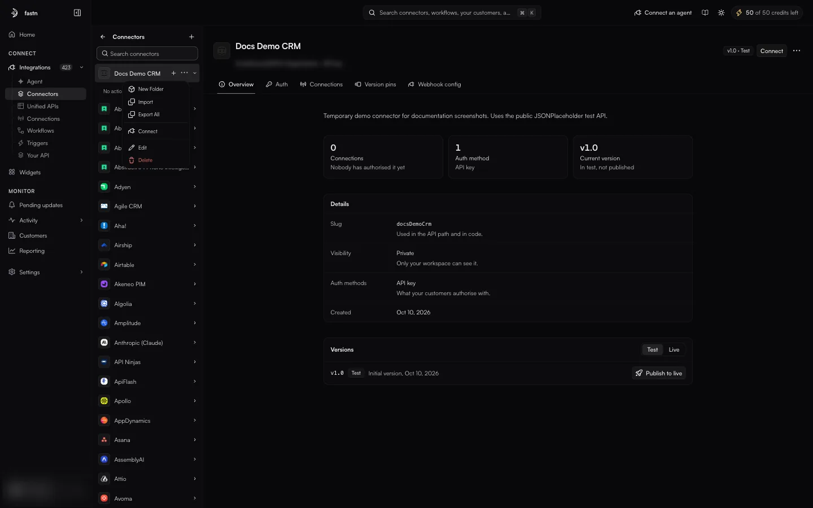
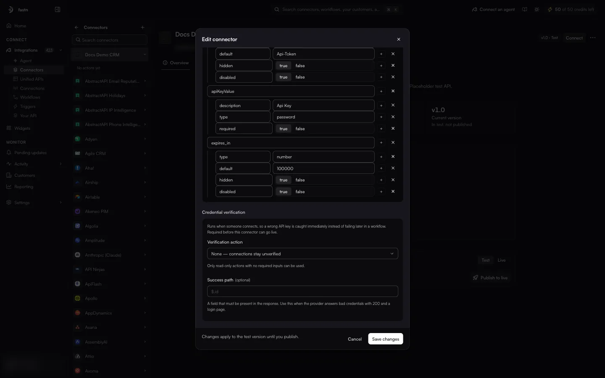
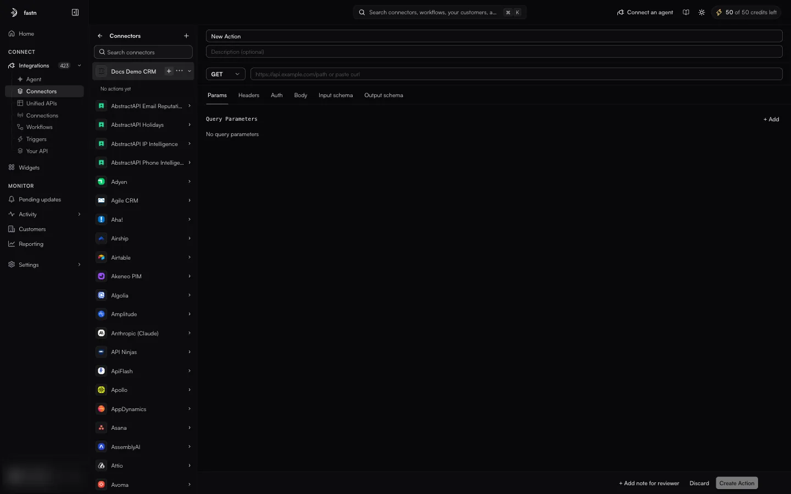
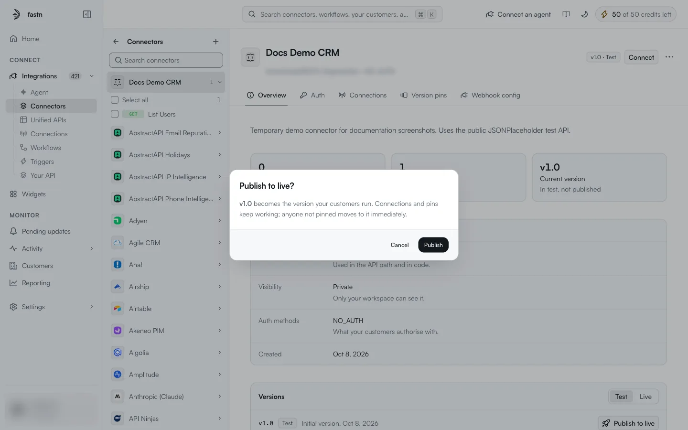
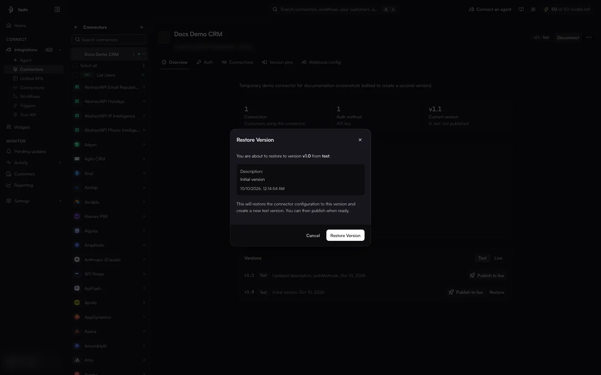
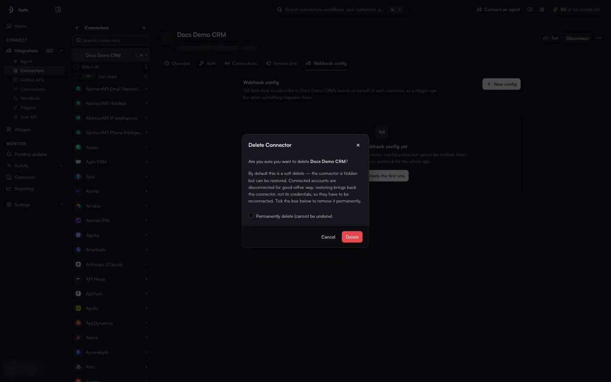

# Editing, publishing and deleting

Everything on this page applies to connectors your workspace **owns**: ones you created with **Create connector** or brought in with **Import**. Their card is badged `Custom` and reads *Managed by* followed by your organisation's name. Managed connectors (badged `managed`, *Managed by Fastn*) are read-only in your workspace; to change one of their actions, use [Propose an update](action-detail.md#platform-owned-actions-and-propose-an-update).

### Where the controls are

On an owned connector:

* the header's **⋯** menu holds **Edit** and **Delete**;
* the connector's row in the rail has **+** (Add action) and a **⋯** menu with **New Folder**, **Import**, **Export All**, **Connect**, **Edit** and **Delete**;
* the catalogue card's **⋯** menu holds **Select**, **Edit**, **Export** and **Delete** (see [Importing and exporting](importing-and-exporting.md#export-connectors));
* each test version under **Overview → Versions** has **Publish to live**.

<figure><figcaption>An owned connector: <strong>Edit</strong> and <strong>Delete</strong> in the header menu, <strong>Publish to live</strong> on the version.</figcaption></figure>

<figure><figcaption>The menu on an owned connector's row in the rail.</figcaption></figure>

### Edit a connector

**⋯ → Edit** opens **Edit connector**. It has the same Identity, Connection and Authentication sections as [Create a connector](creating-a-connector.md), plus **Credential verification**:

<figure><figcaption>Credential verification appears only when editing.</figcaption></figure>

> Runs when someone connects, so a wrong API key is caught immediately instead of failing later in a workflow. Required before this connector can go live.

| Field | Meaning |
| --- | --- |
| **Verification action** | An action fastn runs right after someone connects, to prove the credential works. *Only read-only actions with no required inputs can be used.* The default, **None — connections stay unverified**, skips the check. |
| **Success path** | Optional. *A field that must be present in the response. Use this when the provider answers bad credentials with 200 and a login page.* For example `$.id`. |

**Save changes** saves. The footer explains where the change goes: *Changes apply to the test version until you publish.*

### Add an action

**+** next to the connector's name in the rail opens a blank action in the editor:

<figure><figcaption>A new action. <strong>Create Action</strong> stays disabled until the request is filled in.</figcaption></figure>

1. Replace **New Action** with the action's name, and add a description.
2. Choose the method and enter the URL. You can also paste a complete `curl` command into the URL field.
3. Fill in the tabs as described in [Actions](action-detail.md#the-seven-tabs).
4. Click **Create Action**. **Discard** throws the draft away.

The action's slug is derived from its name in camelCase, for example *List Users* becomes `listUsers`, and the action opens at `/integrations/connectors/<connector-slug>/<action-slug>`. After that, edit it in the same editor and click **Save Changes**.

Actions can also be grouped into folders (**⋯ → New Folder** on the connector's rail row).

### Publish a version

Every saved change goes to the connector's **Test** version. Customers keep running the **Live** version until you publish.

1. Open **Overview** and scroll to **Versions**, with **Test** selected.
2. Click **Publish to live** on the version.
3. Confirm:

<figure><figcaption>Publishing moves every customer who is not pinned to this version.</figcaption></figure>

Customers pinned to another version (see [Version pins](inside-a-connector.md#version-pins)) stay on it. The Edit dialog also says [credential verification](#edit-a-connector) is *required before this connector can go live*. Publishing a test version without it is not blocked, so add a verification action before customers rely on the connector.

### Restore a version

Each save adds a version with a note of what changed, for example *Updated description, authMethods*. Older versions in the **Versions** list have a **Restore** button.

<figure><figcaption>Restoring creates a new test version; nothing goes live until you publish.</figcaption></figure>

> This will restore the connector configuration to this version and create a new test version. You can then publish when ready.

**Restore Version** confirms. Customers are not affected until you [publish](#publish-a-version) the new test version.

### Delete a connector

**⋯ → Delete** opens **Delete Connector**:

<figure><figcaption>Soft delete is the default; tick the box to delete permanently.</figcaption></figure>

* **Soft delete** (the default): the connector disappears from the catalogue. The dialog says it *can be restored*. Every connection on it is disconnected and its credentials are deleted; restoring brings back the connector, not the credentials.
* **Permanently delete (cannot be undone)**: tick this box to remove the connector for good.

After **Delete**, you return to the catalogue.


Either way, every workflow and trigger that uses the connector's connections stops working. Check who uses it on the **Connections** tab before deleting.

