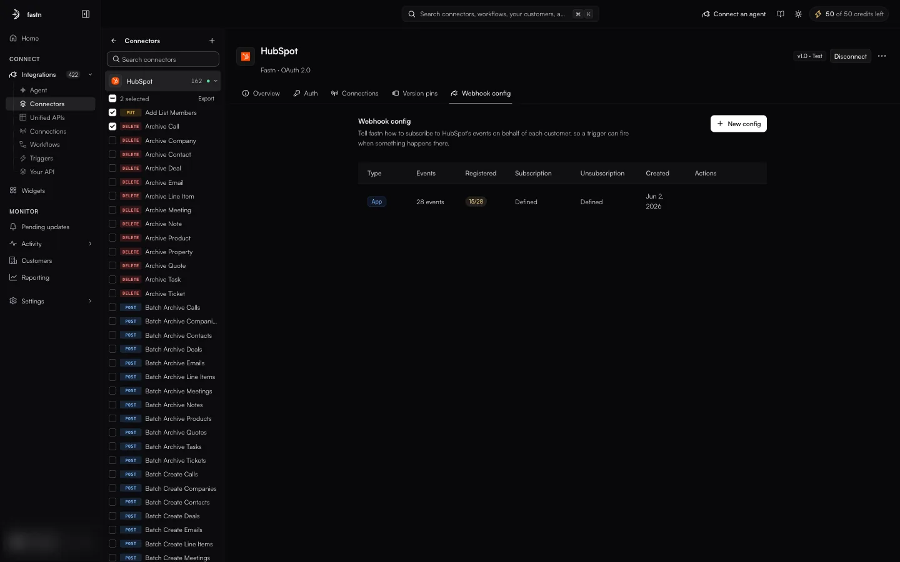
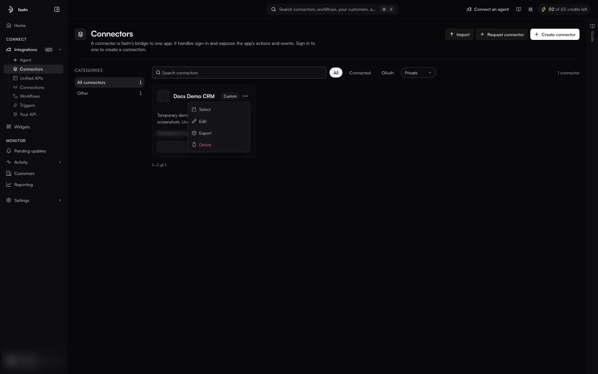
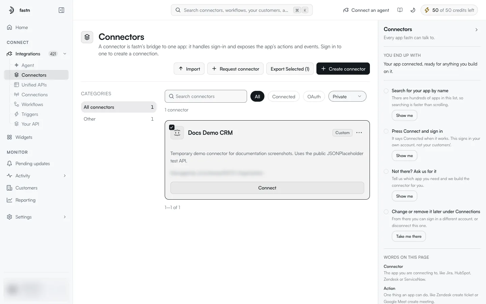
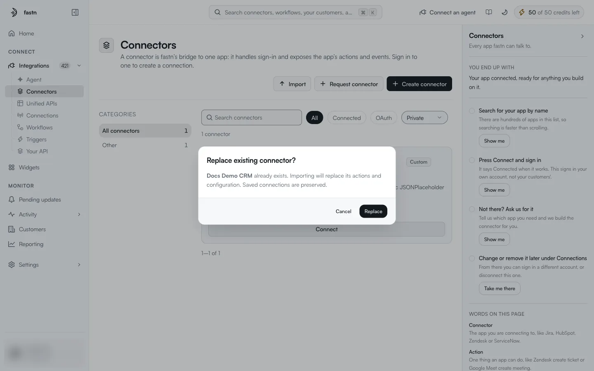

# Importing and exporting

Connectors and actions can be saved to JSON files and loaded into another workspace. Use this to copy a connector between environments, to keep a copy under version control, or to share a connector definition with someone.

### Export actions

You can export the actions of any connector, managed or owned.

1. Open the connector's detail page.
2. Either tick the actions you want in the connector rail (or **Select all**) and click **Export** in the *n selected* bar, or open one action's **⋯** menu and click **Export**.
3. The browser downloads a JSON file named after the connector and the number of actions, for example `hubspot-2-actions.json`.

<figure><figcaption>Bulk export from the connector rail.</figcaption></figure>

The file looks like this (shortened):

```json
{
  "$schema": "https://fastn.ai/schemas/actions/v1.json",
  "version": "1.0",
  "exportedAt": "2026-10-08T11:28:39.012Z",
  "connector": { "id": "…", "name": "HubSpot", "slug": "hubspot" },
  "actions": [
    {
      "id": "…",
      "name": "Add List Members",
      "slug": "addListMembers",
      "description": "Add records to a MANUAL list. …",
      "httpConfig": { "…": "method, URL, headers, query parameters, body" },
      "ftpConfig": null,
      "redisConfig": null,
      "authConfig": null,
      "inputContract": { "…": "the Input schema" },
      "outputContract": { "…": "the Output schema" },
      "rateLimit": null,
      "stage": "live",
      "version": "v1.2"
    }
  ]
}
```

| Field | Meaning |
| --- | --- |
| `connector` | The connector the actions came from. |
| `httpConfig` | The request: everything on the Params, Headers, Auth and Body tabs. `ftpConfig` and `redisConfig` hold the equivalent for FTP and REDIS connectors. |
| `inputContract` / `outputContract` | The **Input schema** and **Output schema**. |
| `stage` | `test` or `live`. |
| `version` | The action's version. |

An export holds definitions only. It never contains credentials or connections.

### Export connectors

Connectors your workspace owns (badged `Custom`) have a **⋯** menu on their catalogue card with **Select**, **Edit**, **Export** and **Delete**.

<figure><figcaption>The card menu on a connector your workspace owns.</figcaption></figure>

* **⋯ → Export** downloads that one connector.
* **⋯ → Select** ticks the card and adds **Export Selected (n)** to the page header. Select more cards, then click it to download them together.
* On the connector's detail page, its row in the rail also has a **⋯** menu with **Export All** and **Import**.

<figure><figcaption><strong>Export Selected (n)</strong> appears once a card is selected.</figcaption></figure>

The download is named `connectors-bundle-<date>.json`, for example `connectors-bundle-2026-10-08.json`:

```json
{
  "$schema": "https://fastn.ai/schemas/connector-bundle/v1.json",
  "version": "1.0",
  "exportedAt": "2026-10-08T11:56:56.422Z",
  "connectors": [
    {
      "connector": { "name": "Docs Demo CRM", "slug": "docsDemoCrm", "protocol": "REST", "visibility": "private", "authMethods": [], "…": "…" },
      "actions": [ { "name": "List Users", "slug": "listUsers", "httpConfig": { "method": "GET", "url": "https://jsonplaceholder.typicode.com/users" }, "…": "…" } ],
      "webhookConfigs": [],
      "authProviders": [],
      "appRegistrations": []
    }
  ]
}
```

Each entry carries the connector's definition, its actions, its webhook configs, its auth providers and its app registrations. Managed connectors do not have this menu; to copy one of their actions, use [Export actions](#export-actions).

### Import

**Import** on the catalogue page opens a file picker. Choose one `.json` file, such as a `connectors-bundle-<date>.json` from [Export connectors](#export-connectors). There is no form to fill in: the file is read and its connectors are created in your workspace as connectors you own.

If a connector in the file already exists in your workspace, fastn asks first:

<figure><figcaption>Importing a connector that already exists.</figcaption></figure>

> **Replace existing connector?**
>
> *&lt;name&gt;* already exists. Importing will replace its actions and configuration. Saved connections are preserved.

**Replace** overwrites the existing connector's actions and configuration with the file's. Connections on it are kept, so customers do not need to reconnect. **Cancel** stops the import.
