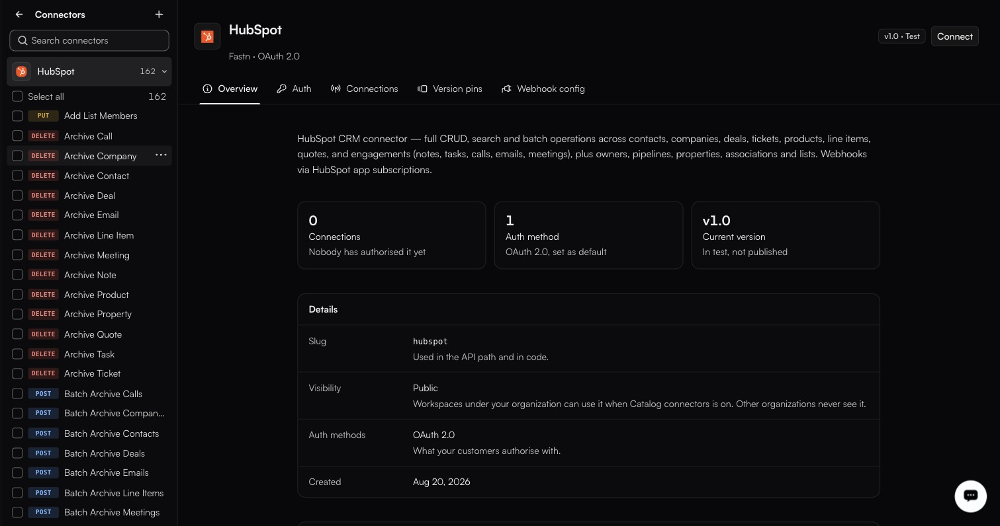
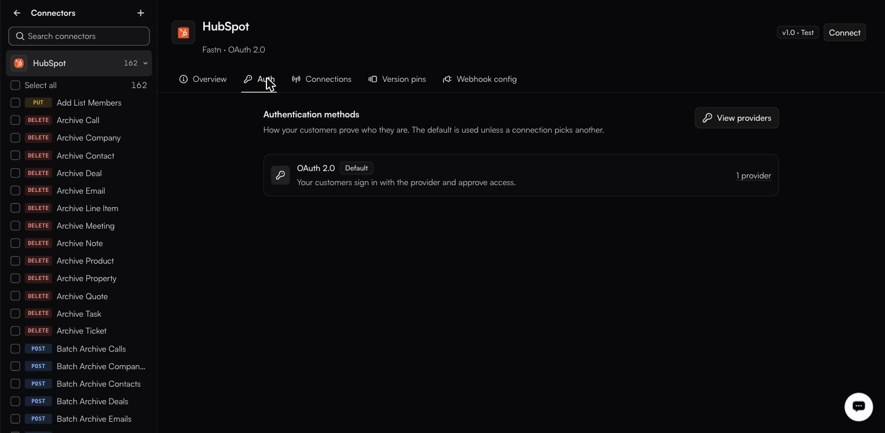

# Inside a connector

`/integrations/connectors/<slug>`. Three panes: the connector list on the left, that connector's actions in the middle, and the detail tabs on the right.

* **Left** — **Back to all connectors**, **Create a connector**, a search box, and the connector list with `<Name> operations` expanders. Connectors your org owns also get **Add action**.
* **Middle** — the action list, each with a method chip (`GET`, `POST`, `PUT`, `PATCH`, `DELETE`), plus **Select all**. Selecting actions is how you scope what a workflow or an agent may use — the point of *read-only Jira for one customer, nothing beyond that*.
* **Right** — the connector name, a `<owner> · <auth type>` line, a version chip such as `v1.0 · Test`, a **Connect** button, and a `⋯` menu with **Edit** and **Delete**. Below that, five tabs.

<figure><figcaption>The version tile reads <em>In test, not published</em> — the connector works, but no customer can reach it yet.</figcaption></figure>

#### Overview

Three tiles — **Connections**, **Auth method(s)**, **Current version** — and a details table.

| Field            | Meaning                                                                       |
| ---------------- | ------------------------------------------------------------------------------- |
| **Slug**         | The identifier used in API paths and in workflow code.                         |
| **Visibility**   | Private or Public. New connectors start Private; publishing publicly is a platform-admin action. |
| **Auth methods** | What your customers authorise with.                                            |
| **Created**      | When it entered the catalogue.                                                 |

A **Versions** section underneath carries a `Test` / `Live` toggle and a **Publish to live** control.

#### Auth

<figure><figcaption>The providers link opens the OAuth apps sitting behind that method.</figcaption></figure>

One row per authentication method, each showing its provider count, plus a **View providers** button that opens the OAuth apps behind them. The tab describes each shape in your customer's terms:

> Your customers sign in with the provider and approve access.

> Your customers paste a key they generate themselves.

#### Connections

Every customer who has authorised this connector. Before anyone has, it reads `Nobody has connected yet`. It is the same data as the workspace-wide [Connections](../connections/README.md) page, filtered to this one system.

#### Version pins

> Hold one customer on one version while everyone else moves on. A version set in code still wins over a pin.

That second sentence is the rule that matters: a pin is a fallback, not an override. Pin a customer when they cannot absorb a change yet — a field they depend on moved, or their own integration needs a release first — then unpin them when they are ready.

With nothing to pin, the tab reads `No versioned actions yet` / *Add actions with an externalVersion to enable per-tenant routing.*

The tab also carries a **Compare two versions** tool: `Action slug`, `From`, `To`, `From major`, `To major`, and **Compare**.

#### Webhook config

**New config** creates one. Until then:

> No webhook config yet

> Until one exists, customers of this connector can be polled but cannot be notified.

That is the plumbing behind an [app event trigger](../triggers/README.md) — configure it once here and app event triggers on this connector work for every customer, rather than each of them registering a webhook themselves.
