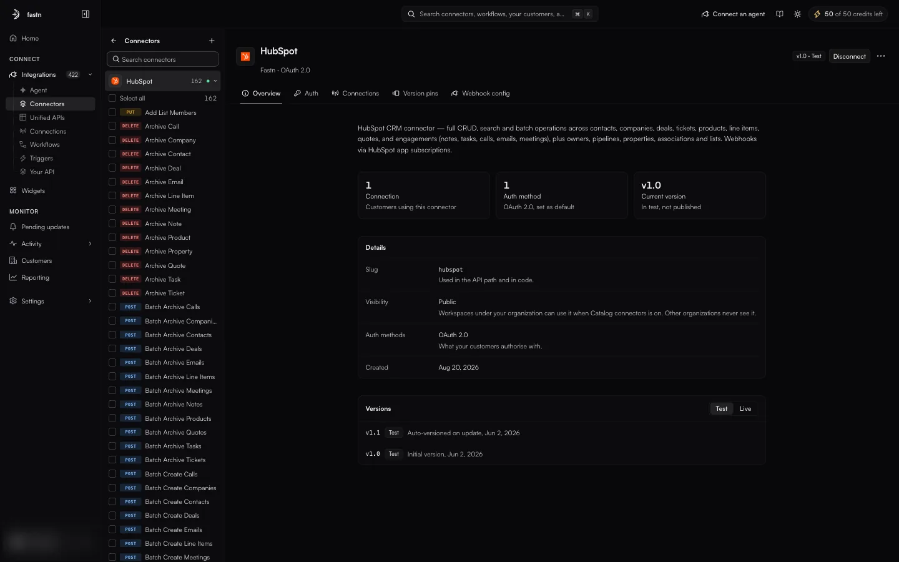
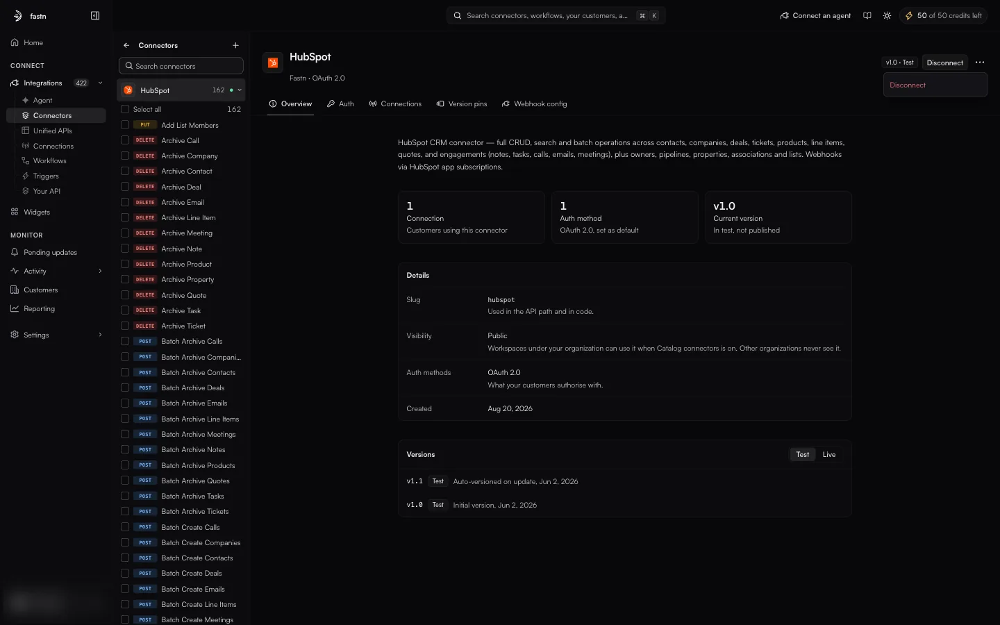
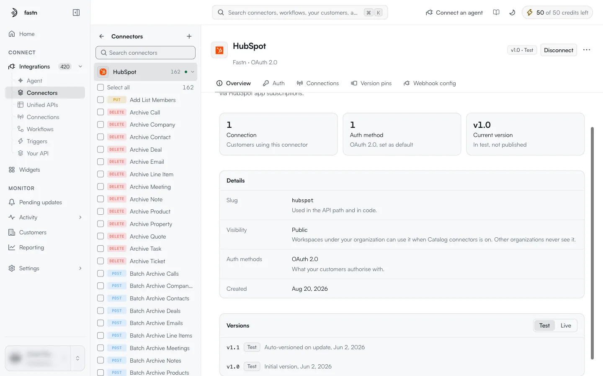
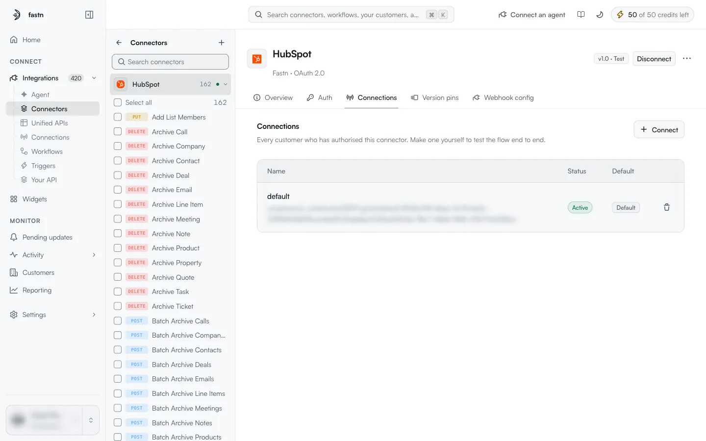
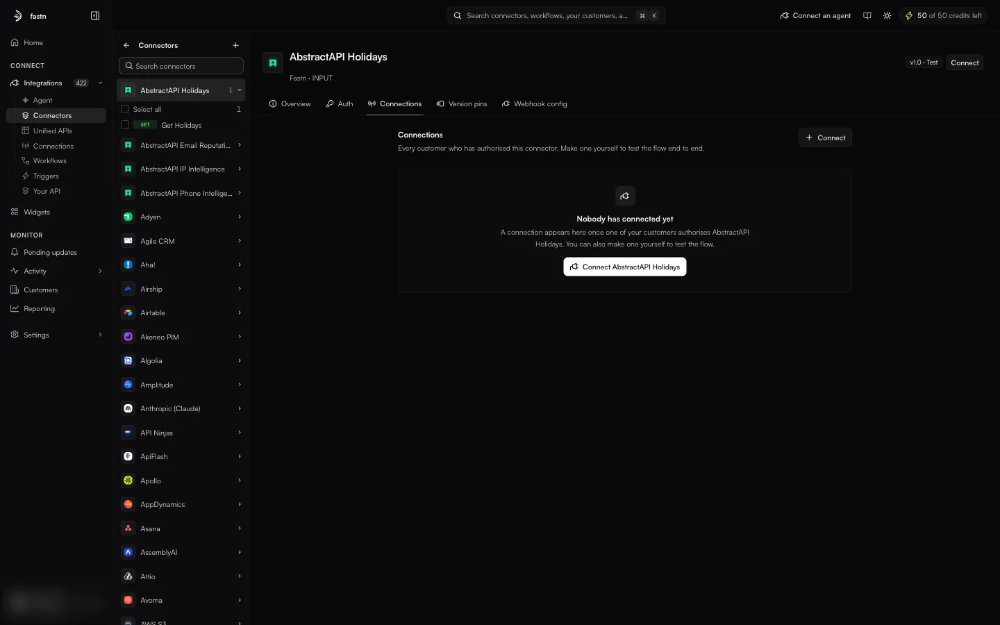
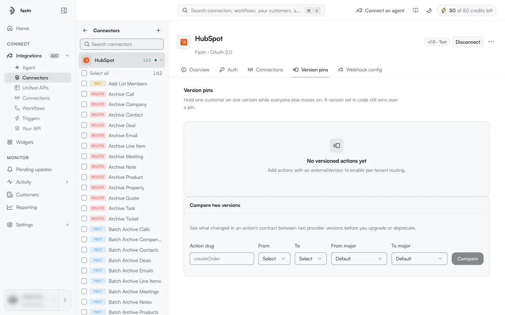

# Inside a connector

`/integrations/connectors/<slug>`. Click a connector's name in the catalogue to open it.

<figure><figcaption>The detail page has two panes: the connector rail on the left and the selected connector on the right.</figcaption></figure>

### The connector rail (left)

* **←** (Back to all connectors) returns to the catalogue.
* **+** (Create a connector) opens the [Create a connector](creating-a-connector.md) dialog.
* **Search connectors** filters the rail.
* Every connector is listed with its icon. The open connector is expanded: it shows its action count, a green dot if it is connected, and a chevron that collapses or expands its action list.
* Under it, **Select all** and one row per action, each with a checkbox and a method chip (`GET`, `POST`, `PUT`, `PATCH`, `DELETE`). Click an action to open it in the [action editor](action-detail.md). Tick actions to export them; see [Importing and exporting](importing-and-exporting.md).

### The header

| Element | Meaning |
| --- | --- |
| **Name** and icon | The connector. |
| `<owner> · <auth type>` | Who maintains it (*Fastn* for managed connectors, your organisation's name for connectors you own) and its default auth type, for example `Fastn · OAuth 2.0` or `Fastn · INPUT`. |
| Version chip, for example `v1.0 · Test` | The connector's current version and whether that version is in **Test** or **Live**. |
| **Connect** or **Disconnect** | **Connect** opens the connect dialog. Once you are connected it changes to **Disconnect**, which removes your connection after a confirmation. |
| **⋯** (More actions) | On a managed connector you are connected to: **Disconnect**. On a connector your workspace owns: **Edit** and **Delete**; see [Editing, publishing and deleting](editing-and-deleting.md). |

<figure><figcaption>On a managed connector the menu only offers <strong>Disconnect</strong>.</figcaption></figure>

Below the header are five tabs: **Overview**, **Auth**, **Connections**, **Version pins** and **Webhook config**. **Auth** is covered in [Auth methods and providers](auth-methods.md) and **Webhook config** in [Webhook config](webhook-config.md).

### Overview

The connector's description, then three tiles:

| Tile | Shows |
| --- | --- |
| **Connection(s)** | How many connections use this connector (*Customers using this connector*). |
| **Auth method(s)** | How many auth methods it offers, and which is the default, for example *OAuth 2.0, set as default*. |
| **Current version** | The current version, and *In test, not published* or the live state. |

Then a **Details** table:

| Field | Meaning |
| --- | --- |
| **Slug** | *Used in the API path and in code.* |
| **Visibility** | **Private**: only your workspace can see it. **Public**: *Workspaces under your organization can use it when Catalog connectors is on. Other organizations never see it.* |
| **Auth methods** | *What your customers authorise with.* |
| **Created** | When the connector was added. |

#### Versions

<figure><figcaption>The Versions list with the <strong>Test</strong> toggle selected.</figcaption></figure>

Every saved change to a connector creates a version. The **Versions** section lists them, newest first, with a note such as *Initial version* or *Auto-versioned on update* and the date.

* **Test** lists versions that are still being tested. Customers do not run them.
* **Live** lists published versions, the ones customers run.

If a list is empty it reads *No test versions yet.* (or the live equivalent). On a connector your workspace owns, each test version also has a **Publish to live** button; see [Editing, publishing and deleting](editing-and-deleting.md#publish-a-version).

### Connections

<figure><figcaption>Every connection made on this connector. The second line of each row is the connection ID (blurred here).</figcaption></figure>

> Every customer who has authorised this connector. Make one yourself to test the flow end to end.

| Column | Meaning |
| --- | --- |
| **Name** | The connection's name (`default` unless it was named), with its connection ID underneath. |
| **Status** | `Active`, `Inactive`, `Expired` or `Failed`. See [Statuses](../connections/statuses.md). |
| **Default** | Marks the connection that is set as the default for this connector. |
| 🗑 | Disconnects that connection. |

**Connect** adds a connection. Before anyone has connected, the tab reads *Nobody has connected yet* with a **Connect &lt;connector&gt;** button:

<figure><figcaption>The empty state on a connector nobody has connected yet.</figcaption></figure>

This tab shows the same connections as the workspace-wide [Connections](../connections/README.md) page, limited to one connector.

### Version pins

<figure><figcaption>Version pins and the version comparison tool.</figcaption></figure>

> Hold one customer on one version while everyone else moves on. A version set in code still wins over a pin.

A pin keeps one customer on an older version of an action while every other customer moves to the new one. Use it when a customer cannot take a change yet, for example because a field they depend on moved. Remove the pin when they are ready.

The second sentence matters: a pin is a fallback. If a workflow asks for a specific version in its code, that version is used, pin or not.

Pins work on actions that have an external version (`externalVersion`), which you create in the action editor with **New version → New external version** (see [Actions](action-detail.md#versions)). Until a connector has such actions, the tab reads *No versioned actions yet* · *Add actions with an externalVersion to enable per-tenant routing.*

**Compare two versions** shows what changed in an action's contract between two versions before you upgrade or deprecate:

| Field | What to enter |
| --- | --- |
| **Action slug** | The action to compare, for example `createOrder`. |
| **From** / **To** | The two provider versions. |
| **From major** / **To major** | The internal major versions (`Default` or `major 1`, `major 2` and so on). |

**Compare** shows the difference.
