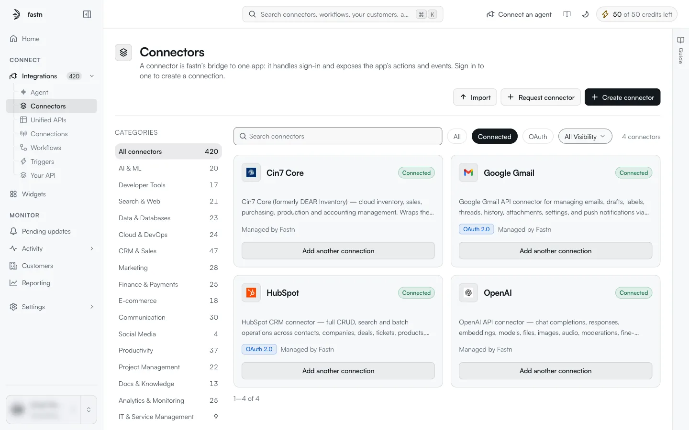
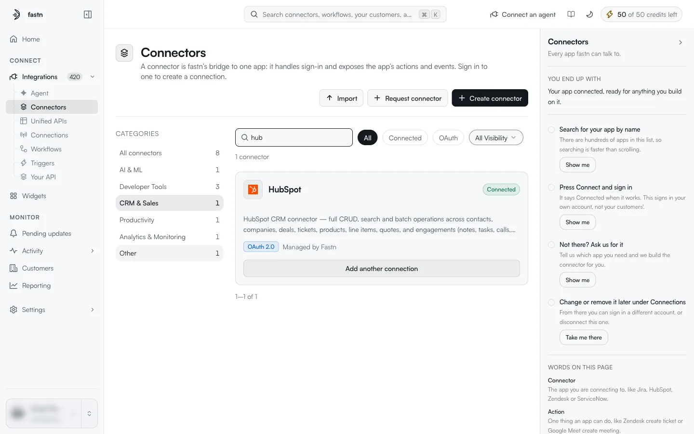
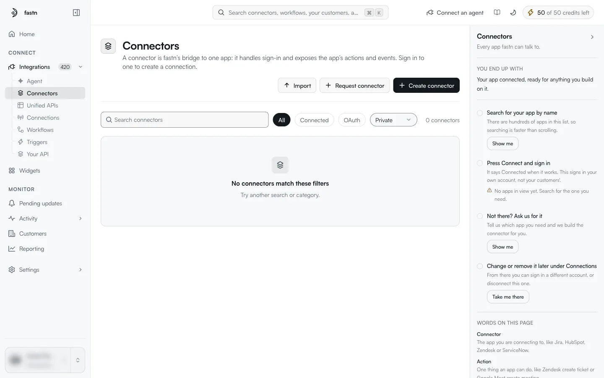
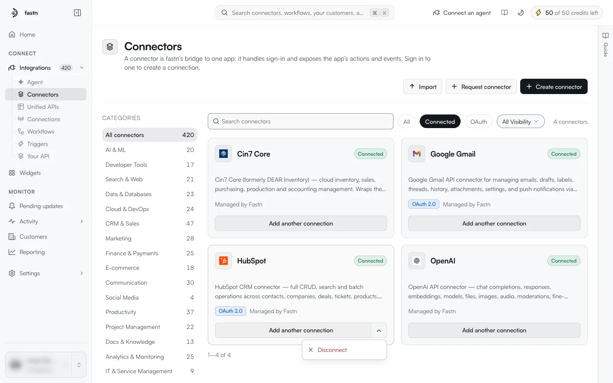

# The catalogue

`/integrations?tab=connectors` lists every connector your workspace can use: the ones fastn manages and the ones your workspace created.

<figure><figcaption>The <strong>Connected</strong> chip narrows the list to connectors that already have a connection.</figcaption></figure>

### Page header

| Button | What it does |
| --- | --- |
| **Import** | Opens a file picker that accepts one `.json` connector file. See [Importing and exporting](importing-and-exporting.md). |
| **Request connector** | Asks fastn to build a connector you need. See [Request a connector](creating-a-connector.md#request-a-connector). |
| **Create connector** | Opens the Create a connector dialog. See [Creating a connector](creating-a-connector.md). |

### Finding a connector

| Control | What it does | URL parameter |
| --- | --- | --- |
| **Categories** (left column) | Shows one category, such as *CRM & Sales* or *Communication*. Each category shows how many connectors it holds. **All connectors** clears the category. | `category=` (for example `crm-sales`) |
| **Search connectors** | Matches the connector's name and its description. A search for `slack` also finds connectors that mention Slack in their description. | `q=` |
| **All / Connected / OAuth** | **All** shows everything. **Connected** shows connectors with at least one connection. **OAuth** shows connectors that offer an OAuth 2.0 method. | `view=connected`, `view=oauth` |
| **All Visibility / Private / Public** | **Private** shows connectors only your workspace can see. **Public** shows connectors from the shared catalogue. | `visibility=` |

Filters combine. When you search, the category counts change to show how many matches each category holds.

<figure><figcaption>A search combined with a category. The counts on the left now count matches only.</figcaption></figure>

Because the filters are kept in the URL, you can bookmark or share a filtered view. The page number is not kept, so a shared link always opens on page one.

If nothing matches, the page shows *No connectors match these filters* and *Try another search or category.*

<figure><figcaption>The empty state. Here the workspace has no private connectors.</figcaption></figure>


The **Connected** and **OAuth** views can take several seconds to load the first time you open them, because the page checks each connector's connections and auth methods. The list shows *Loading...* until it is ready.


The list shows 24 connectors per page, with **Previous** and **Next** below it.

### Reading a card

Each card shows:

* the connector's **icon** and **name**;
* a **badge**: `managed` (maintained by fastn), `Custom` (created in your workspace), or `Connected` (at least one connection exists);
* the **description**, cut to a few lines;
* an **OAuth 2.0** chip if the connector offers OAuth;
* who maintains it, for example *Managed by Fastn*;
* a button at the bottom.

The button depends on whether you have connected:

| State | Button | What it does |
| --- | --- | --- |
| Not connected | **Connect** | Opens the connect dialog for this connector. See [Connect a system](connect-a-system.md). |
| Connected | **Add another connection**, plus a chevron | **Add another connection** opens the connect dialog again so you can sign in a second account. The chevron opens a menu with **Disconnect**. |

<figure><figcaption>The chevron next to <strong>Add another connection</strong> holds <strong>Disconnect</strong>.</figcaption></figure>

Click a card's name to open the [connector's detail page](inside-a-connector.md).

### The guide panel

The right-hand panel, headed **Connectors** · *Every app fastn can talk to.*, is a short checklist for first-time users:

1. **Search for your app by name**
2. **Press Connect and sign in**: *It says Connected when it works. This signs in your own account, not your customers'.*
3. **Not there? Ask us for it**: opens Request connector.
4. **Change or remove it later under Connections**: **Take me there** opens the [Connections](../connections/README.md) page.

Each step has a **Show me** button that outlines the matching control on the page, and a checkbox to mark it done. The panel also defines the words on the page (**Connector**, **Action**). Close it with the arrow at its top right. Once closed, it collapses to a **Guide** tab on the right edge of the page.
