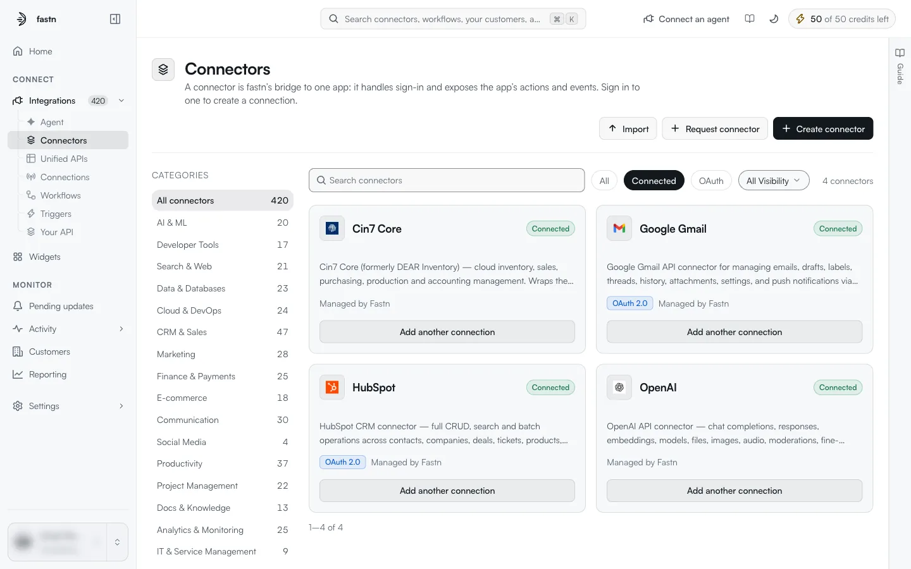
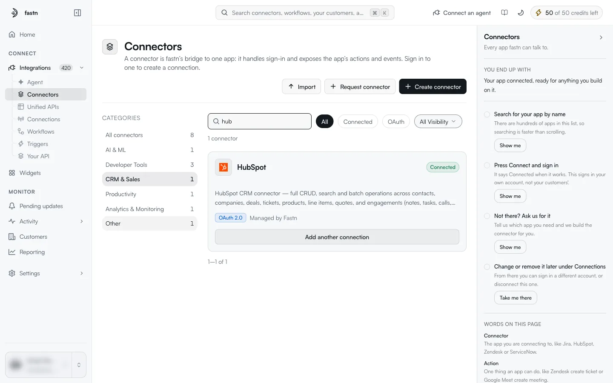
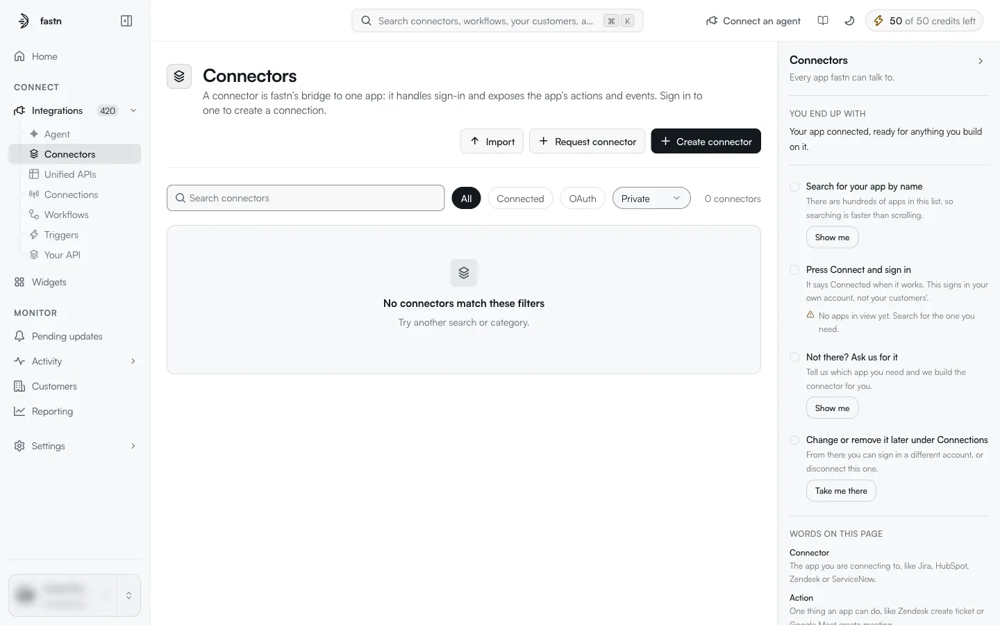
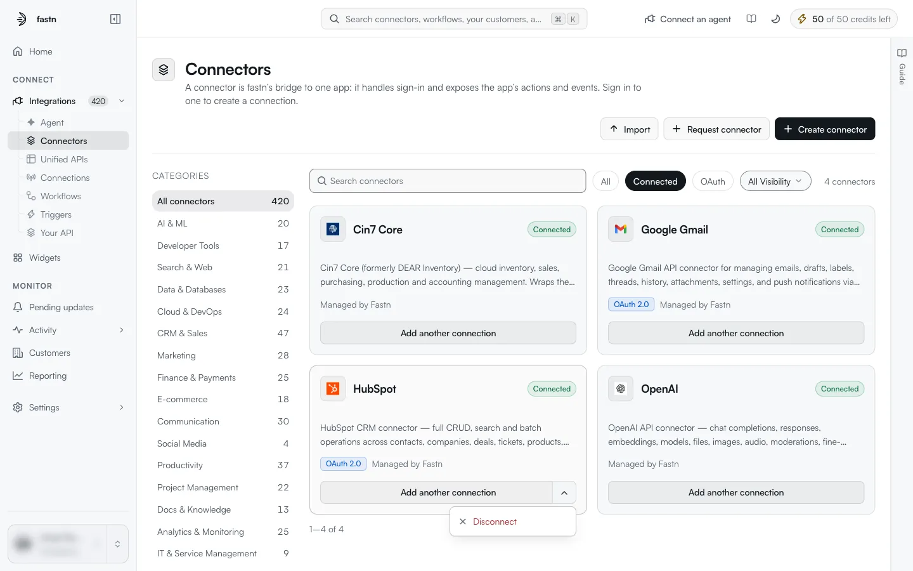

# The catalog

`/integrations?tab=connectors` lists every connector your workspace can use: the ones fastn manages and the ones your workspace created.

<figure><figcaption>The <strong>Connected</strong> chip narrows the list to connectors that have at least one active connection.</figcaption></figure>

### Page header

| Button | What it does |
| --- | --- |
| **Request connector** | Asks fastn to build a connector you need. See [Request a connector](creating-a-connector.md#request-a-connector). |
| **Create connector** | Opens a menu with every way to add a connector: **From scratch** opens the Create a connector dialog (see [Creating a connector](creating-a-connector.md)); **Build with AI** opens fastn's builder; **Build from Claude or any MCP client** shows how to build one from your AI tool; **Import from file** opens a file picker that accepts one `.json` connector file (see [Importing and exporting](importing-and-exporting.md)). **Build with AI** and the MCP item show only where your role can use them. If your role cannot create connectors, you see an **Import** button instead of this menu. |

### Finding a connector

| Control | What it does | URL parameter |
| --- | --- | --- |
| **Categories** (left column) | Shows one category, such as *CRM & Sales* or *Communication*. Each category shows how many connectors it holds. **All connectors** clears the category. | `category=` (for example `crm-sales`) |
| **Search connectors** | Searches the catalog by connector name. | `q=` |
| **All / Featured / Connected / OAuth** | **All** shows everything. **Featured** shows connectors fastn marks as featured. **Connected** shows connectors with at least one active connection. **OAuth** shows connectors that offer an OAuth 2.0 method. | `view=featured`, `view=connected`, `view=oauth` |
| **All Visibility / Private / Public** | **Private** shows connectors only your workspace can see. **Public** shows connectors from the shared catalog. | `visibility=` |

Filters combine. When you search, the category counts change to show how many matches each category holds.

<figure><figcaption>A search combined with a category. The counts on the left now count matches only.</figcaption></figure>

Because the filters are kept in the URL, you can bookmark or share a filtered view. The page number is not kept, so a shared link always opens on page one.

If nothing matches, the page shows *No connectors match these filters* and *Try another search or category.*

<figure><figcaption>The empty state. Here the workspace has no private connectors.</figcaption></figure>


The **Connected** and **OAuth** views can take several seconds to load the first time you open them, because the page checks each connector's connections and auth methods. The list shows *Loading...* until it is ready.


The list is split into pages, with **Previous** and **Next** below it.

### Reading a card

Each card shows:

* the connector's **icon** and **name**;
* a **badge**: `managed` (maintained by fastn), `Custom` (created in your workspace), `Connected` (at least one active connection exists), or `Inactive` (it has connections, but none is active);
* the **description**, cut to a few lines;
* an **OAuth 2.0** chip if the connector offers OAuth;
* who maintains it: *Managed by Fastn*, or *Managed by* your organization's name for a connector your workspace created;
* a button at the bottom.

The button depends on whether you have connected:

| State | Button | What it does |
| --- | --- | --- |
| Not connected | **Connect** | Opens the connect dialog for this connector. See [Connect a system](connect-a-system.md). |
| Connected | **Add another connection**, plus a chevron | **Add another connection** opens the connect dialog again so you can sign in a second account. The chevron opens a menu with **Disconnect**. |

<figure><figcaption>The chevron next to <strong>Add another connection</strong> holds <strong>Disconnect</strong>.</figcaption></figure>

Cards of connectors your workspace owns also have a **⋯** menu with **Select**, **Edit**, **Export** and **Delete**; see [Importing and exporting](importing-and-exporting.md#export-connectors) and [Editing, publishing and deleting](editing-and-deleting.md).

Click a card's name to open the [connector's detail page](inside-a-connector.md).

### The page guide

The first time you open the page, a small step-by-step guide offers itself. It is headed *Page guide · 4 steps* and *New to Connectors?*, with **Not now** and **Show me**. **Show me** walks you through four steps, one at a time, each pointing at the real control on the page:

1. **Search for your app**
2. **Press Connect and sign in**: *It says Connected when it works. This signs in your own account, not your customers'.* The guide waits here and moves on by itself once the app is connected.
3. **Not there? Ask us for it**: points at **Request connector**.
4. **Manage it later in Connections**: **Take me there** opens the [Connections](../connections/README.md) page.

The guide never blocks the page; you can keep clicking while it is open. You can minimize it to a small pill and pick it up again later, or close it.
