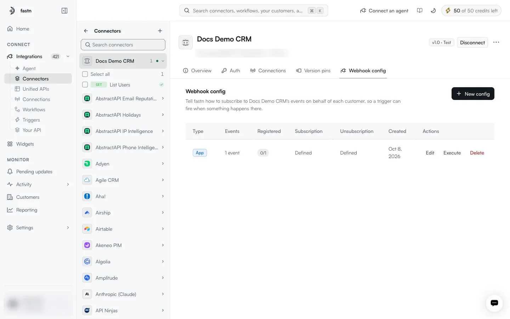
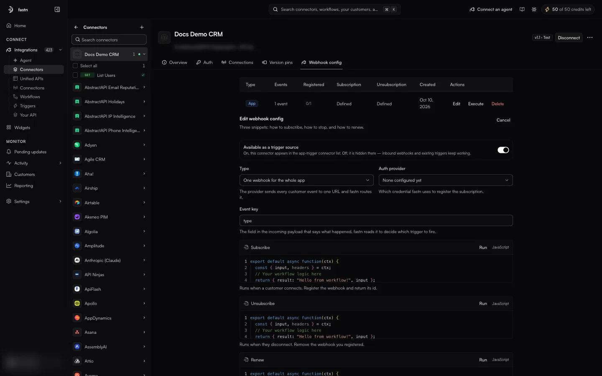
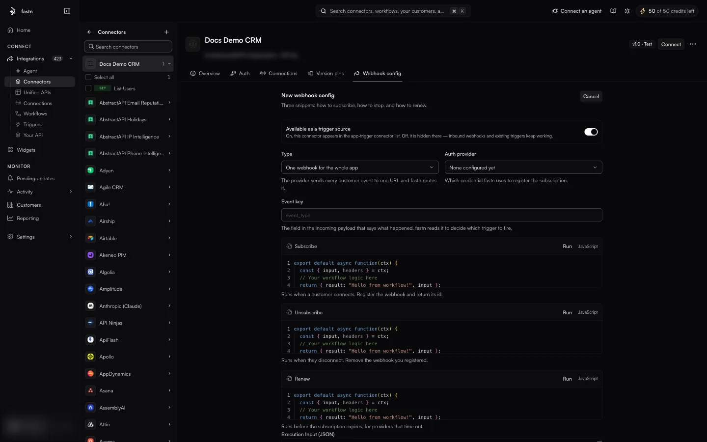
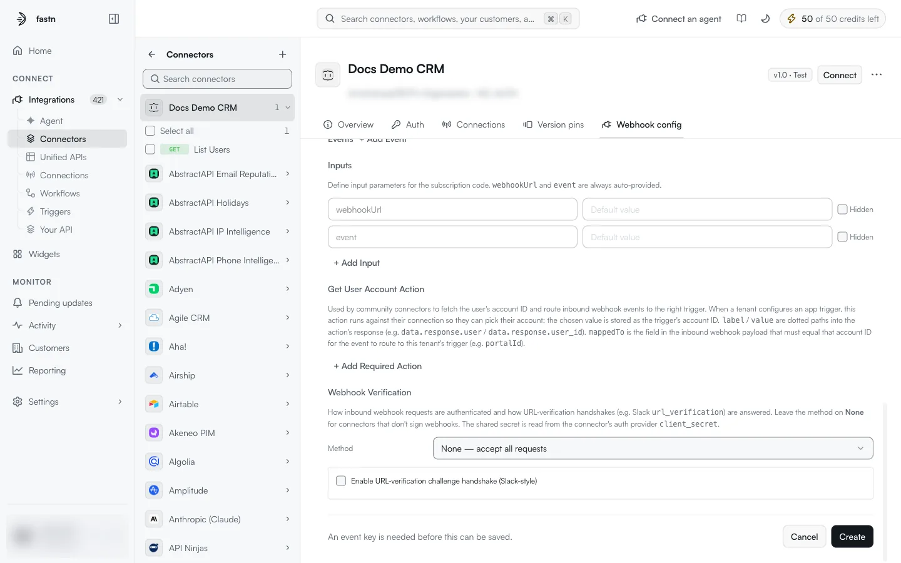

# Webhook config

A **webhook config** tells fastn how to subscribe to an app's events on behalf of each customer, so that an [app event trigger](../triggers/app-events.md) can start a workflow when something happens in the app. You set it up once per connector; every customer who connects then gets the subscription automatically.

> Tell fastn how to subscribe to HubSpot's events on behalf of each customer, so a trigger can fire when something happens there.

### How it works

1. A customer connects to the connector.
2. fastn runs the config's **Subscribe** code with that customer's connection. The code registers the subscription with the app. With the **App** type, every customer's events arrive at one shared fastn URL; with **Event Webhook**, a separate webhook is registered for each event.
3. The app sends events to fastn. fastn checks the request (see [Webhook verification](#webhook-verification)), works out which customer and which event it is, and fires the matching app event triggers.
4. When the customer disconnects, fastn runs the **Unsubscribe** code to remove the webhook.
5. For apps whose subscriptions expire, fastn runs the **Renew** code before they do.

### The config table

<figure><figcaption>HubSpot has one config of type App.</figcaption></figure>

| Column | Meaning |
| --- | --- |
| **Type** | **App**: one webhook for the whole app. **Event Webhook**: one webhook per event. A **Hidden** badge means the config is switched off as a trigger source. |
| **Events** | How many events the config declares. |
| **Registered** | How many of those events are registered, for example `15/28`. Green when all are registered, amber when only some are. |
| **Subscription** / **Unsubscription** | `Defined` when the config has that code, `—` when it does not. |
| **Created** | When the config was created. |
| **Actions** | **Edit**, **Execute** and **Delete**, on connectors your workspace owns. Empty on managed connectors. |

<figure><figcaption>On a connector you own, each config row has <strong>Edit</strong>, <strong>Execute</strong> and <strong>Delete</strong>.</figcaption></figure>

* **Edit** opens **Edit webhook config** below the table, the same form as **New config** with **Update** instead of **Create**.
* **Execute** runs the **Subscribe** snippet once with empty input and reports *Subscription executed successfully* when it works. It is disabled if the config has no Subscribe code.
* **Delete** asks *Delete this webhook config?* in a browser confirmation, then removes it. The tab returns to *No webhook config yet* if it was the only one.

<figure><figcaption>Editing an existing config.</figcaption></figure>

Until a connector has a config, the tab reads:

<figure><figcaption>Without a config, workflows can only poll this app.</figcaption></figure>

> No webhook config yet · Until one exists, customers of this connector can be polled but cannot be notified. Most providers support one webhook for the whole app.


Webhook configs on **managed** connectors are maintained by fastn and are read-only in your workspace: **New config** is shown there but does not open a form. On a connector your workspace owns, it opens the form below.


### The config form

**New config** opens **New webhook config** in place of the table; **Edit** on a row opens the same form filled in. **Cancel** (top right or bottom) closes it without saving.

<figure><figcaption>The top of the form: general settings and the first snippet.</figcaption></figure>

#### General

| Field | Meaning |
| --- | --- |
| **Available as a trigger source** | On: the connector appears in the list of connectors you can pick for an app event trigger. Off: it is hidden there, but inbound webhooks and existing triggers keep working. |
| **Type** | **One webhook for the whole app**: *The provider sends every customer event to one URL and fastn routes it.* **One webhook per event**: *The provider registers a separate webhook for each event you subscribe to.* |
| **Auth provider** | *(App type only.)* *Which credential fastn uses to register the subscription.* |
| **Webhook URL** | *(App type only, once an auth provider is chosen.)* The fastn URL to give the app. *This URL is shared across all events for this connector.* |
| **Event key** | *(App type only.)* *The field in the incoming payload that says what happened. fastn reads it to decide which trigger to fire.* For example `event_type`. |

#### Code: Subscribe, Unsubscribe, Renew

> Three snippets: how to subscribe, how to stop, and how to renew.

Each snippet is a JavaScript function. A new config starts each one with a template:

```javascript
export default async function(ctx) {
  const { input, headers } = ctx;
  // Your workflow logic here
  return { result: "Hello from workflow!", input };
}
```

Each snippet has its own **Run** button for trying it out.

| Snippet | When it runs |
| --- | --- |
| **Subscribe** | *Runs when a customer connects. Register the webhook and return its id.* |
| **Unsubscribe** | *Runs when they disconnect. Remove the webhook you registered.* |
| **Renew** | *Runs before the subscription expires, for providers that time out.* |

**Execution Input (JSON)** is the sample input used when you click a snippet's **Run**.

#### Events

The list of events the config can deliver. **+ Add Event** adds one. Each event has an **Event ID** (the app's own name for it, for example `invoice.created`), a **Label** and an optional **Description**. These are the events a user picks from when creating an app event trigger on this connector.

#### Inputs

> Define input parameters for the subscription code. `webhookUrl` and `event` are always auto-provided.

Each input has a **Key** and a **Default value**, and a **Hidden** checkbox. **+ Add Input** adds one.

#### Get User Account Action

Used when one webhook carries events for many customers (the **App** type). It tells fastn how to match an incoming event to the right customer. **+ Add Required Action** adds one:

* **Select an action**: an action that returns the customer's account, run against their connection when they set up an app trigger.
* **Label path** and **Value path**: dotted paths into that action's response, for example `data.response.user` and `data.response.user_id`. The value becomes the trigger's account ID.
* **Mapped to**: the field in the incoming webhook payload that must equal that account ID for the event to reach this customer's trigger, for example `portalId`.

#### Webhook verification

> How inbound webhook requests are authenticated and how URL-verification handshakes (e.g. Slack `url_verification`) are answered.

| Method | Use it when |
| --- | --- |
| **None — accept all requests** | The app does not sign its webhooks. |
| **HMAC signature** | The app signs each request with a shared secret. Set **Signature Header** (for example `x-slack-signature`), **Algorithm** (for example `sha256`), **Signature Prefix** (for example `v0=` or `sha256=`), **Signature Format**, **Signing Payload**, and optionally **Timestamp Header** and **Max Timestamp Age (ms)** (for example `300000`) to reject replayed requests. |
| **Verification token (Notion-style)** | The app sends a one-time token when the subscription is created. fastn answers it, stores the token as **Captured Token**, and uses it to verify later events. For Notion, paste the captured token into Notion under **Webhooks → Verify** to activate the subscription. |
| **Challenge-response only** | The app checks the URL with a challenge request. Set **Trigger Field** and **Trigger Value** (for example `type` = `url_verification`) and **Response Field** (for example `challenge`), the field fastn echoes back. |

The shared secret for HMAC is the `client_secret` of the connector's auth provider. A separate checkbox, **Enable URL-verification challenge handshake (Slack-style)**, answers the app's URL-verification request.

<figure><figcaption>The bottom of the form. <strong>Create</strong> needs an event key first.</figcaption></figure>

### Saving

**Create** saves the new config. For the **App** type, the footer reads *An event key is needed before this can be saved.* until **Event key** is filled in.

### Related

* [App event triggers](../triggers/app-events.md): using a connector's events to start a workflow.
* [Auth methods and providers](auth-methods.md): the provider whose credential registers the subscription.
