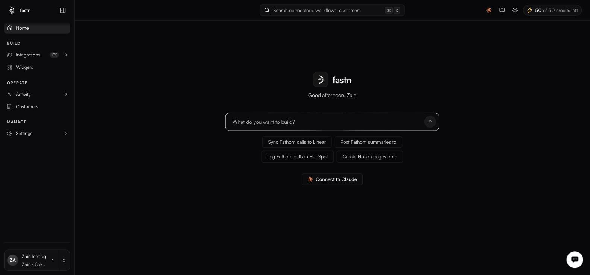

# MCP gateway

**Connect to Claude** — in the top bar, and again under the prompt box on Home

Everything you build in fastn — connectors, actions, workflows — can be exposed to an AI client over the Model Context Protocol. The client sees your connectors as tools it can call, with the same customer scoping and the same permission model as everything else.

<figure><figcaption>Connect to Claude sits under the build prompt on Home.</figcaption></figure>

### Connecting

**Connect to Claude** opens a dialog carrying several ways in: the gateway's MCP URL, a deep link that opens Claude's custom-connector modal with it filled in, a ready-made Claude Code command, a Claude Desktop `mcp-remote` config, and an org-wide add link.

```
https://mcp.fastn.dev
```

For Claude Code, the dialog also gives you a command to run:

```
claude mcp add --transport http fastn https://mcp.fastn.dev
```

For any other MCP client, point it at that URL and authenticate with an API key from [Settings → API keys](../manage/api-keys.md):

```
Authorization: Bearer fsk_live_<your-key>
```

Test keys work too, with `X-fastn-Test-Mode: true` — and carry the same warning as everywhere else:

> Neither mode is a sandbox. A Test key reaches the same live connections as a Live key and causes the same real writes.

### Scoping

The gateway inherits the platform's access model rather than inventing a second one:

* **Customer scope** — a connection belongs to one customer, so a tool call runs against that customer's credential and cannot reach another's. Which customers a key may reach is set on the key itself, under *Customers it can reach*.
* **Permissions** — an API key carries a permission preset (`Full access`, `Developer`, `Operator`, `Viewer`, `End user` or `Custom`) and a per-resource matrix. That caps what the gateway can do with it.
* **Action scope** — on a [connector's](connectors.md) detail page, the middle pane lists every action with a **Select all** control. Narrowing that selection is what makes *read-only Jira for one customer, nothing beyond that* a configuration rather than a promise.


An MCP client acts with whatever the key it holds can do. Mint a key specifically for the client, give it the narrowest permission preset that works, and name it after the client — the Name field's own helper text is *Shown in the audit log beside everything this key does.*


### Watching it

Gateway activity lands in the same places as everything else: runs appear in [Executions](../operate/executions.md), with the calling identity in the **Triggered by** column, and calls made with an API key are attributable to that key in the [audit log](../manage/audit-log.md), which is readable by Owners and Admins.

Agent usage against your AI credit allowance is broken down **By agent** in the credits popover in the top bar.

### The A2A option

The widget's Embed tab lists **A2A** — agent-to-agent — alongside Iframe and SDK, marked *soon*. That is the customer-facing counterpart: your customer's own agent reaching the integrations you offer. See [Embedding the widget](../embed/embedding/README.md).
