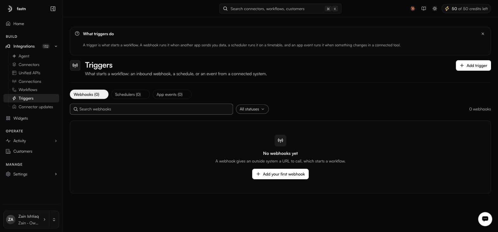
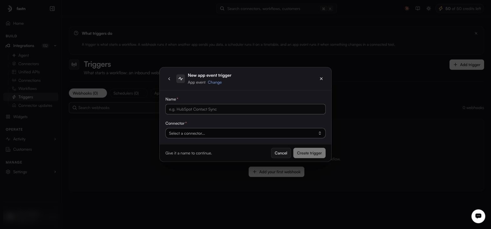

# Triggers

**Integrations → Triggers** · `/integrations?tab=triggers`

<figure><figcaption></figcaption></figure>

A workflow with no trigger only runs when something calls it. A trigger is what makes it run on its own.

The page splits into three sub-tabs — **Webhooks**, **Schedulers** (`?trigger=scheduler`) and **App events** (`?trigger=app`) — with a status select offering `All statuses`, `Active` and `Disabled`.

### Choosing a type

<figure><figcaption></figcaption></figure>

| Type          | Fires when                                                     | Reach for it when                                            |
| ------------- | -------------------------------------------------------------- | -------------------------------------------------------------- |
| **Webhook**   | Another system calls a URL you give it. Nothing is polled.     | The sender can push, and you want it immediate.               |
| **Schedule**  | A clock you set.                                               | Nightly reconciliation, hourly pulls, anything time-based.    |
| **App event** | Something changes in a connected system.                       | A HubSpot deal moves, a GitHub PR merges.                     |

---

## Webhook triggers

<figure><figcaption></figcaption></figure>

**Columns:** `Name`, `Tenant`, `Type`, `Status`, `Auth`, `Routes`, `Created`. The row menu offers **Copy URL**, **Copy as cURL**, **Disable**, **Edit** and **Delete** — *Copy as cURL* is the fastest way to fire one by hand while you are debugging.

### Identity

| Field           | Notes                                                       |
| --------------- | ------------------------------------------------------------- |
| **Name**        | Required. Shown in the list and on every execution record.   |
| **Description** | Optional.                                                   |

### Routes

A route says where a payload goes when it arrives. **Add route** creates more than one, which fans a single inbound call out to several workflows. Routes are required.

| Field           | Notes                                                                                                   |
| --------------- | --------------------------------------------------------------------------------------------------------- |
| **Workflow**    | Required. Which workflow this route runs.                                                                |
| **Environment** | Optional. `test (latest published)` runs the workflow's latest published version; `live` runs what is deployed to Live. |
| **Headers**     | Optional key/value pairs sent with the request to the workflow. Use for a key the workflow needs to call back to the sender. |

### Delivery attempts

How many times in total fastn tries to deliver an event to the workflow, counting the first try. Once the attempts are exhausted the delivery is recorded as failed; you replay it from [Activity → Events](../operate/events.md), which has a **Replay** column on every row.

| Field                | Range / options                                      | Default          |
| -------------------- | ------------------------------------------------------ | ---------------- |
| **Max attempts**     | 1–10. `1` means try once and never retry.             | 3                |
| **Backoff strategy** | `Exponential (1s, 2s, 4s…)`, `Linear`, `Fixed`        | Exponential      |

### Advanced options

<figure><figcaption></figcaption></figure>

| Field                 | Notes                                                                                                                                    |
| --------------------- | ------------------------------------------------------------------------------------------------------------------------------------------ |
| **Webhook ID**        | Optional. Becomes part of the public webhook URL. Leave empty and one is generated.                                                      |
| **Authentication**    | **API Key (x-fastn-access-key)**, the default — callers must send the header. **None (public)** — anyone with the URL can fire it.        |
| **Execution mode**    | **Parallel**, the default — concurrent events run concurrently. **Sequential** — one at a time, in arrival order.                         |
| **Deduplication key** | Optional. A field in the incoming payload that uniquely identifies each event, so a retried delivery from the sender does not run the workflow twice. |


Only use **None (public)** when the sender genuinely cannot set a header, and pair it with a deduplication key and a workflow that validates its own payload.



Sequential mode plus a deduplication key is the combination that makes a webhook-driven sync idempotent. Worth setting up front rather than after the first duplicate-record incident.


---

## Schedule triggers

<figure><figcaption></figcaption></figure>

**Columns:** `Name`, `Tenant`, `Schedule`, `Next run`, `Last run`, `Status`, `Failures`, `Timezone`, `Routes`, `Created`, `Actions`. The row menu adds **Trigger Now** to the usual set — that is how you fire a nightly job without waiting for the night.

Name and description as above, then a schedule. Five modes:

| Mode         | Configure                                                                                         |
| ------------ | --------------------------------------------------------------------------------------------------- |
| **Interval** | The default. **Run every** *n* + `minutes` / `hours` / `days`, with a live preview — *Every 5 minutes*. |
| **Daily**    | **Time**, defaulting to 09:00.                                                                     |
| **Weekly**   | S–M–T–W–T–F–S toggles, and a time.                                                                 |
| **Monthly**  | **Day of month**, 1–31 — one day, not several — and a time.                                        |
| **Custom**   | **Cron expression**, required. *Standard 5-field cron: minute hour day-of-month month day-of-week*  |

**Timezone** is required and defaults to your browser's zone — not your organisation's, and not the one on [your profile](../manage/profile.md), which only controls how times are displayed to you.

Two more fields sit alongside it: **Starts at**, optional, and **Run immediately on create**, a checkbox.

Routes on a schedule trigger carry one field the other two do not: **Payload (JSON)**, optional, which is the body handed to the workflow when there is no inbound request to supply one.

**Advanced:** **Scheduler ID** (optional), **Delay (minutes)** (default 0), **Keep failed deliveries**.


Every time on this form is interpreted in the timezone you pick, not the viewer's. If your team is spread out, agree on one and stay with it.


---

## App event triggers

<figure><figcaption></figcaption></figure>

**Columns:** `Name`, `Tenant`, `Connector`, `Type`, `Events`, `Status`, `Subscription` (`Subscribed` or `Failed`), `Routes`, `Created`, `Actions`. The row menu offers **Copy ingest URL**.

The form is progressive — each answer reveals the next question — and it needs five things, not two.

1. **Name** — required.
2. **Connector** — required, searchable, and **immutable after the trigger is created**. Choose carefully; you cannot change it later.
3. A gate. Without a live connection for that connector the form stops here: *No active connection found for this connector. Connect first to use it as a trigger source.* Make the [connection](connections.md) first.
4. **Connection** — required. Which authorised link this trigger listens on.
5. **Event** — required. A radio list with **Search events...**, a `WEBHOOK` badge, a `Registered` or `Not Subscribed` state, the raw event key, and a **Payload Schema** expander so you can see what will arrive.
6. **Routes** — required, and the same shape as a webhook's, minus the JSON payload field.

App events are the cleanest option when the connector supports them — no URL to hand out, no polling, and fastn manages the subscription with the upstream provider on your behalf. The subscription state is visible in the list's `Subscription` column.

### Managing triggers

The status select separates active from disabled. Disabling a trigger stops it firing without losing its configuration — the right move while you fix a workflow, and better than deleting it.
