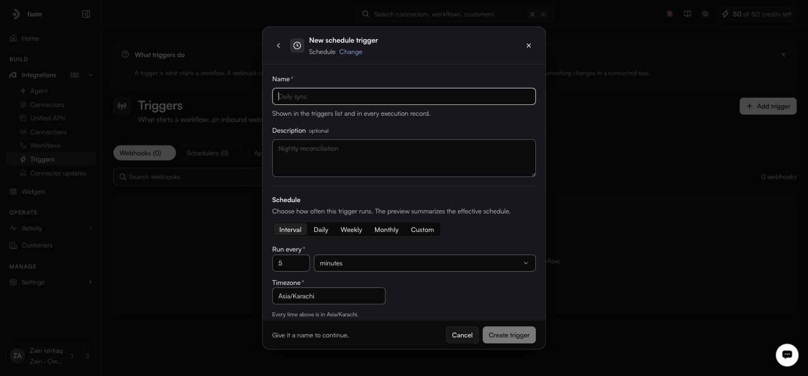

# Schedule triggers

A schedule trigger fires on a clock you set — nightly reconciliation, hourly pulls, anything time-based.

**Columns:** `Name`, `Tenant`, `Schedule`, `Next run`, `Last run`, `Status`, `Failures`, `Timezone`, `Routes`, `Created`, `Actions`.

### Create a schedule trigger



#### Name it

From **Add trigger**, choose **Schedule**, and give it a **Name** (and an optional **Description**).

<figure><figcaption>Interval is the default mode, and the timezone defaults to your browser's.</figcaption></figure>



#### Pick a mode and set the schedule

Five modes:

| Mode         | Configure                                                                                         |
| ------------ | --------------------------------------------------------------------------------------------------- |
| **Interval** | The default. **Run every** *n* + `minutes` / `hours` / `days`, with a live preview — *Every 5 minutes*. |
| **Daily**    | **Time**, defaulting to 09:00.                                                                     |
| **Weekly**   | S–M–T–W–T–F–S toggles, and a time.                                                                 |
| **Monthly**  | **Day of month**, 1–31 — one day, not several — and a time.                                        |
| **Custom**   | **Cron expression**, required. *Standard 5-field cron: minute hour day-of-month month day-of-week*  |



#### Set the timezone and start

**Timezone** is required and defaults to your browser's zone — not your organisation's, and not the one on [your profile](../../manage/profile.md), which only controls how times are displayed to you. Two more fields sit alongside it: **Starts at**, optional, and **Run immediately on create**, a checkbox.



#### Add routes, with a payload if the workflow needs one

Routes on a schedule trigger carry one field the other two do not: **Payload (JSON)**, optional, which is the body handed to the workflow when there is no inbound request to supply one.



#### Set the advanced options, if you need them

**Scheduler ID** (optional), **Delay (minutes)** (default 0) and **Keep failed deliveries**.



#### Save

The trigger joins the **Schedulers** list. Its row menu adds **Trigger Now** to the usual set — that is how you fire a nightly job without waiting for the night.




Every time on this form is interpreted in the timezone you pick, not the viewer's. If your team is spread out, agree on one and stay with it.

