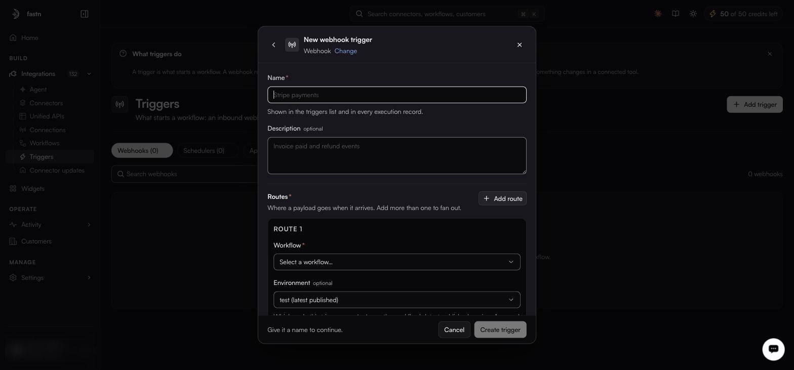
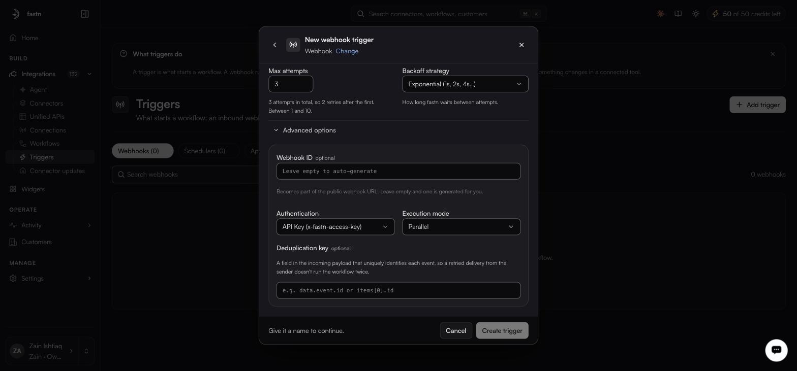

# Webhook triggers

A webhook trigger fires when another system calls a URL you give it. Nothing is polled.

**Columns:** `Name`, `Tenant`, `Type`, `Status`, `Auth`, `Routes`, `Created`.

### Create a webhook trigger



#### Name it

From **Add trigger**, choose **Webhook**.

<figure><figcaption>Routes are required — a webhook with none has nowhere to send its payload.</figcaption></figure>

| Field           | Notes                                                       |
| --------------- | ------------------------------------------------------------- |
| **Name**        | Required. Shown in the list and on every execution record.   |
| **Description** | Optional.                                                   |



#### Add at least one route

A route says where a payload goes when it arrives. Routes are required, and **Add route** creates more than one, which fans a single inbound call out to several workflows.

| Field           | Notes                                                                                                   |
| --------------- | --------------------------------------------------------------------------------------------------------- |
| **Workflow**    | Required. Which workflow this route runs.                                                                |
| **Environment** | Optional. `test (latest published)` runs the workflow's latest published version; `live` runs what is deployed to Live. |
| **Headers**     | Optional key/value pairs sent with the request to the workflow. Use for a key the workflow needs to call back to the sender. |



#### Set delivery attempts

How many times in total fastn tries to deliver an event to the workflow, counting the first try. Once the attempts are exhausted the delivery is recorded as failed; you replay it from [Activity → Events](../../operate/events.md), which has a **Replay** column on every row.

| Field                | Range / options                                      | Default          |
| -------------------- | ------------------------------------------------------ | ---------------- |
| **Max attempts**     | 1–10. `1` means try once and never retry.             | 3                |
| **Backoff strategy** | `Exponential (1s, 2s, 4s…)`, `Linear`, `Fixed`        | Exponential      |



#### Set the advanced options, if you need them

<figure><figcaption>Advanced options start collapsed; the defaults shown here suit most senders.</figcaption></figure>

| Field                 | Notes                                                                                                                                    |
| --------------------- | ------------------------------------------------------------------------------------------------------------------------------------------ |
| **Webhook ID**        | Optional. Becomes part of the public webhook URL. Leave empty and one is generated.                                                      |
| **Authentication**    | **API Key (x-fastn-access-key)**, the default — callers must send the header. **None (public)** — anyone with the URL can fire it.        |
| **Execution mode**    | **Parallel**, the default — concurrent events run concurrently. **Sequential** — one at a time, in arrival order.                         |
| **Deduplication key** | Optional. A field in the incoming payload that uniquely identifies each event, so a retried delivery from the sender does not run the workflow twice. |



#### Save, then hand out the URL

Save the trigger and it joins the **Webhooks** list. Its row menu offers **Copy URL**, **Copy as cURL**, **Disable**, **Edit** and **Delete** — **Copy as cURL** is the fastest way to fire one by hand while you are debugging.




Only use **None (public)** when the sender genuinely cannot set a header, and pair it with a deduplication key and a workflow that validates its own payload.



Sequential mode plus a deduplication key is the combination that makes a webhook-driven sync idempotent. Worth setting up front rather than after the first duplicate-record incident.

