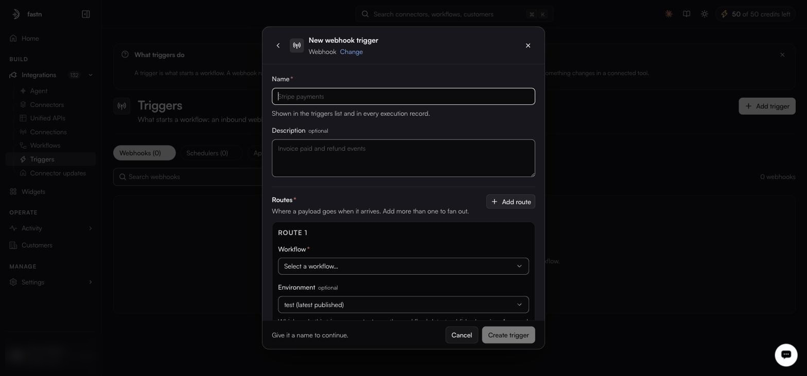
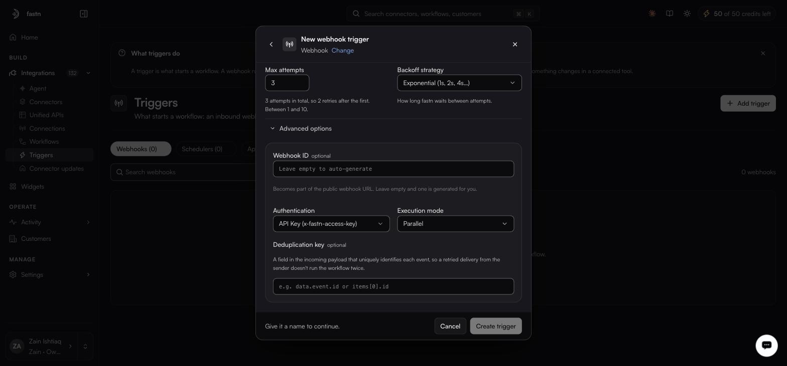

# Webhook triggers

**Integrations → Triggers** — in your dashboard, `/integrations?tab=triggers`.

A webhook trigger fires when another system calls a URL you give it. Nothing is polled.


**Looking for triggers somewhere else?** They used to sit under Settings and under Activity. Both of those paths now redirect to **Integrations**, which is the one place triggers are created and listed. App-level webhooks are the neighbouring **App webhooks** tab.


**Columns:** `Name`, `Tenant`, `Type`, `Status`, `Auth`, `Routes`, `Created`.

* **`Auth`** reads `API key` where the webhook requires the `x-fastn-access-key` header, or `None (public)` where anyone with the URL can fire it. It is the column to scan if you are auditing exposure.
* **`Tenant`** is the customer the trigger belongs to, and reads `—` for org-level triggers.

Unlike the Schedulers and App events tables, this one ships **no `Actions` header**: the row menu is still there at the end of each row, the column simply has no title. That is a quirk of the product, not a missing feature.

### Can the agent do this for me?

Yes. The AI builder can bind triggers as part of building a workflow — webhook, schedule and app-event triggers are all actions it can take, so "run this whenever my store sends an order webhook" is a reasonable thing to ask for in plain language rather than wiring by hand.

What the agent binds is the trigger-to-workflow connection. You still come to this screen to read the URL it created, to copy it as cURL while debugging, or to disable or delete it. Build it by hand when you want control over the routes, the delivery attempts and the auth up front; ask the agent when you want the workflow and its trigger created together.

### Create a webhook trigger by hand



#### Name it

From **Add trigger**, choose **Webhook**.

<figure><figcaption>Routes are required, a webhook with none has nowhere to send its payload.</figcaption></figure>

| Field           | Notes                                                       |
| --------------- | ------------------------------------------------------------- |
| **Name**        | Required. Shown in the list and on every execution record.   |
| **Description** | Optional.                                                   |



#### Add at least one route

A route says where a payload goes when it arrives. Routes are required. Add more with **Add route** to fan a single inbound call out to several workflows.

| Field           | Notes                                                                                                   |
| --------------- | --------------------------------------------------------------------------------------------------------- |
| **Workflow**    | Required. Which workflow this route runs.                                                                |
| **Environment** | Optional. `test (latest published)` runs the workflow's latest published version. **Any other option is one of your org's named environments** (see [Environments](../../manage/environments.md)) and runs the version deployed there, and **if nothing is deployed there, the fire fails**. Every org starts with one named environment, `Live`. |
| **Headers**     | Optional key/value pairs sent with the request to the workflow. Use for a key the workflow needs to call back to the sender. |



#### Set delivery attempts

How many times in total fastn tries to deliver an event to the workflow, counting the first try. Once the attempts are exhausted the delivery is recorded as failed, and you replay it from [Activity → Events](../../operate/events.md), where every row carries a **Replay** action.


**Finding the failed one is the hard part.** Events filters by source (`All`, `Webhook`, `Scheduled`, `Manual`) and has **no status filter**, so on a busy org you cannot list failures directly. Search Events by the trigger's name and look for a row whose status is not `Delivered`. The create-trigger form calls this destination *Failed deliveries*; there is no view by that name: Activity → Events is where the events actually are.


| Field                | Range / options                                      | Default          |
| -------------------- | ------------------------------------------------------ | ---------------- |
| **Max attempts**     | 1–10. `1` means try once and never retry.             | 3                |
| **Backoff strategy** | `Exponential (1s, 2s, 4s…)`, `Linear`, `Fixed`        | Exponential      |



#### Set the advanced options, if you need them

<figure><figcaption>Advanced options start collapsed; the defaults shown here suit most senders.</figcaption></figure>

| Field                 | Notes                                                                                                                                    |
| --------------------- | ------------------------------------------------------------------------------------------------------------------------------------------ |
| **Webhook ID**        | Optional. Becomes part of the public webhook URL. Leave empty and one is generated.                                                      |
| **Authentication**    | **API Key (x-fastn-access-key)**, the default (callers must send the header. **None (public)**), anyone with the URL can fire it.        |
| **Execution mode**    | **Parallel**, the default (concurrent events run concurrently. **Sequential**), one at a time, in arrival order.                         |
| **Deduplication key** | Optional. A field in the incoming payload that uniquely identifies each event, so a retried delivery from the sender does not run the workflow twice. |



#### Create it, then hand out the URL

Select **Create trigger** (there is no Save button) and it joins the **Webhooks** list. Its row menu offers **Copy URL**, **Copy as cURL**, **Disable**, **Edit** and **Delete**: **Copy as cURL** is the fastest way to fire one by hand while you are debugging.




Only use **None (public)** when the sender genuinely cannot set a header, and pair it with a deduplication key and a workflow that validates its own payload.



Sequential mode plus a deduplication key is the combination that makes a webhook-driven sync idempotent. Worth setting up front rather than after the first duplicate-record incident.

