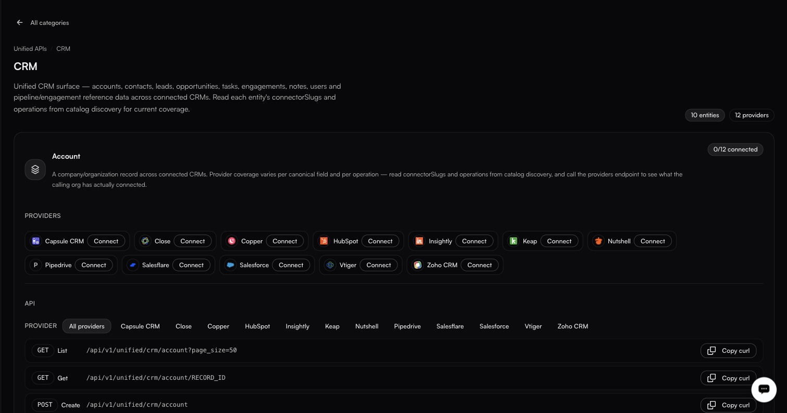

# Unified APIs

**Integrations → Unified APIs** · `/integrations?tab=unified`

<figure><figcaption></figcaption></figure>

Three of your customers use three different CRMs. Without a unified API, your code branches three ways for what is conceptually one operation: create a contact. With one, you call a single endpoint and fastn routes to whichever provider that customer authorised.

> One canonical endpoint per business entity, served by whichever providers your org connects.

### Categories and entities

A **category** is a domain. An **entity** is a business object inside it. Each entity is backed by one or more **providers**. There are five categories, shown with a `5 categories` chip and a **Search categories** box: **CRM**, **Documents**, **Knowledge Base**, **Messaging** and **Project Management**. A search that matches nothing reads `No categories match` / *Try another search.*

| Category      | Entities                                                                                                      | Providers (slugs)                                             |
| ------------- | ------------------------------------------------------------------------------------------------------------- | ------------------------------------------------------------ |
| **CRM**       | `Account`, `Contact`, `Engagement`, `Engagement Type`, `Lead`, `Note`, `Opportunity`, `Stage`, `Task`, `User` | 12 providers, including `hubspot`, `salesforce` and `zohoCrm` |
| **Documents** | `Document`, `Document Content`                                                                                 | `googleDocs`, `notion`                                       |
| **Messaging** | `Channel Message`, `Direct Message`                                                                            | `microsoftTeams`, `slack`                                    |

The provider slugs are what you use in the API; the cards show display names.

Knowledge Base and Project Management are the two newest categories; their entities and providers are shown when you open them in the product.

### Inside a category

<figure><figcaption></figcaption></figure>

Opening a category swaps the pane for a detail view with the breadcrumb **Unified APIs / \<Category>** and two chips, *N entities* and *N providers*. **The URL does not change when you do this**, so there is no link you can send someone that opens a category directly.

Each entity gets its own block showing:

* **Connection state** — `0/1 connected`, `0/3 connected`. How many of the backing providers this customer has authorised.
* **PROVIDERS** — one row per provider, with a **Connect** button, or **Connected** and a `⋯` menu offering **Add another connection** and **Disconnect default**.
* **API** — the endpoints, filtered by an **All providers** selector, each row with **Copy curl**.

Endpoints follow a consistent shape:

```http
GET  /api/v1/unified/crm/account?page_size=50
GET  /api/v1/unified/crm/account/RECORD_ID
POST /api/v1/unified/crm/account
```

```http
POST /api/v1/unified/crm/note
```

Not every entity supports every verb. `Note` and both Messaging entities — `Channel Message` and `Direct Message` — are create-only.

### Choosing between unified and direct

| Use a unified API when                                      | Use the connector directly when                             |
| ------------------------------------------------------------ | ------------------------------------------------------------ |
| Several providers do the same job for different customers   | You need a field or action only one provider has            |
| You want one code path regardless of the customer's stack   | The operation has no meaningful equivalent elsewhere        |
| The fields you need are common across providers             | You are already deep in one vendor's model                  |

The two are not exclusive — a workflow can use a unified endpoint for the common path and a direct connector action for the vendor-specific part.

### The All providers filter

Above the endpoint list, **All providers** shows the canonical surface; picking a single provider shows how that one behaves. Useful when a provider has a quirk you need to design around.
