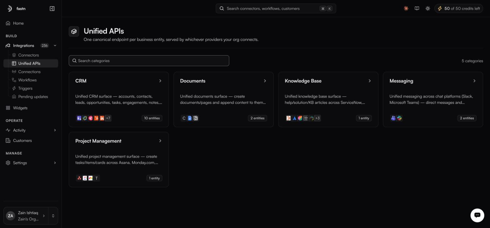

# Unified APIs

**Integrations → Unified APIs** · `/integrations?tab=unified`

<figure><figcaption></figcaption></figure>

Three of your customers use three different CRMs. Without a unified API, your code branches three ways for what is conceptually one operation: create a contact. With one, you call a single endpoint and fastn routes to whichever provider that customer authorised.

> One canonical endpoint per business entity, served by whichever providers your org connects.

### Categories and entities

A **category** is a domain. An **entity** is a business object inside it. Each entity is backed by one or more **providers**. There are five categories, shown with a `5 categories` chip and a **Search categories** box: **CRM**, **Documents**, **Knowledge Base**, **Messaging** and **Project Management**. A search that matches nothing reads `No categories match` / *Try another search.*

| Category      | Entities                                                                                                      | Providers (slugs)                                             |
| ------------- | ------------------------------------------------------------------------------------------------------------- | ------------------------------------------------------------ |
| **CRM**       | `Account`, `Contact`, `Engagement`, `Engagement Type`, `Lead`, `Note`, `Opportunity`, `Stage`, `Task`, `User` | 12 providers, including `hubspot`, `salesforce` and `zohoCrm` |
| **Documents** | `Document`, `Document Content`                                                                                 | `googleDocs`, `notion`                                       |
| **Messaging** | `Channel Message`, `Direct Message`                                                                            | `microsoftTeams`, `slack`                                    |

The provider slugs are what you use in the API; the cards show display names.

Knowledge Base and Project Management are the two newest categories; their entities and providers are shown when you open them in the product.

### In this section

* [Inside a category](inside-a-category.md)
* [Unified vs direct](unified-vs-direct.md)
