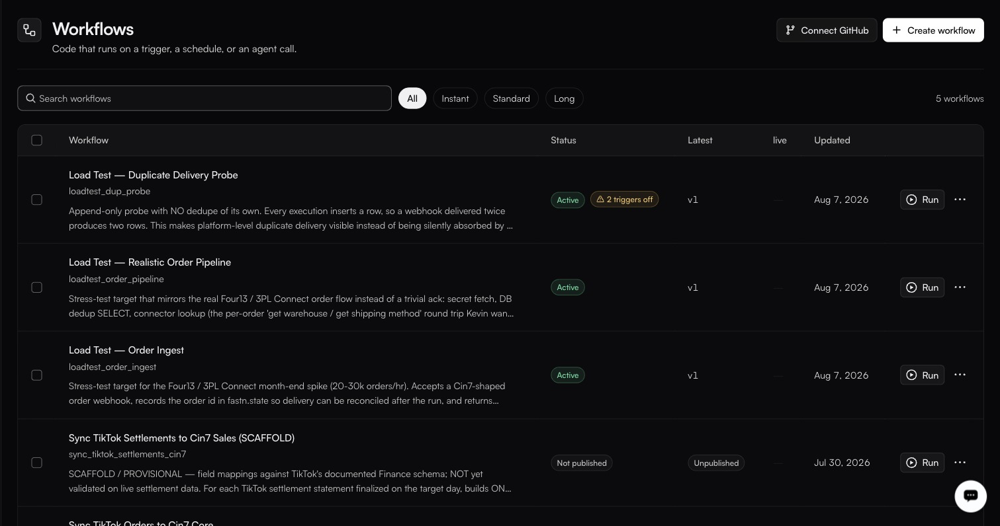

# Workflows

**Integrations → Workflows** · `/integrations?tab=workflows`

<figure><figcaption></figcaption></figure>

A workflow is JavaScript. One file, `<slug>.js`, exporting one function:

```javascript
export default async function (ctx) {
  // ctx.input, ctx.headers, ctx.connectors
}
```

There is no node palette and no drag-and-drop step builder. Everything else on this screen configures, describes, tests or deploys that function.

### The list

| Column         | Notes                                                                          |
| -------------- | -------------------------------------------------------------------------------- |
| checkbox       | Selects rows.                                                                   |
| **Workflow**   | Name, slug and description.                                                     |
| **Status**     | `Active` or `Not published`.                                                    |
| **Latest**     | `v2`, or `Unpublished` when no snapshot exists yet.                             |
| **live**       | Which version is deployed to the live environment, if any.                      |
| **Updated**    | Last change.                                                                    |
| **Run** + **⋯** | Run executes on demand; the `⋯` menu holds **Edit** and **Delete**.            |

Three status tooltips explain the unpublished state, and the middle one is the string you will search for when a call fails:

> Never published — this workflow cannot run yet.

> Every call returns WORKFLOW\_NOT\_PUBLISHED until a snapshot is published

> Nothing deployed to Live.

**Search workflows** filters by name; pills split the list by execution tier — **All**, **Instant**, **Standard**, **Long**.

Two buttons sit top-right: **Connect GitHub**, which connects the workspace to a GitHub repository, and **Create workflow**, which gives you an empty one.

### In this section

* [The editor](the-editor.md)
* [The tabs](the-tabs.md)
* [Lifecycle](lifecycle.md)
