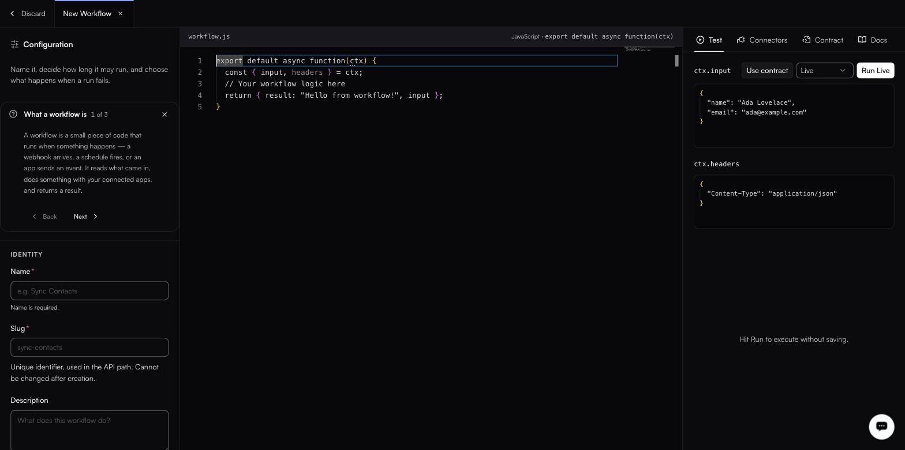
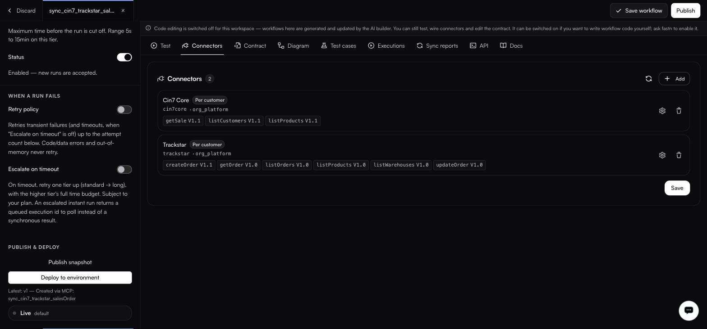

# The workflow editor, tab by tab

<figure><figcaption>The workflow editor — Configuration on the left, the JavaScript code in the middle, the Test panel on the right.</figcaption></figure>

Opening a workflow — **Create workflow**, or **Edit** from a row's `⋯` menu — drops you into a three-column drawer: **Configuration** on the left, the `<slug>.js` code in the middle, and the tool tabs on the right. This is roughly the order you move through it.



#### Set up Configuration

Under **Identity**, give it a **Name** (required) and, on a new workflow, a **Slug** — the slug is fixed once the workflow exists, so choose it deliberately. **Description** is free text. Under **Execution**, pick an **Execution tier**: `Instant` runs synchronously and caps at 30s, `Standard` returns `202` and runs up to 15 min, `Long` returns `202` and runs up to 36 h. The **Execution timeout** slider is then constrained to that tier.

Full ranges and defaults are in the Configuration panel reference below.



#### Decide what happens when a run fails

**Retry policy** is off by default; turning it on exposes **Max attempts**, **Initial interval (ms)**, **Backoff coefficient** and **Max interval (ms)**. It only retries transient failures — code errors, data errors and out-of-memory never retry. **Escalate on timeout** is a separate toggle that retries one tier up on a timeout, and is hidden on the `Long` tier.



#### Write the function

The middle column is one `<slug>.js` file exporting `export default async function (ctx)`. You reach the request through `ctx.input` and `ctx.headers`, and connected systems through `ctx.connectors` and `fastn.*`.

Where a workspace has code editing switched off, the file is generated and updated by the AI builder instead — you change behaviour by talking to the [agent](../agent/README.md), and everything else on this screen still works.



#### Test it — `Test` tab

Put a body in the `ctx.input` editor and headers in `ctx.headers`, or press **Use contract** to fill the input from the declared contract. Pick what the run actually touches — `Live`, `Partial Mock` or `Fully Mock` — then **Run Live** (or **Run**).



#### Check the wiring — `Connectors` tab

Every `fastn.connectors.X.Y(…)` call in your code is extracted here each time you save, so this tab is a readout of what the workflow actually talks to. **Add** covers anything you need to wire by hand.



#### Declare the shape — `Contract` tab

**Input contract** and **Output contract**, each viewable as **JSON** or **Schema**. Paste an example payload in the JSON view and the schema is generated live; the schema is the contract, and is hand-editable.



#### Read the logic back — `Diagram` tab

**Flow**, **Sequence** and **Docs** are all generated from the code and read-only — you edit the code and they follow. **Docs** carries an **End user** / **Technical** toggle and consumes AI credits when you **Regenerate**.



#### Confirm the scenarios — `Test cases` tab

The cases drafted during the build, grouped `happy-path`, `pagination`, `fields`, `edge-cases` and `error-handling`, each row an id such as `TC-01` with a `LIVE` or `MOCK` badge.



#### Watch it run — `Executions` tab

This workflow's own run history, filtered by the HTTP-status pills `All`, `200`, `201`, `400`, `404`, `422`, `500`. The neighbouring **Sync reports** tab fills in the first time the workflow runs `fastn.diff.compare`.



#### Hand it to callers — `API` and `Docs` tabs

**API** gives the `POST …/api/v1/workflows/<wfId>/execute` endpoint with a copyable curl and the two headers that steer it, `X-fastn-Test-Mode` and `x-fastn-env`. **Docs** is the runtime reference for what `ctx` and `fastn.*` expose inside the function.



### The editor

Opening a workflow opens a drawer with three columns: **configuration on the left, the code editor in the middle, and nine tool tabs on the right**. The middle column is labelled `<slug>.js` and `JavaScript · export default async function(ctx)`.

Along the top: **Discard**, the workflow name, **Close tab**, **Save workflow** and **Publish**. Closing with unsaved edits asks first — *Discard unsaved changes?* / "This workflow has edits that have not been saved. Closing the tab throws them away." / **Keep editing** / **Discard changes**.

<figure><figcaption>Deploy to environment sits under Publish snapshot, with the latest version noted beneath it.</figcaption></figure>

#### Configuration panel

**Identity**

| Field           | Notes                                                                             |
| --------------- | ----------------------------------------------------------------------------------- |
| **Name**        | Required. Empty saves are refused with *Name is required.*                         |
| **Slug**        | Required when you create the workflow, and **cannot be changed afterwards**.        |
| **Description** | What it does. The agent writes one; edit freely.                                    |

**Execution**

| Field                 | Notes                                                                                     |
| --------------------- | ------------------------------------------------------------------------------------------- |
| **Execution tier**    | `Instant` (default) — synchronous, result inline, max 30s. `Standard` — asynchronous via Temporal, returns 202, max 15 min. `Long` — asynchronous, returns 202, max 36 h. |
| **Execution timeout** | A slider constrained to the tier: 1s–30s, 5s–15min, or 30s–36h. Defaults are 30s, 2.0m and 15.0m respectively. |
| **Status**            | A toggle, on by default, and shown only on workflows that already exist. Off stops new runs without deleting anything. |

**WHEN A RUN FAILS**

The **Retry policy** toggle is off by default. Its own description sets the boundary: it retries transient failures, and code errors, data errors and out-of-memory never retry. Turning it on exposes four fields.

| Field                    | Range | Default |
| ------------------------ | ----- | ------- |
| **Max attempts**         | 1–10  | 3       |
| **Initial interval (ms)** | —    | 5000    |
| **Backoff coefficient**  | —     | 2       |
| **Max interval (ms)**    | —     | 60000   |

**Escalate on timeout** is a separate toggle, off by default and hidden on the Long tier. On timeout it retries one tier up — instant → standard — and an escalated instant run returns a queued execution id to poll rather than a synchronous result.

**PUBLISH & DEPLOY** (existing workflows only)

* **Publish snapshot** — freezes the current code and configuration as a version.
* **Deploy to environment** — sends a published version to an environment.
* Underneath: a row showing the environment's current status.
