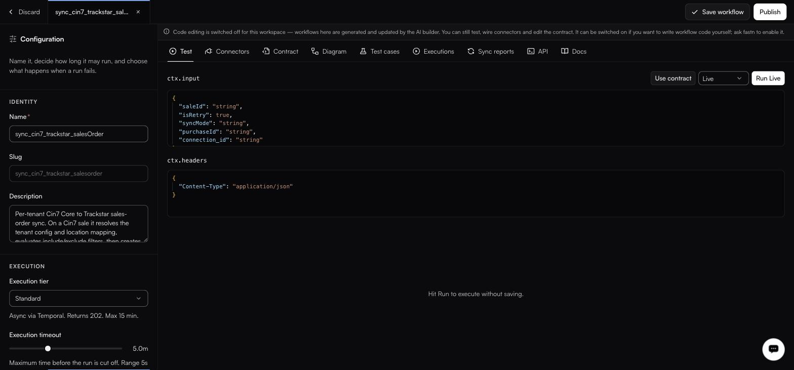
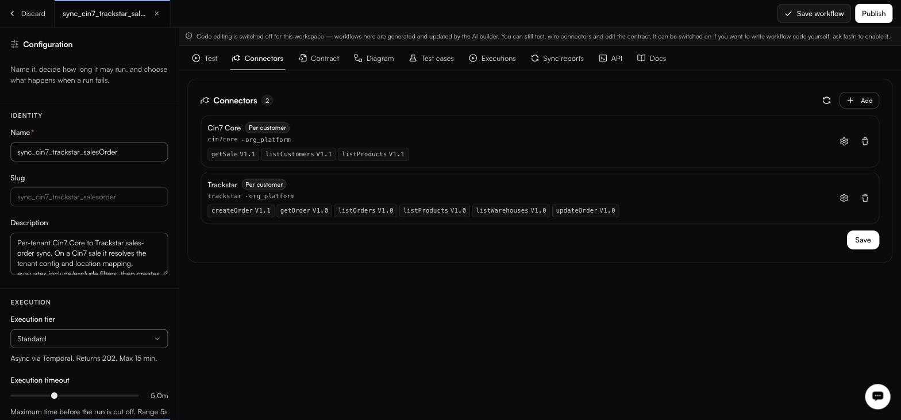
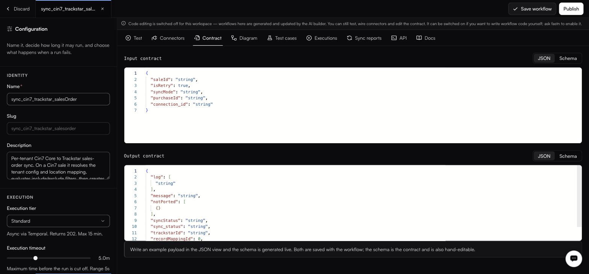
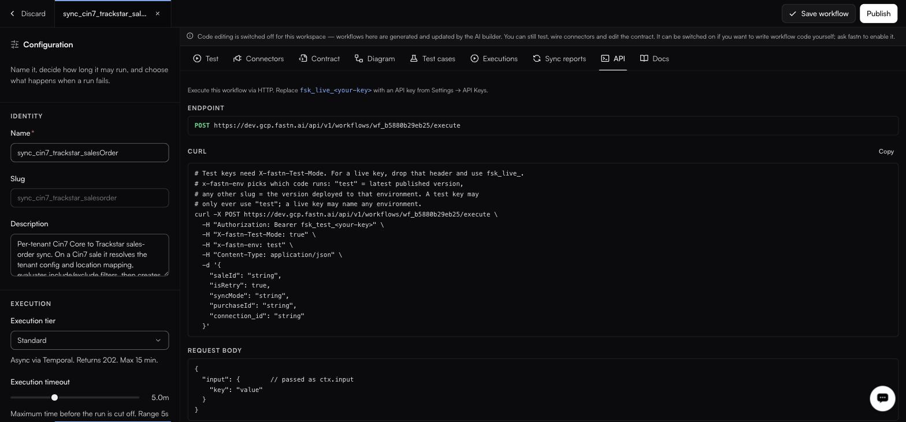

# The tabs

#### Test

<figure><figcaption>Until you run it, the result pane just reads Hit Run to execute without saving.</figcaption></figure>

Two JSON editors, `ctx.input` and `ctx.headers`. **Use contract** fills the input from the declared contract. The mode select beside the run button chooses what the run actually calls:

| Mode             | What runs                            |
| ---------------- | -------------------------------------- |
| **Live**         | Real calls to the connected systems.  |
| **Partial Mock** | A mix of real calls and stubs.        |
| **Fully Mock**   | Stubs only.                           |

Then **Run Live** (or **Run**).

#### Connectors

<figure><figcaption>Every action chip carries its pinned version, such as getSale V1.1.</figcaption></figure>

This list is **auto-extracted from the `fastn.connectors.X.Y(…)` calls in your code every time you save** — it is a readout of the code, not a separate configuration. **Add** exists for anything you need to wire manually. Each row shows a **Per customer** badge where it applies, plus the connector slug, the owning org, the action and its version.


Pinned action versions are what stop an upstream change breaking you silently. When fastn proposes a newer action, it arrives through [Pending updates](../connector-updates.md) for you to accept.


#### Contract

<figure><figcaption>Both editors sit on JSON here; the Schema view holds the generated contract.</figcaption></figure>

**Input contract** and **Output contract**, each viewable as **JSON** or **Schema**. Write an example payload in the JSON view and the schema is generated live. The schema is the contract, and is also hand-editable.

#### Diagram

Three sub-tabs.

**Flow** — a read-only React Flow rendering, generated from your code. Node kinds are `TRIGGER`, `DECISION`, `READ` and `DONE`; the controls are Zoom In, Zoom Out and Fit View. You cannot edit the graph. Edit the code and the graph follows.

**Sequence** — the same logic as an ordered list of phases.

**Docs** — generated documentation, with an **End user** / **Technical** toggle, an **Out of date** badge when the code has moved on, and **Regenerate** / **Generate**.

The end-user document has eight sections: *What this integration does*, *Before you start*, *Connected apps*, *How it works*, *Field mapping*, *Smart features*, *When it runs*, *Troubleshooting*.


Generating or regenerating these docs consumes AI credits from the workspace allowance shown in the top bar.


#### Test cases

Scenarios generated during the build, organised into groups — `happy-path`, `pagination`, `fields`, `edge-cases`, `error-handling`. The header carries pass, fail and untested counters. Each row is an id such as `TC-01`, a `LIVE` or `MOCK` badge, and the expectation.

#### Executions

This workflow's run history, filtered by status pills: **All**, **200**, **201**, **400**, **404**, **422**, **500**. The workspace-wide view is [Activity → Executions](../../operate/executions.md).

#### Sync reports

> A report appears the first time a workflow runs fastn.diff.compare.

See [Sync reports](../../operate/sync-reports.md).

#### API

<figure><figcaption>Generated from the deployment you are actually calling — copy the curl from here rather than from docs.</figcaption></figure>

How to call this workflow over HTTP, with a copyable curl:

```http
POST https://app.fastn.dev/api/v1/workflows/<wfId>/execute
```

Two headers steer it — `X-fastn-Test-Mode` and `x-fastn-env` — and you authenticate with an API key in the `fsk_live_…` format. Covered in full in the [HTTP API reference](../../reference/api.md).

#### Docs

The runtime reference for the code you are writing:

| Surface                 | For                                                              |
| ----------------------- | ------------------------------------------------------------------ |
| `ctx.input`             | The request body, shaped by the input contract.                   |
| `ctx.headers`           | The request headers.                                              |
| `ctx.connectors`        | The connectors wired to this workflow.                            |
| `fastn.envConfig`       | Per-environment values — see [Configs](../../manage/configs.md).      |
| `fastn.unified`         | The [unified API](../unified-apis/README.md) surface.                        |
| `fastn.connector`       | A connector call.                                                  |
| `fastn.db`              | The workspace Postgres schema — see [Database](../../manage/database.md). |
| `fastn.state`           | Key/value state, with scopes `ORG` and `INVOCATION`.               |
| `fastn.secrets`         | Encrypted values — see [Secrets](../../manage/secrets.md).            |

Multi-tenant calls are addressed with headers: `x-end-org-id`, `x-end-org-ref`, `x-installation-id`, `x-fastn-connections`, `x-fastn-installation-config`.


This tab uses `fastn.connector` (singular) while the Connectors tab extracts from `fastn.connectors.X.Y(…)` (plural). Both spellings appear in the product; check the Docs tab in your own workspace before relying on either.


Fuller treatment in [Workflow runtime API](../../reference/workflow-runtime.md).
