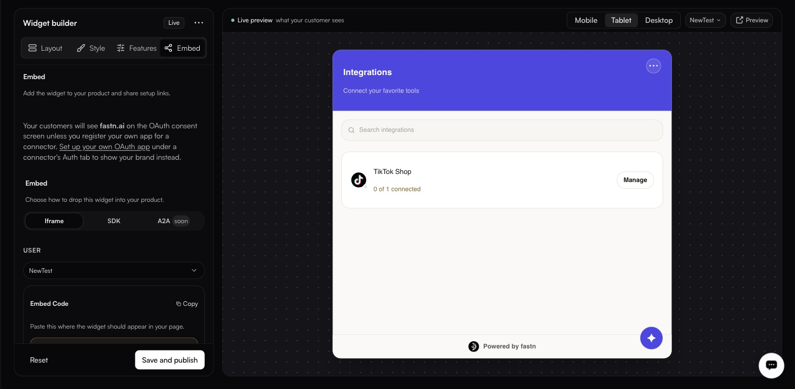

# Embedding the widget

**Widgets → Embed**

<figure><figcaption>The preview follows the selected user — pick one and the panel shows that customer's real connection state, not a mock-up.</figcaption></figure>

Pick a **USER** at the top — the widget is always scoped to one of your customers, and the selector scopes the snippet the tab generates — then choose how to mount it.

| Method     | Requirement                          | Status      |
| ---------- | ------------------------------------ | ----------- |
| **Iframe** | Anywhere you control HTML            | Available   |
| **SDK**    | You can run JavaScript               | Available   |
| **A2A**    | Agent-to-agent                       | Coming soon |

## Shareable links

Instead of a snippet, send a link. It keeps working until you revoke it, and the URL carries no token.


The reference in a shareable link *is* the credential. Treat the link itself as a secret — anyone who has it can act as that customer.


Create links per customer under **Shareable links** on the Embed tab. Each row offers **Copy**, **Show** and **Revoke**.

### In this section

* [Iframe](iframe.md)
* [SDK](sdk.md)
* [Token API](token-api.md)
