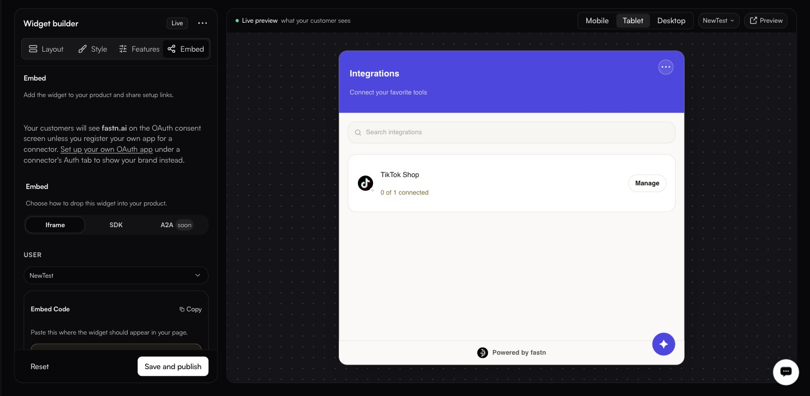

# Embedding the widget

**Widgets → Embed**

<figure><figcaption>The preview follows the selected user, pick one and the panel shows that customer's real connection state, not a mock-up.</figcaption></figure>

## Pick the customer first

The widget is always scoped to **one** of your customers, so the **USER** dropdown at the top is not a preview toggle. It decides who the generated snippet is for.

The dropdown lists the customers on your account, by their identifier, for example `test-tenant`. Selecting one does two things at once:

* the preview beside it shows **that customer's real connection state**, not a mock-up, so `TikTok Shop, 0 of 1 connected` is the truth for that customer
* the **Embed Code** block regenerates with a token scoped to them

If the dropdown is empty, you have no customers yet. Create one under [Customers](../../operate/customers.md) first.

Then choose how to mount it.

| Method     | Requirement                          | Status      |
| ---------- | ------------------------------------ | ----------- |
| **Iframe** | Anywhere you control HTML            | Available   |
| **SDK**    | You can run JavaScript               | Available   |
| **A2A**    | Agent-to-agent                       | Coming soon |


**The snippet on this tab contains a live token.** It is there so you can paste it and see the widget working in seconds, and it is not safe for production: anyone with the URL can act as that customer until the token expires.

For production, mint short-lived tokens from your backend and keep them out of the URL. The [SDK](sdk.md) is built for that pattern, and the [Token API](token-api.md) is how you mint them.


## Shareable links

Instead of a snippet, send a link. It keeps working until you revoke it, and the URL carries no token.


The reference in a shareable link *is* the credential. Treat the link itself as a secret: anyone who has it can act as that customer.


#### Creating one

1. Go to **Widgets → Embed** and pick the customer in the **USER** dropdown. **Create link** stays disabled until you do — with nobody selected the card reads *Pick a customer above first.*
2. In the **Shareable links** card, select **Create link**.
3. The new row appears badged **New**.

Each row identifies itself by the last few characters of its id rather than printing the credential as a headline, and carries its own state:

| State | Meaning |
| ----- | --------- |
| **Never used** | Created, not yet opened. |
| **Used N times** | How many times it has been opened. |
| **Revoked** | You revoked it. It will not load. |
| **Expired** | It passed its expiry. It will not load. |

**Copy** works without revealing anything. **Show** reveals the URL on that row, on request only. **Revoke** is immediate, and a revoked or expired link offers neither — handing one over is only a way to give someone something that will not load.

A shareable link suits the cases where you cannot embed at all: onboarding a customer before they have access to your product, letting someone connect their accounts from an email, or handing a link to a customer's IT team to authorise on their behalf. **Revoke** is immediate, and it is the only way to withdraw one.

### In this section

* [Iframe](iframe.md)
* [SDK](sdk.md)
* [Token API](token-api.md)
