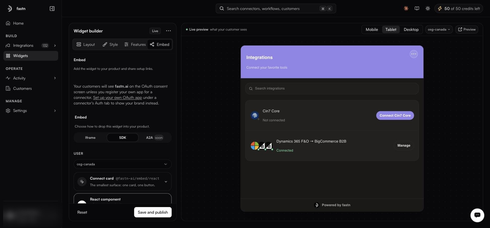

# SDK

<figure><figcaption>Each variant expands to the exact snippet for the user you selected.</figcaption></figure>

The SDK mounts the same iframe and adds what a raw tag cannot: events when a user connects an app, token refresh, live theming, and modal mode.

Four variants, depending on how much of the UI you want to own:

| Variant                  | Package path                | Use when                                                          |
| ------------------------ | --------------------------- | ------------------------------------------------------------------- |
| **React component**      | `@fastn-ai/embed/react`     | Your app is React and you want the whole panel.                    |
| **Connect card**         | `@fastn-ai/embed/react`     | You want the smallest surface: one card, one button.               |
| **Script tag**           | hosted bundle, no install   | Vue, Svelte, Rails, plain HTML — anything that runs JS.            |
| **Build your own UI**    | `@fastn-ai/embed/headless`  | The integrations screen has to look like the rest of your product.  |

### React

The confirmed exports are `FastnConnectCard`, `FastnHub` and `FastnProvider`; the headless entry point exposes the hooks `useConnectors`, `useConnections` and `useConnect`.

`FastnProvider` supplies the session the other components read, so wrap your tree in it rather than mounting `FastnHub` bare. Copy the exact props from the dashboard's generated snippet — they are rendered there for the user you selected.

### Script tag

Not an npm install: a hosted bundle you load with a `<script>` tag.

```html
<script src="https://YOUR_FASTN_HOST/api/v1/embed/assets/fastn-embed.min.js"></script>
```

```javascript
const hub = FastnEmbed.createFastnEmbed({ /* config from the Embed tab */ });

hub.mount('#hub');   // inline
hub.open();          // or as a modal

hub.on('connected', (e) => {
  // Refresh your app's data after the user connects an integration.
});
```

Because fastn hosts the screen, it gains features without you shipping a release, and its styles can never collide with yours.
