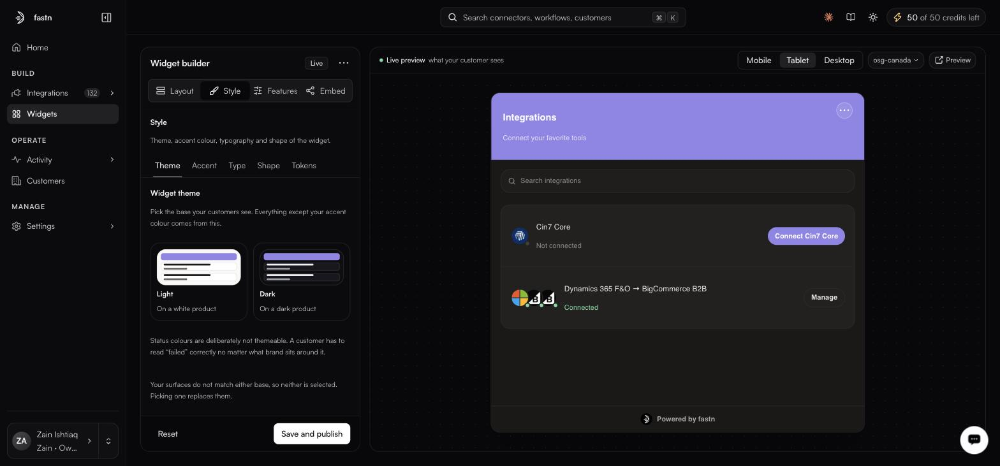

# Widget builder

**Widgets** — the Layout, Style and Features tabs. The Embed tab has its [own page](embedding.md).

### Integrations

Above the tabs, the **INTEGRATIONS** panel lists what appears in the widget, with a count. **Add** puts another integration in; the pencil edits one; the trash removes it. An integration that moves data between two systems shows both logos and a direction marker, such as `Dynamics 365 F&O → BigCommerce B2B  outbound →`.

This list is the offer. Everything else on this screen is presentation.

---

## Layout

<figure><figcaption></figcaption></figure>

**Header content**

| Field        | Notes                                                        |
| ------------ | -------------------------------------------------------------- |
| **Title**    | The heading across the top of the widget.                     |
| **Subtitle** | Shown under the title. Leave empty to hide it.                |

**Sections** toggles the blocks your customers see.

| Section                | Notes                                                                        |
| ---------------------- | ------------------------------------------------------------------------------ |
| **Header and branding** | Your title, subtitle and accent colour across the top.                       |
| **Search bar**         | Worth showing once there are more than about a dozen connectors.             |

---

## Style

<figure><figcaption></figcaption></figure>

Five sub-tabs: **Theme**, **Accent**, **Type**, **Shape**, **Tokens**.

**Theme** picks the base — **Light** for a white product, **Dark** for a dark one. Everything except your accent colour derives from it. If you have set custom surface colours that match neither base, the UI tells you: picking one replaces them.

**Accent** sets the colour used for primary actions. **Type** covers typography, **Shape** corner radius and density, and **Tokens** exposes the underlying design tokens for fine control.


Status colours are deliberately not themeable. A customer has to read "failed" correctly no matter what brand sits around it.


---

## Features

<figure><figcaption></figcaption></figure>

Optional capabilities your customers get inside the widget.

**Available now**

| Feature                | What it does                                                                              |
| ---------------------- | ------------------------------------------------------------------------------------------- |
| **Catalog connectors** | Shows all catalog connectors in the widget so end users can browse and connect them.       |
| **Workflow Diagram**   | Shows the generated flow diagram on a workflow inside the widget.                          |

**Coming soon**

| Feature                | What it will do                                        |
| ---------------------- | -------------------------------------------------------- |
| **Widget filter**      | Let end users filter widgets by category or status.     |
| **Role based access**  | Role-based access control per widget.                   |


**Catalog connectors** widens the offer from the integrations you curated to everything public in your catalogue. Useful for self-serve products, too broad for most. Decide deliberately.

