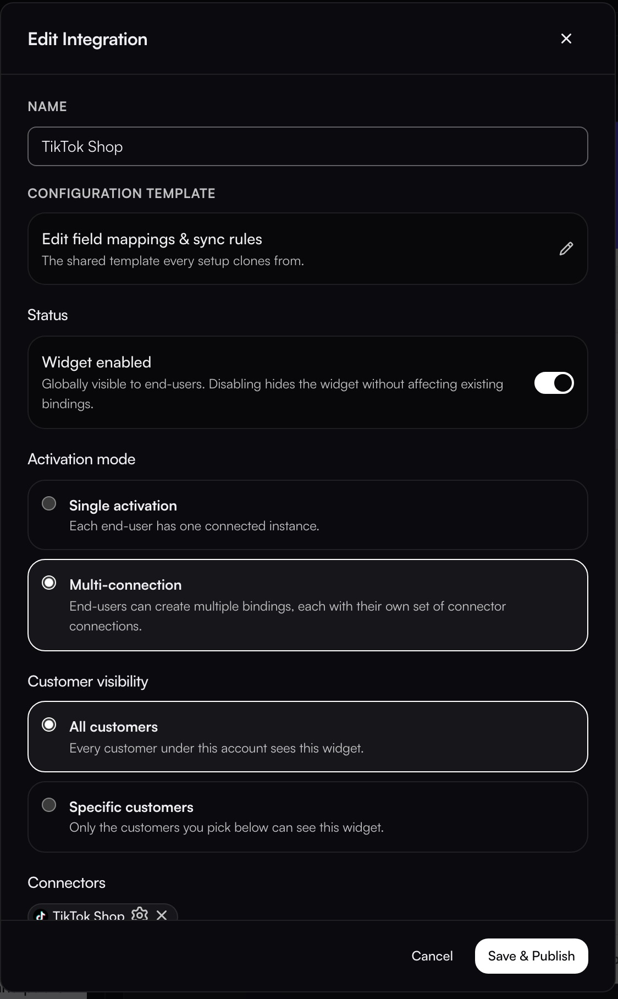
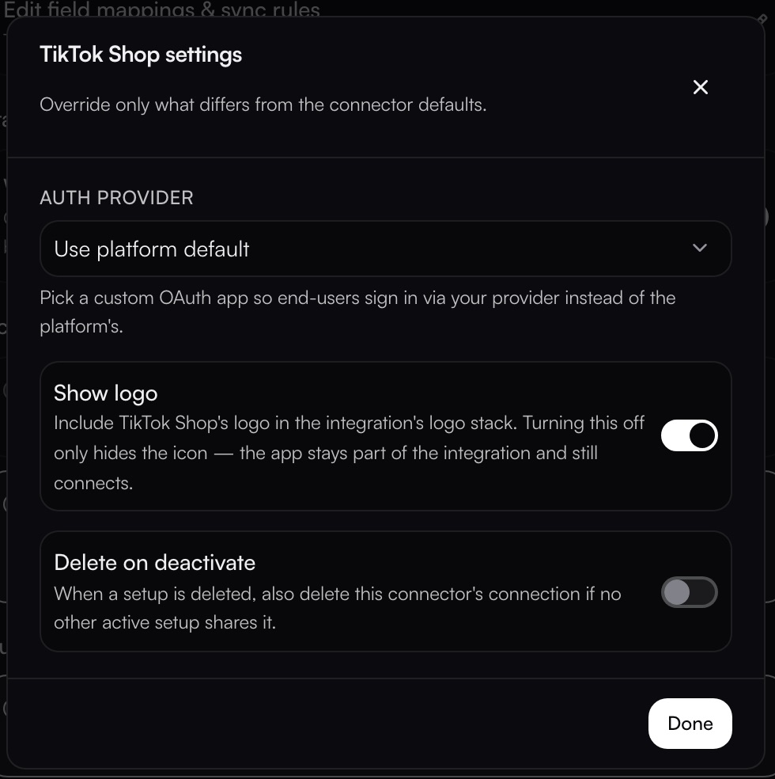
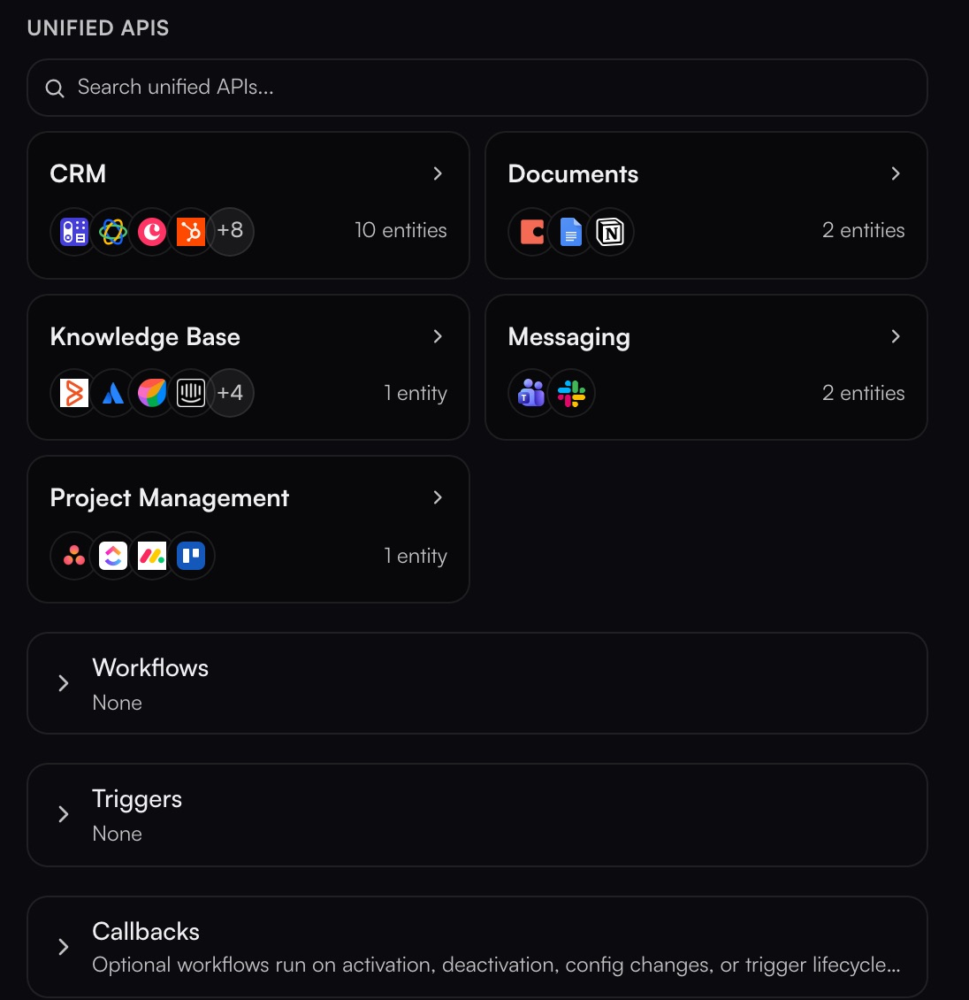
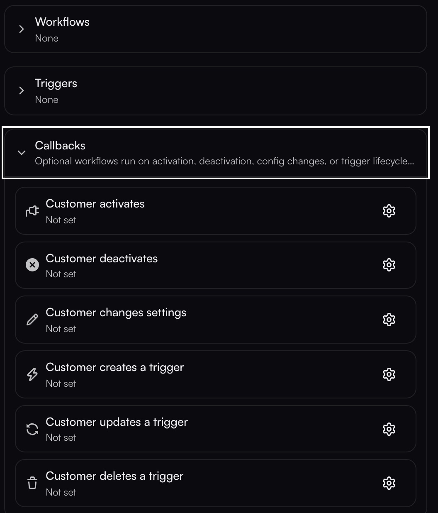

# Edit Integration

**Widgets → INTEGRATIONS → pencil on a row**

Each row in the INTEGRATIONS panel carries a status dot, a **pencil** and a **trash**. The pencil opens **Edit Integration**, and this dialog is where most of an integration's behaviour is configured. The trash removes the integration from the widget.

<figure><figcaption>Everything above the Connectors list: identity, status, activation mode and visibility.</figcaption></figure>

## Identity and template

| Field | What it does |
| ----- | ------------ |
| **NAME** | What the customer sees on the card |
| **CONFIGURATION TEMPLATE** | **Edit field mappings & sync rules**, described in the dialog as *the shared template every setup clones from*. Each customer's setup starts as a copy of this, so editing the template changes the starting point for new setups, not the ones already created |

## Status

**Widget enabled** is a switch: *globally visible to end-users*. Turning it off hides the widget **without affecting existing bindings**. Customers who already activated it keep running; new ones simply do not see it.

## Activation mode

How many times one end-user may connect this integration.

| Mode | Meaning |
| ---- | ------- |
| **Single activation** | Each end-user has one connected instance |
| **Multi-connection** | End-users can create multiple bindings, each with its own set of connector connections |

Pick **Multi-connection** when one customer legitimately has several accounts on the same system, such as two TikTok Shop storefronts.

## Customer visibility

| Option | Meaning |
| ------ | ------- |
| **All customers** | Every customer under this account sees this widget |
| **Specific customers** | Only the customers you pick below can see it |

**Specific customers** is how you pilot an integration with a few accounts before opening it to everyone.

## Connectors

The systems this integration connects. Search the catalogue and add them; each selected connector becomes a chip carrying a **gear** and an **X**.

### Per-connector settings

<figure><figcaption>The gear on a connector chip. Only what you change here overrides the connector default.</figcaption></figure>

The gear on a connector chip opens **&lt;Connector&gt; settings**, which *override only what differs from the connector defaults*.

| Setting | What it does |
| ------- | ------------ |
| **AUTH PROVIDER** | **Use platform default**, or pick a custom OAuth app so end-users sign in via your provider instead of the platform's. This is what puts your own brand on the consent screen |
| **Show logo** | Includes that connector's logo in the integration's logo stack. Turning it off **only hides the icon**. The app stays part of the integration and still connects |
| **Delete on deactivate** | When a setup is deleted, also delete this connector's connection, but only if no other active setup shares it |

**Reset overrides** returns the connector to the defaults; **Done** closes the panel.


**Delete on deactivate is destructive.** Deleting a connection is permanent. Any workflow, trigger or other integration using that connector for that customer stops working until the customer reconnects. Leave it off if connections are shared across more than one integration.


<figure><figcaption>Unified API categories, then the three binding sections. All three read <strong>None</strong> on a new integration.</figcaption></figure>

## Unified APIs

Instead of naming connectors one at a time, attach a **unified** category and the integration serves whichever provider each customer connected. The picker shows each category with how many entities it carries, for example **CRM** with 10 entities, **Documents** with 2, **Knowledge Base** with 1, **Messaging** with 2, and **Project Management**. See [Unified APIs](../../build/unified-apis/README.md).

## Workflows

**Selected workflows auto-bind to every customer with an active connection when you Save & Publish.**

This is the binding people look for: rather than wiring a workflow per customer, you pick it once here and every customer who has connected gets it. The panel shows how many are bound, a chip per selection, and a search listing each workflow with its slug, such as `fulfilment-dry-run-cin7-to-tiktok-read-only` or `cin7_connection_test`.

Binding happens **on Save & Publish**, not when you tick the box.

## Triggers

Triggers the customer gets with this integration. Each has a gear for its template defaults and for whether the end user may edit it. A fresh integration reads **None**.

<figure><figcaption>Six lifecycle events. Each one runs a workflow you choose with the gear.</figcaption></figure>

## Callbacks

**Optional workflows run on activation, deactivation, config changes, or trigger lifecycle events.**

A callback runs one of your **workflows** when a customer does something in the widget. Each row has a toggle and a gear to choose the workflow; an unset row reads **Not set**, and a set one names the workflow and how it runs, for example *TikTok Shop Connection Test · background*.

| Callback | Fires when |
| -------- | ---------- |
| **Customer activates** | A customer turns the integration on |
| **Customer deactivates** | A customer turns it off |
| **Customer changes settings** | A customer edits its configuration |
| **Customer creates a trigger** | A customer adds a trigger |
| **Customer updates a trigger** | A customer edits one |
| **Customer deletes a trigger** | A customer removes one |

**Customer activates** is the one most teams set first: it runs a connection test the moment a customer connects, so a broken credential surfaces immediately rather than on the first real sync.


A callback marked **background** does not hold up the customer. The widget completes the activation and the workflow runs behind it, so a slow check never blocks the person in front of the screen.


## Saving

**Save & Publish** applies everything, including binding the selected workflows. **Cancel** discards the dialog.
