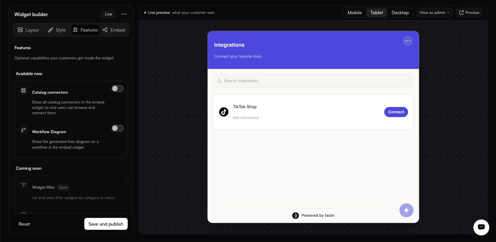

# Features

<figure><figcaption></figcaption></figure>

Optional capabilities your customers get inside the widget.

**Available now** — both off by default.

| Feature                | What it does                                                                         |
| ---------------------- | -------------------------------------------------------------------------------------- |
| **Catalog connectors** | Shows all catalog connectors in the widget so end users can browse and connect them.  |
| **Workflow Diagram**   | Shows the generated flow diagram on a workflow inside the widget.                     |

**Coming soon**

| Feature                | What it will do                                        |
| ---------------------- | -------------------------------------------------------- |
| **Widget filter**      | Let end users filter widgets by category or status.     |
| **Role based access**  | Role-based access control per widget.                   |


**Catalog connectors** widens the offer from the integrations you curated to everything public in your catalogue. Useful for self-serve products, too broad for most. Decide deliberately.

