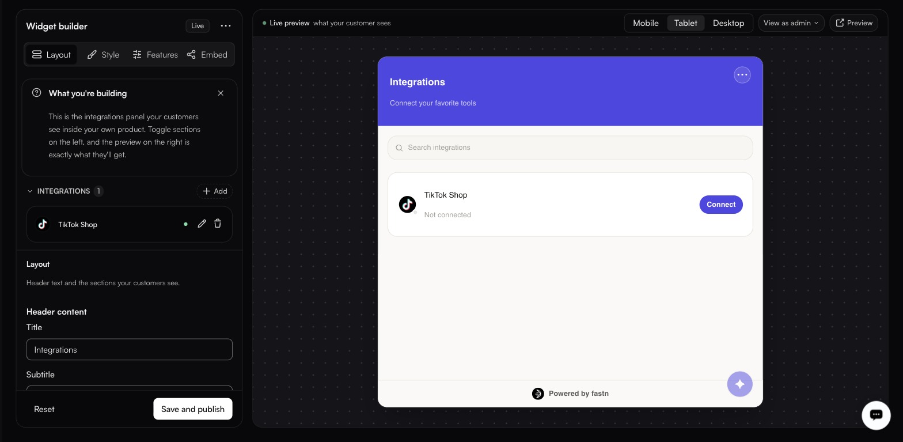

# Layout

<figure><figcaption>The preview redraws as you type — that header text is exactly what appears above it.</figcaption></figure>

**Header content**

| Field        | Default                        |
| ------------ | -------------------------------- |
| **Title**    | `Integrations`                  |
| **Subtitle** | `Connect your favorite tools`   |

**Sections** toggles the blocks your customers see. All three are on by default.

| Section                 | Notes                                                             |
| ----------------------- | ------------------------------------------------------------------- |
| **Header and branding** | Your title, subtitle and accent colour across the top.             |
| **AI assistant**        | The assistant surface inside the widget.                           |
| **Search bar**          | Worth keeping once there are more than about a dozen connectors.   |
