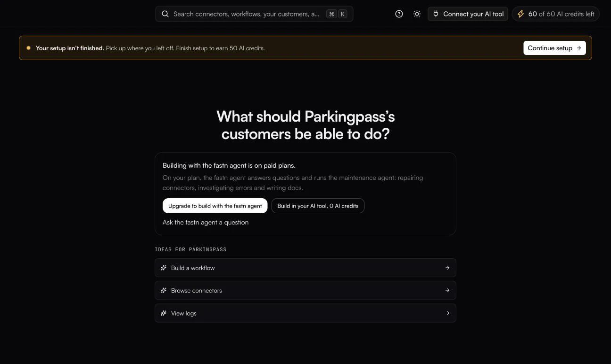
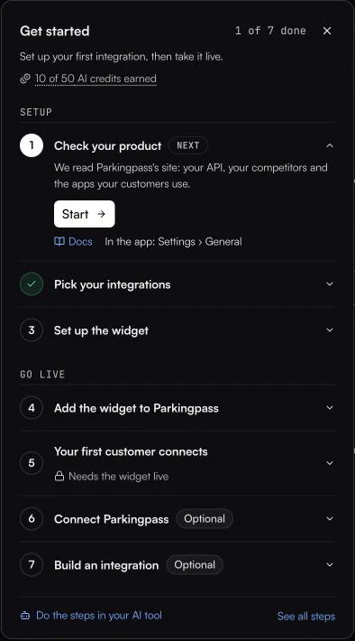
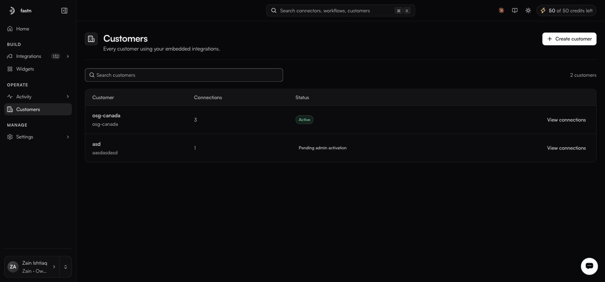

# Platform tour

### The top bar

The top bar carries the same controls on every screen.

| Element | What it does |
| --- | --- |
| **Search** (⌘K / Ctrl+K) | Finds connectors, workflows and customers. Results are grouped by type. The action **Connect fastn to your AI tool** is here too. |
| **Help** (?) | **Take a tour** of the current page, **Documentation** (these docs) and **Contact support**. Some accounts also see **Support tickets** and **Escalate to on-call support**. |
| **Theme** | Switches the dashboard between light and dark. |
| **Report a bug** | Sends a bug report to fastn. |
| **Connect your AI tool** | Connects Claude, Cursor, ChatGPT or any MCP client to fastn, from any page. Building from your AI tool uses no AI credits. |
| **Credits** | Owners and Admins only. Your AI credits left. Click it for a breakdown by agent and the org total. A paid plan's monthly credits reset on the 1st of each month, UTC. A Launch account with no monthly credits sees how many earned credits are left, with no reset date: onboarding credits do not reset. |

The account card at the bottom-left switches organization and opens your profile.

### Where everything lives

The sidebar starts with **Home**, then follows the three steps of putting fastn in your product: **Build**, **Embed** and **Operate**. **Settings** sits in its own unlabeled group at the end. Every item in a step group is a page; the sections inside a page are its tabs. What you see depends on your [role](../manage/roles.md).

| Group | Item | Route | Docs |
| --- | --- | --- | --- |
| | Home | `/` | [Quickstart](quickstart.md) |
| Build | Connect your product | `/your-product` | [Connect your product](../manage/saas-connectors.md) |
| | Integrations → Connectors | `/integrations?tab=connectors` | [Connectors](../build/connectors/README.md) |
| | Integrations → Workflows | `/integrations?tab=workflows` | [Workflows](../build/workflows/README.md) |
| | Integrations → Triggers | `/integrations?tab=triggers` | [Triggers](../build/triggers/README.md) |
| | Integrations → Unified APIs | `/integrations?tab=unified` | [Unified APIs](../build/unified-apis/README.md) |
| Embed | Widget | `/widgets` | [Widget](../embed/README.md) |
| | API keys | `/api-keys` | [API keys](../manage/api-keys.md) |
| | MCP server | `/mcp-server` | [Build from Claude, Cursor or any agent](../build/mcp-gateway/README.md) |
| Operate | Health → Needs attention, Overview, Pending updates, Alerts | `/health` | [Operate](../operate/README.md), [Pending connector updates](../build/connector-updates.md), [Alerts](../operate/alerts.md) |
| | Customers | `/customers` | [Customers](../operate/customers.md) |
| | Connections | `/connections` | [Connections](../build/connections/README.md) |
| | Logs → Events, Executions, Sync reports, Monitoring | `/activity/*` | [Logs](../operate/README.md) |
| (own group) | Settings | `/settings/*` | [Settings](../manage/README.md) |


**Integrations → Create integration → Build with fastn agent** and the **What should your customers be able to do?** prompt on Home open the same builder at `/agent`. There is no sidebar row for it. See [Build with the agent](../build/agent/README.md).


### Home

Home asks one question: **What should your customers be able to do?** (with your product's name in it once fastn knows it). Under it, for roles that can use the builder, a prompt box reads *Describe an integration in plain words…*. Send it and the fastn agent opens at `/agent` with your request, and fastn's agent starts building it using AI credits. Building with the agent is on paid plans: on Launch the box is replaced by *Building with the fastn agent is on paid plans.*, with **Upgrade to build with the fastn agent**, **Build in your AI tool, 0 AI credits** and **Ask the fastn agent a question**: on Launch the agent still answers questions and runs maintenance work.

<figure><figcaption>Home on the Launch plan, for a product named Parkingpass.</figcaption></figure>

Below the box, **Ideas** (or **Ideas for** your product) offers up to three suggestions, written for your product where fastn has researched it. Click one to send it to the builder. Roles that cannot use the builder, and Launch accounts, see links to pages instead: **Build a workflow** (Developer and above), **Browse connectors** and **View logs**.

While setup is unfinished, Home also shows a banner, *Your setup isn't finished.*, offering 50 AI credits for finishing it, with **Continue setup**.

To build from Claude, Cursor or another AI tool instead, use **Connect your AI tool** in the top bar.

### Get started (setup checklist)

The checklist follows onboarding at `/onboarding`: three setup steps, then going live.

<figure><figcaption>The <strong>Get started</strong> checklist opened from the bottom of the sidebar.</figcaption></figure>

| Item | Done when |
| --- | --- |
| **Check your product** | You confirmed your product's description, and fastn's research on it has run. |
| **Pick your integrations** | Your widget offers at least one app, or **Catalog connectors** is on. |
| **Set up the widget** | The widget has loaded in your product, or a customer has connected through it. |
| **Add the widget to** your product | The widget has loaded on a page of your own. |
| **Your first customer connects** | A customer has connected an app in the widget (a connection to anything other than your own product). |
| **Connect** your product (optional) | Your product is registered under **Build** → **Connect your product**. Admin work: a Developer sees *An admin does this*. |
| **Build an integration** (optional) | One of your widgets runs a workflow. |

Each item is marked from what actually exists in your account, not from a stored checklist, so an item done from your AI tool or another tab ticks over too. The setup steps and building an integration earn onboarding AI credits. See [Onboarding](onboarding/README.md).

Owners, Admins and Developers see a **Get started** card at the bottom of the left rail, with how many of the 7 items are done (for example `2/7`). Click it on any page to open the checklist. It goes away once setup is complete.

### Build → Connect your product

Your own product, through its API or webhooks, registered as a connector so your customers' connections to it can be scoped (for example per store or per warehouse). Needed when an integration reads or writes your product's data. One-time setup, admin only. See [Connect your product](../manage/saas-connectors.md).

### Build → Integrations

Integrations is the third-party catalog and opens on **Connectors**: an integration starts from the app your customers use. Your own product is not here; it has its own row, **Connect your product**.

| Tab                   | Purpose                                                                                          |
| --------------------- | ------------------------------------------------------------------------------------------------ |
| **Connectors**        | Every app your customers can authorize. **Create connector** opens one menu: **From scratch**, **Build with fastn agent** (paid plans), **Build in your AI tool**, or **Import from file**. **Request connector** asks fastn to add one. |
| **Workflows**         | The JavaScript that runs, with editor, tests, executions and API details.                        |
| **Triggers**          | Webhooks, schedules and app events that start workflows.                                         |
| **Unified APIs**      | One canonical endpoint per business entity, backed by whichever providers you connect.           |

**Connect your AI tool**, in the top bar, connects Claude, Cursor or another AI tool to the fastn MCP server, so you can build and manage all of this from your chat. See [fastn MCP server](../build/mcp-gateway/README.md).

### Embed → Widget

The widget builder has four tabs (Layout, Style, Features, Embed) and a live preview that renders at mobile, tablet and desktop widths. A sticky footer carries **Reset**, **Discard changes** (only while you have unsaved edits) and **Save and publish**. **Reset** publishes the defaults to every customer using the widget straight away, after you type `RESET` to confirm; **Widget actions** → **Reset to defaults** does the same. A **Live** badge appears once the widget is saved.

### Embed → API keys and Embed → MCP server

Two pages. **API keys** are what your backend uses to mint embed tokens and call the API. **MCP server** adds fastn's integrations to Claude, Cursor, Codex or any MCP client. See [Build from Claude, Cursor or any agent](../build/mcp-gateway/README.md).

### Operate → Customers

<figure><figcaption>Every customer using your embedded integrations; this workspace has only a test one.</figcaption></figure>

**Customers** lists everyone using your embedded integrations, with columns *Customer*, *Connections* and *Status* (`Active` or `Pending admin activation`), plus **Create customer**, a search box, and **View connections** on each row. Documented with [Operate](../operate/customers.md).

### Operate → Connections

Every connection your customers have made on your connectors, across every customer, with its status. The **My organization** view shows the connections your own organization holds, which your workflows act through. Documented under [Connections](../build/connections/README.md).

### Operate → Health

First under Operate. The maintainer agent watches the apps you connect to, your customers' connections and your workflows; what it finds, with the fix it proposes, is here. The number on **Health** in the left rail is how many vendor changes are waiting on you.

| Tab | Answers |
| --- | --- |
| **Needs attention** | Opens first. Every vendor change waiting for review, every customer connection that expired or failed, and every workflow that failed today, each with its action: **Review**, **Open connection**, or **Runs** and **Fix with AI**. |
| **Overview** | Every customer's integration health in one place: who needs attention, runs and records over time, connection health, what is failing and why. See [Operate](../operate/README.md). |
| **Pending updates** | The full review of each vendor patch the maintainer agent proposes: the diff, accept or refuse. Nothing is applied until you accept it. See [Pending connector updates](../build/connector-updates.md). |
| **Alerts** | Which failures and thresholds send an alert, and where it goes. See [Alerts](../operate/alerts.md). |

### Operate → Logs

| Tab              | Answers                                                        |
| ---------------- | -------------------------------------------------------------- |
| **Events**       | What arrived, from where, and was it delivered?                |
| **Executions**   | Which runs happened, and how did they end?                      |
| **Sync reports** | What actually changed, record by record?                        |
| **Monitoring**   | Owners and Admins. Is each trigger healthy? Per-trigger health, the dead-letter queue (replay or delete), circuit-breaker state, and pause or resume. Shown locked until fastn turns it on for your organization. |

A **Traces** view (which connected apps a run called, and how slow they were) exists at `/activity/traces` but is not on the tab strip yet.

### Settings

**The Settings navigation is scoped to your role.** Each item has a minimum role:

| Minimum role | Settings pages |
| --- | --- |
| **Admin** (and Owner) | People, General, Billing, Roles, Audit log |
| **Developer** and above | Environments, Secrets, Configs, Database, Workflow tags, Trash |

Two capabilities are gated by role rather than by permission: using the builder, and reading the audit log. Each screen has its own page under [Settings](../manage/README.md).

### The account card

Bottom-left. It shows who you are and which organization you are in. The chevron opens [your profile](../manage/profile.md); the up-down arrows open **Switch organization**, which lists every organization you belong to with your role in each: Owner, Admin, Developer, Operator or Viewer (fastn staff show as Platform Admin). Everything else in the dashboard is scoped to whichever organization is selected, so check this first when something you expected to find is missing.
