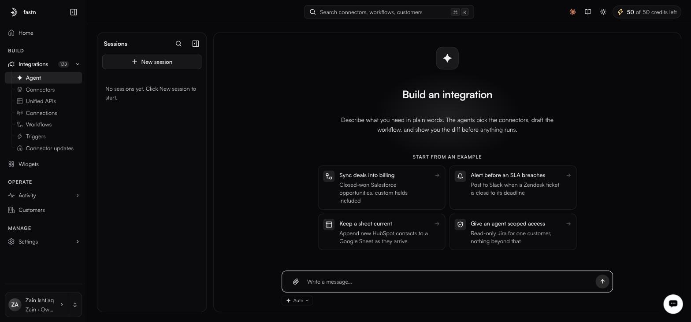
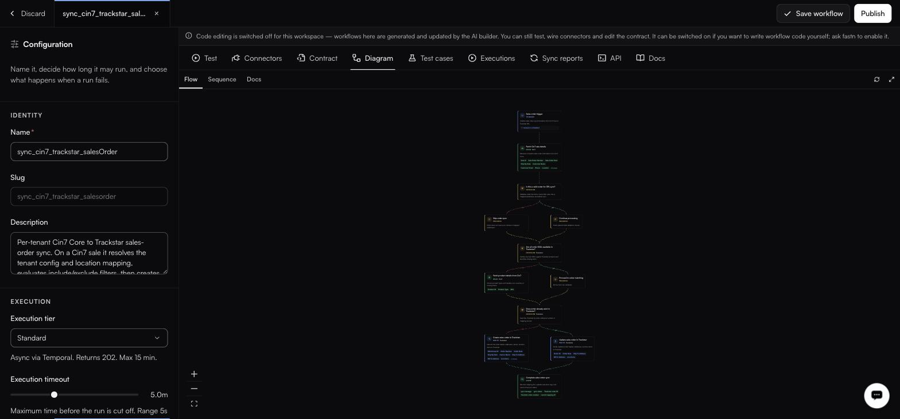
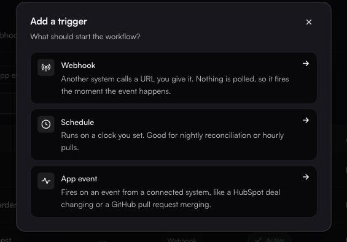

# Quickstart: your first integration

This walks the shortest honest path. Budget about twenty minutes.

### 1. Describe what you want

Type what you want to build into the **What do you want to build?** prompt on Home — that opens the agent. Once you are in, **New session** on the left rail starts a fresh build; with no sessions yet the rail reads *No sessions yet. Click New session to start.*

<figure><figcaption>The pane heading is Build an integration; four example cards sit under START FROM AN EXAMPLE.</figcaption></figure>

The pane states the contract plainly:

> Describe what you need in plain words. The agents pick the connectors, draft the workflow, and show you the diff before anything runs.

If you would rather start from a shape than a blank page, the four cards under **START FROM AN EXAMPLE** are *Sync deals into billing*, *Alert before an SLA breaches*, *Keep a sheet current* and *Give an agent scoped access*.

Otherwise, write the integration the way you would explain it to a colleague:

> When a HubSpot deal moves to closed-won, create a customer and a draft invoice in QuickBooks, and post a line in our #sales Slack channel.

Name the systems, the trigger, and the fields that matter. The agent asks about anything ambiguous rather than guessing.

The **Approval mode** chip under the message box decides how much it does unattended: **Auto** is the default and does not ask; **Manual** asks before any create, update or delete. Leave it on Auto while you are exploring.

### 2. Let it set up connectors and auth

The agent checks whether connectors exist for the systems you named, creates any that are missing, and handles authentication in the chat — API-key fields inline, or an OAuth form with client ID, secret and pre-filled scopes.

Anything it creates shows up under [Connectors](../build/connectors.md) afterwards, so you can inspect it.

### 3. Review the draft

The agent produces a workflow and opens the editor. It has three columns: configuration on the left, the code in the middle, and the tool tabs on the right.

<figure><figcaption>The Diagram tab draws the workflow from the code — it is read-only, and it cannot drift.</figcaption></figure>

Work through it in this order:

1. **The code** — the middle column holds `<slug>.js`, a JavaScript module exporting `export default async function(ctx)`. This is the workflow. Everything else on the screen describes, tests or deploys it.
2. **Diagram → Flow** — a read-only picture auto-generated from that code, with node kinds `TRIGGER`, `DECISION`, `READ` and `DONE`. You cannot edit the graph; edit the code and the graph follows.
3. **Contract** — check the input and output shapes.
4. **Connectors** — the list is extracted from the `fastn.connectors.X.Y(…)` calls in your code when you save. Confirm the right actions are wired, and whether each connector is marked **Per customer**.
5. **Configuration** (left panel) — set the execution tier and timeout. **Instant** is synchronous and capped at 30 seconds, **Standard** is asynchronous and capped at 15 minutes, **Long** is asynchronous and capped at 36 hours. Instant is the default; most syncs want Standard.


Some workspaces have code editing switched off. There, workflows are generated and updated by the AI builder, and you can still test them, wire connectors and edit the contract.


### 4. Test it

<figure><figcaption></figcaption></figure>

Open **Test**, click **Use contract** to populate a sample `ctx.input`, and choose a mode beside the run button: **Live** calls the real systems, **Partial Mock** mixes real calls with stubs, **Fully Mock** uses stubs only. Then hit **Run Live** (or **Run**).

If something is wrong, tell the agent rather than patching by hand. *"Skip deals under $500"* or *"Add error handling when QuickBooks is down"* and it rewrites the code, mappings and test cases together.

### 5. Publish and deploy

In the left panel, under **PUBLISH & DEPLOY**:

* **Publish snapshot** freezes the current code and configuration as a version. The workflows list numbers them in its **Latest** column (`v1`, `v2`, …), and shows `Unpublished` until the first one exists.
* **Deploy to environment** sends that version to an environment so it starts handling real events.

Until a snapshot is published, the workflow's status reads `Not published` and every call returns `WORKFLOW_NOT_PUBLISHED`.

### 6. Attach a trigger

A workflow with no trigger only runs when you call it. Go to **Integrations → Triggers → Add trigger** and pick one:

<figure><figcaption></figcaption></figure>

For the HubSpot example, choose **App event**. The form is progressive: name it, pick the HubSpot connector, then pick a connection and an event, then add a route pointing at your workflow. Two things to know before you start — the connector cannot be changed after the trigger is created, and you cannot get past the connector step without an active connection. Without one the form stops you:

> No active connection found for this connector. Connect first to use it as a trigger source.

Full field-by-field detail is in [Triggers](../build/triggers.md).

### 7. Put it in front of customers

Open **Widgets**, click **Add** under INTEGRATIONS, and pick the integration you just built. Then use the **Embed** tab to drop it into your product — see [Embedding the widget](../embed/embedding.md).

### 8. Make failure loud

Go to **Activity → Alerts** and click **Turn on failure alerts** — one click turns on the two alerts most teams need. A sync that fails quietly for six hours is a support ticket you could have avoided. Alerts are checked every 15 minutes, and the editor autosaves: there is no Save button, and a new alert exists the moment you create it.


Done. From here, [Core concepts](concepts.md) explains the model underneath, [Workflows](../build/workflows.md) covers the editor in full, and [MCP gateway](../build/mcp-gateway.md) covers exposing the same integrations to an AI client.



Deleted a connector or workflow by mistake while exploring? It is in [Settings → Trash](../manage/trash.md), restorable with its slug and history intact. Trash appears in the Settings sidebar for Owners, Admins and Developers alike, at `/settings/trash`.

