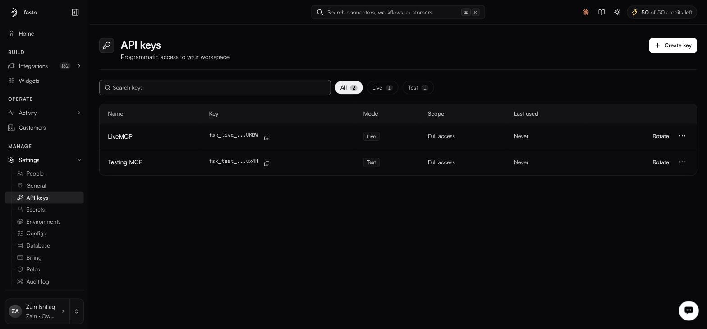
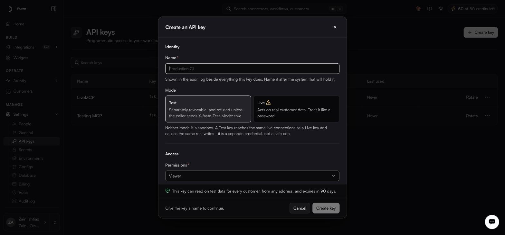

# API keys

**Settings → API keys**

<figure><figcaption></figcaption></figure>

| Column        | Notes                                              |
| ------------- | ---------------------------------------------------- |
| **Name**      | What you called it.                                |
| **Key**       | Prefix and last four characters, with a copy icon. |
| **Mode**      | Live or Test.                                      |
| **Scope**     | The permissions it carries.                        |
| **Last used** | Timestamp, or Never.                               |

**Rotate** issues a new secret for the same key. The **…** menu holds revoke and delete.

### Creating a key

<figure><figcaption></figcaption></figure>

**Identity**

**Name** — shown in the audit log beside everything this key does. Name it after the system that will hold it, not after a person.

**Mode**

| Mode     | Behaviour                                                                          |
| -------- | ------------------------------------------------------------------------------------ |
| **Test** | Separately revocable, and refused unless the caller sends `X-fastn-Test-Mode: true`. |
| **Live** | Acts on real customer data. Treat it like a password.                              |


Neither mode is a sandbox. A Test key reaches the same live connections as a Live key and causes the same real writes — it is a separate credential, not a safe one.


**Access**

**Permissions** takes a role, which caps what the key can do. Choose the narrowest that works: a key that only reads should carry Viewer.

The dialog summarises the result before you commit — for example: *this key can read on test data for every customer, from any address, and expires in 90 days.*

### Using a key

```bash
curl -X POST https://YOUR_FASTN_HOST/api/v1/workflows/WORKFLOW_ID/execute \
  -H "Authorization: Bearer fsk_live_<your-key>" \
  -H "Content-Type: application/json" \
  -d '{ "input": { "key": "value" } }'
```

With a test key, add the two headers:

```bash
  -H "Authorization: Bearer fsk_test_<your-key>" \
  -H "X-fastn-Test-Mode: true" \
  -H "x-fastn-env: test"
```

Full detail in the [HTTP API reference](../reference/api.md).

### Practice worth keeping

* One key per consuming system, so revoking one does not take down four things.
* Rotate on a schedule, and when anyone with access leaves.
* Never in client-side code. Browser-facing widgets use short-lived embed tokens minted by your backend — see [Embedding the widget](../embed/embedding.md).
* Check **Last used** before revoking. A key showing Never is either unused or misconfigured; either way, find out which.


Free plans cap API keys per customer, and the Billing page shows when you are at the ceiling. See [Billing and limits](billing.md).

