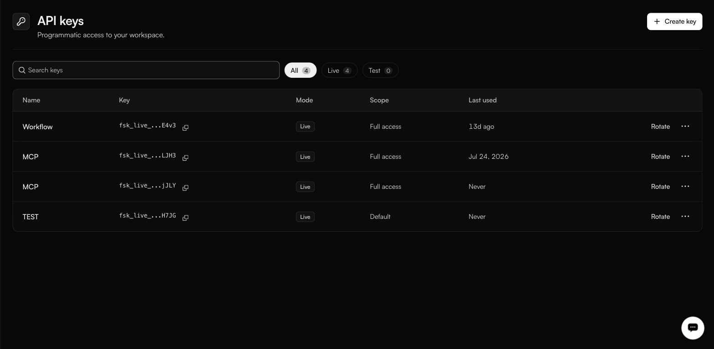
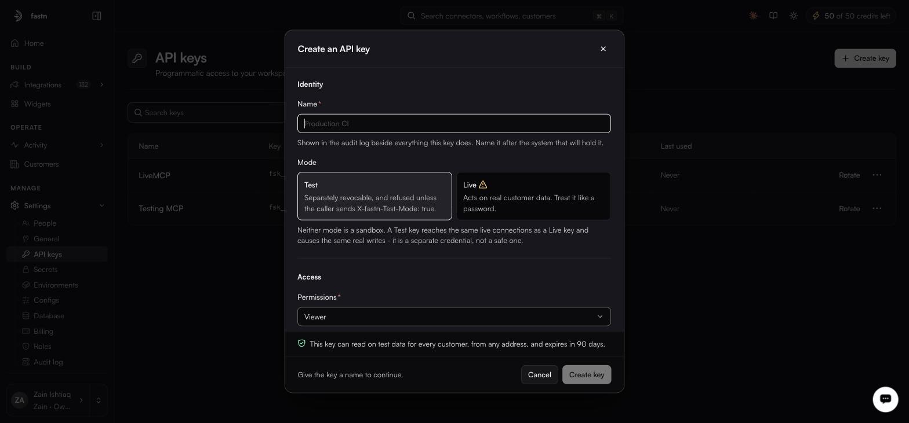

# API keys

**Settings → API keys**

<figure><figcaption>The Key column shows only a prefix and the last four characters, with a copy icon.</figcaption></figure>

| Column        | Notes                                              |
| ------------- | ---------------------------------------------------- |
| **Name**      | What you called it.                                |
| **Key**       | Prefix and last four characters, with a copy icon. |
| **Mode**      | Live or Test.                                      |
| **Scope**     | The permissions it carries.                        |
| **Last used** | Timestamp, or Never.                               |

**Search keys** narrows the list, and the filters are **All** / **Live** / **Test**.

**Rotate** issues a new secret for the same key. The **…** menu holds **Edit**, **Identity verification** and **Revoke**. There is no delete. Revoking is the way a key ends.

### Creating a key

<figure><figcaption>The dialog spells out that Test is a separate credential, not a sandbox.</figcaption></figure>

The dialog runs in three sections: **Identity**, **Access** and **Limits**.

#### Quick steps

1. Go to your Fastn dashboard → **Settings** → **API Keys**.
2. Click **+ Create API Key**.
3. In the dialog:
    * **Name**: give it something identifiable.
    * **Mode**: select **Live** for production use or **Test** for dev use.
    * Set scopes, IP whitelisting, rate limits, and expiry as needed.
    * Enable caller identity verification (HMAC).
4. Click **Create Key**.

<figure><figcaption><strong>Verify caller identity (HMAC)</strong> in the Create an API key dialog.</figcaption></figure>

#### Identity

**Name \***: shown in the audit log beside everything this key does. Name it after the system that will hold it, not after a person.

**Mode**: **Test** or **Live**, defaulting to **Test**.

| Mode     | Behaviour                                                                          |
| -------- | ------------------------------------------------------------------------------------ |
| **Test** | Separately revocable, and refused unless the caller sends `X-fastn-Test-Mode: true`. |
| **Live** | Acts on real customer data. Treat it like a password.                              |


Neither mode is a sandbox. A Test key reaches the same live connections as a Live key and causes the same real writes. It is a separate credential, not a safe one.


#### Access

**Permissions \*** takes one of six presets: **Full access**, **Developer**, **Operator**, **Viewer** (the default), **End user** or **Custom**. These are key presets, not the people roles on [Roles](roles.md), even where the names match. Choose the narrowest that works: a key that only reads should stay on Viewer.

Whichever preset you pick, the **What it can touch** matrix below shows exactly what it grants, and **Custom** lets you set each box yourself. Ten resource groups:

| Resource        | Permissions                                                     |
| --------------- | ----------------------------------------------------------------- |
| **Connectors**  | create, read, update, delete, write                              |
| **Connections** | create, read, update, delete, share, decrypt                     |
| **Workflows**   | create, read, update, delete, execute, deploy_test, deploy_prod  |
| **Users**       | create, read, update, invite, remove                             |
| **Settings**    | read, update, manage                                             |
| **Events**      | create, read, update, delete, replay                             |
| **Secrets**     | read, write, delete                                              |
| **Executions**  | create, read                                                     |
| **Widgets**     | create, read, update, delete                                     |
| **Unified API** | create, read, update, delete, execute                            |


`decrypt` on Connections and `read` on Secrets are the two boxes worth arguing about before you tick them. A key holding either can read credentials, and a key is easier to leak than a person.


**Customers it can reach**: **Every customer**, or **Only the ones I pick**. Narrowing it is not optional everywhere: the form notes that picking specific customers is *Required for keys used in an embed session.*

That note covers a key used directly as one customer's widget session. The backend key that registers customers and gets embed tokens should reach **Every customer**, because a key limited to specific customers is refused for any customer it doesn't list (see [Embed the widget](../getting-started/onboarding/embed-the-widget.md)).

**Verify caller identity (HMAC)**: turning it on requires callers to send a signed `x-identity-hmac` header, so a caller cannot change the `x-org-id` or `x-user-id` it claims to be. The signing secret is shown once at creation. If you lose it, reach it again through **Identity verification** on the key's **…** menu.

**Resource scope** *(optional)*: narrows the key to particular resources rather than everything its permissions would otherwise cover.

#### Limits

| Field                      | Notes                                                                          |
| -------------------------- | -------------------------------------------------------------------------------- |
| **Allowed IP addresses** *(optional)* | An allowlist. Left blank, the key works from any address.           |
| **Rate limit** *(optional)*| A ceiling per minute for this key.                                              |
| **Expires \***             | **In 30 days**, **In 90 days** (the default), **In a year**, **Never**, or **On a specific date**. |

The dialog keeps a live summary sentence at the bottom describing what you have built, so you can read back the whole key before committing:

> This key can read on test data for every customer, from any address, and expires in 90 days.

### Identity hash

Every tenant specific request needs to provide an identity hash to confirm that the org-id and user-id you're sending are ones your backend actually authorized.

#### 1. Get your identity-verification secret

Once you create an API key with HMAC enabled the following dialog will appear. It contains the secret and code snippets to generate the HMAC key.

<figure><figcaption>The key and the secret are shown once. They are blanked out in this screenshot.</figcaption></figure>

**Safety pre-cautions:**

* If the secret is lost, you'll need to generate a new one.
* Never ship this secret to the client. It only ever lives on your backend. If it appears in frontend code, anyone can forge a valid hash for any org or user.

#### 2. Compute the hash

The hash is an HMAC-SHA256 of the org ID and user ID, newline-joined, signed with your secret:

```js
const crypto = require("crypto");
const IDV_SECRET = process.env.IDV_SECRET;

function identityHash(orgId = '', userId = '') {
  return crypto.createHmac("sha256", IDV_SECRET)
    .update(`${orgId}\n${userId}`)
    .digest("hex");
}
```

#### 3. Send it alongside the identity headers

Attach the result as `x-identity-hmac`, sent together with the plaintext `x-org-id` and `x-user-id`.

```
x-org-id: <org-id>
x-user-id: <user-id>
x-identity-hmac: <identityHash(orgId, userId)>
```

The plaintext headers tell the gateway which identity is being claimed; the hash proves your backend authorized that specific claim. The gateway rejects a call whose hash is missing or doesn't match what it recomputes from the plaintext values.

### Using a key

```bash
curl -X POST https://YOUR_FASTN_HOST/api/v1/workflows/WORKFLOW_ID/execute \
  -H "Authorization: Bearer fsk_live_<your-key>" \
  -H "Content-Type: application/json" \
  -d '{ "input": { "key": "value" } }'
```

With a test key, add the two headers:

```bash
  -H "Authorization: Bearer fsk_test_<your-key>" \
  -H "X-fastn-Test-Mode: true" \
  -H "x-fastn-env: test"
```

#### Which header carries the key

Every key starts `fsk_live_` or `fsk_test_`. The header it goes in depends on what you call:

| You call | Send the key as |
| -------- | --------------- |
| The platform API, `https://api.fastn.dev/api/v1/…` (a workflow's `/execute`, `/embed/token`, every other route) | `Authorization: Bearer fsk_…` or `X-API-Key: fsk_…` |
| A [webhook trigger](../build/triggers/webhooks.md)'s URL | `X-API-Key: fsk_…` or `x-fastn-access-key: fsk_…` |

`X-API-Key` works on both. `x-fastn-access-key` on the platform API, or `Authorization` on a webhook URL, is answered `401`. No endpoint reads `x-fastn-api-key`.

Full detail in the [HTTP API reference](../reference/api.md).

### Practice worth keeping

* One key per consuming system, so revoking one does not take down four things.
* Rotate on a schedule, and when anyone with access leaves.
* Never in client-side code. Browser-facing widgets use short-lived embed tokens minted by your backend. See [Embedding the widget](../embed/embedding/README.md).
* Check **Last used** before revoking. A key showing Never is either unused or misconfigured; either way, find out which.
* Set an expiry rather than **Never**, and turn on HMAC verification for any key a customer's browser session depends on.


**API keys per customer** is one of the limits listed under [Billing](billing.md). Check there if key creation starts refusing.

