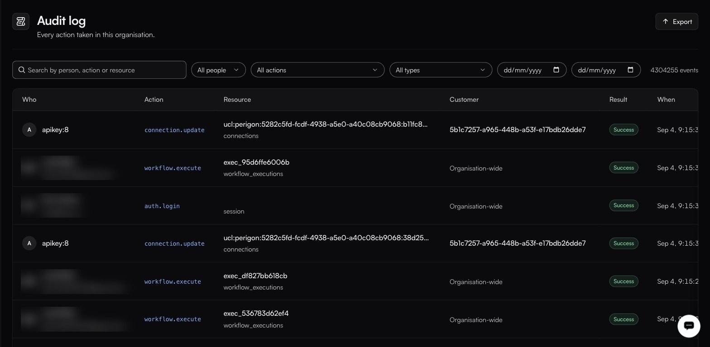

# Audit log

**Settings → Audit log**

<figure><figcaption>Filters for people, actions, types and a date range sit above the table, with Export top-right.</figcaption></figure>

A complete, filterable record of everything anyone — or anything — did. The header carries the total, which runs high: a working organisation accumulates millions of events.

### The table

| Column       | Notes                                                                                   |
| ------------ | ----------------------------------------------------------------------------------------- |
| **Who**      | A person, or an API key in the form `apikey:8`.                                          |
| **Action**   | The action name — `auth.login`, `workflow.execute`, `connection.update`.                 |
| **Resource** | The object acted on, with its type underneath.                                           |
| **Customer** | The customer scope, or **Organisation-wide**.                                            |
| **Result**   | **Success** on every observed row. How a failure renders has not been captured.          |
| **When**     | Timestamp.                                                                               |

### Filters

Search by person, action or resource; then narrow by **people**, **actions**, **types**, and a date range. **Export** downloads the set currently filtered — check the file it produces for its format before wiring anything to it.

### Action families

Actions are namespaced, which is what makes filtering practical: `auth.login`, `workflow.execute` and `workflow.execute.completed` are all confirmed, and the pattern is `<resource>.<verb>`, sometimes with a terminal state appended.

Beyond those three, the surest way to see what your organisation actually emits is the **All actions** dropdown on this page — it lists the real vocabulary. Expect namespaces along these lines, but confirm there before you build a filter or an alert on one:

| Prefix                          | Likely covers                                                            |
| ------------------------------- | -------------------------------------------------------------------------- |
| `auth.*`                        | Logins. `auth.login` confirmed.                                           |
| `workflow.*`                    | Workflow lifecycle and runs. `workflow.execute` and `workflow.execute.completed` confirmed. |
| `api_key.*`                     | Key creation, rotation and revocation.                                    |
| `connection.*`, `credential.*`  | Connection lifecycle and token refresh. `connection.update` confirmed.     |
| `connector.*`                   | Connector creation, publishing and deletion.                              |
| `secret.*`, `config.*`          | Secret and config changes — who and when, not values.                     |
| `user.*`, `membership.*`        | Access changes.                                                           |
| `environment.*`                 | Environment changes.                                                      |

### Who can read it

Restricted to account owners and admins. This is enforced by role at the API layer — `/api/v1/audit-log` — and cannot be granted or revoked per user. See [People and roles](roles.md).

### What to look for

| Question                                | Where to start                                                          |
| --------------------------------------- | ------------------------------------------------------------------------ |
| Who changed this workflow?              | Filter to the workflow as the resource, then pick its update action.     |
| Why did a connection start failing?     | Filter to that customer, then to the connection and credential actions.  |
| Who created that API key?               | Filter to the key-creation action in **All actions**.                    |
| What did this key do?                   | Filter by the key — it appears under **All people** as `apikey:<n>`.     |
| Did anyone touch production last night? | The deploy action plus the date range.                                   |


Filter before you scroll, and export when you need to analyse. At this volume, scrolling is not a search strategy.

