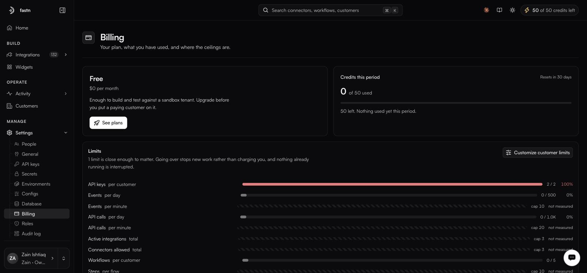

# Billing and limits

**Settings → Billing**

<figure><figcaption></figcaption></figure>

### Plan and credits

The plan card shows what you are on and what it costs. **Credits this period** tracks AI usage — the same number as the top bar — with its reset date.

The Free plan is described as *enough to build and test against a sandbox tenant. Upgrade before you put a paying customer on it.*

### Limits

Every quota, with usage against it. Where a limit is enforced but not metered, it reads **not measured** with the cap shown.

| Limit                       | Scope        |
| --------------------------- | ------------ |
| API keys                    | per customer |
| Events                      | per day, per minute |
| API calls                   | per day, per minute |
| Active integrations         | total        |
| Connectors allowed          | total        |
| Workflows                   | per customer |
| Steps                       | per flow     |
| Concurrent workflows        | total        |
| AI sessions                 | per day      |
| Messages                    | per AI session |
| LLM tokens                  | per day      |
| Data retention (days)       | total        |
| Storage (GB)                | total        |
| Connected accounts          | total        |
| Users                       | per customer |
| Webhook endpoints           | total        |
| Max payload size (bytes)    | total        |
| Executions                  | per month    |
| AI credits                  | per month    |


Going over a limit **stops new work rather than charging you, and nothing already running is interrupted.** No surprise invoices, but also no silent overage — a sync that stops because you hit a ceiling looks like a broken sync until you check this page.


The page flags how many limits are close enough to matter, so you can scan rather than read every row.

### Customer tiers

> What each customer is allowed to use. Every customer is on exactly one tier.

**Create tier** defines a bundle of limits, which you then assign to customers. This is how you express your own plan structure: a trial tier with tight caps, a growth tier, an enterprise tier. Tiers can also carry a [custom role](roles.md), which is what scopes what an embedded user may do.

**Customize customer limits** overrides limits for a single customer without creating a tier.

### Usage by customer

A per-customer breakdown of executions, events per day, integrations, users and storage. Useful for two things: finding the customer causing a spike, and checking whether the tier you put someone on matches what they actually use.

### Payment and invoices

**Payment** holds the card, requested when you upgrade. **Invoices** lists every charge with a downloadable receipt, issued at the end of each period.
