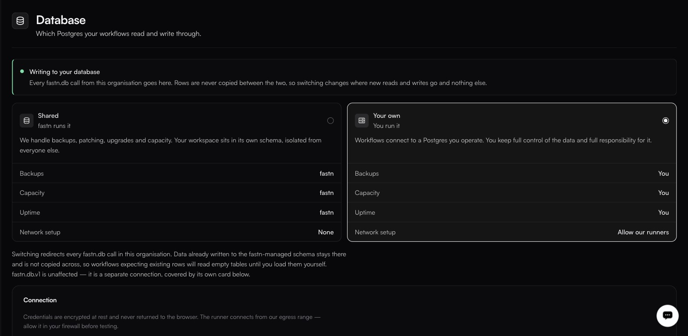

# Database

**Settings → Database**

<figure><figcaption>The choice is exclusive and it is a redirect, not a migration — rows already written stay where they are.</figcaption></figure>

Workflows can persist data with `fastn.db`. This page decides where that data lands.

> Which Postgres your workflows read and write through.

Every `fastn.db` call from this organisation goes to whichever option is selected here, and the page shows the active schema name in the form `ws_<32 hex characters>`.

### What a Developer sees

The page is read-only below Owner and Admin. A Developer gets the mode and the identifiers and nothing else:

| Row                | Value                                        |
| ------------------ | ---------------------------------------------- |
| Mode               | **Shared**                                    |
| **DATABASE**       | `fastn-managed`                               |
| **MANAGED SCHEMA** | `ws_<hash>` — your workspace's schema name    |

Username, password and CA chain are not rendered for this role. That is deliberate, and it is enough: `fastn.db` connects for you, so a workflow never needs the credential. There is no table browser and no SQL console on this page — inspect data from a workflow.

### Two options

| | **Shared** — fastn runs it | **Your own** — you run it |
| --- | --- | --- |
| **Backups** | fastn | You |
| **Capacity** | fastn | You |
| **Uptime** | fastn | You |
| **Network setup** | None | Allow our runners |

**Shared** — fastn runs it, and handles backups, patching, upgrades and capacity. Your workspace sits in its own schema, isolated from everyone else.

**Your own** — you run it: workflows connect to a Postgres you operate. You keep full control of the data and full responsibility for it, and you will need to allow fastn's runners through your network.

### Reasons to bring your own

Data residency requirements, a compliance regime that will not accept a processor's database, or an existing warehouse you want workflow data to land in directly.

If none of those apply, Shared is less work and one fewer thing to page you at 3am.


Switching changes where **new** reads and writes go. Rows are never copied between the two. If a workflow depends on data written before the switch, it will not find it. Migrate deliberately, or not at all.


### What the isolation actually is

**The unit of isolation is the workspace, not the customer.** Each workspace gets its own Postgres schema — the `ws_<hash>` above — isolated from every other workspace, which is what the page means by *your workspace sits in its own schema, isolated from everyone else*.

That is a boundary between you and other fastn customers. It is **not** a boundary between *your* customers: rows written on behalf of one of your customers and rows written on behalf of another land in the same schema. If you need per-customer separation inside it, build it — a customer column on every table, and a predicate on every query.

### Using it from a workflow

```javascript
await fastn.db.query(`
  CREATE TABLE IF NOT EXISTS sync_log (
    id SERIAL PRIMARY KEY,
    customer_id TEXT,
    source_id TEXT,
    synced_at TIMESTAMP DEFAULT NOW()
  )
`);

await fastn.db.query(
  `INSERT INTO sync_log (customer_id, source_id) VALUES ($1, $2)`,
  [customerId, record.id]
);
```


The exact `fastn.db` call signature — whether it is `query(sql, params)` and whether parameters are `$1`-style — is worth confirming against a workflow's own **Docs** tab, which is generated from the runtime you are actually calling. See [Workflow runtime API](../reference/workflow-runtime.md).

