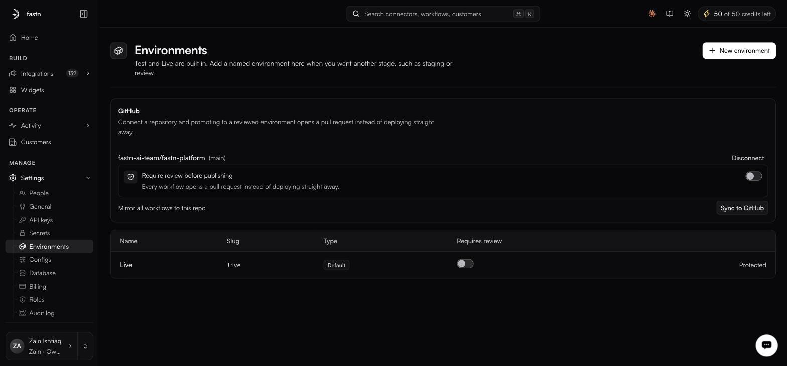

# Environments and GitHub

**Settings → Environments**

<figure><figcaption>Sync to GitHub mirrors every workflow to the connected repository.</figcaption></figure>

> Test and Live are built in. Add a named environment here when you want another stage, such as staging or review.

### Environments

| Column              | Notes                                                                    |
| ------------------- | -------------------------------------------------------------------------- |
| **Name**            | Display name.                                                            |
| **Slug**            | Used in the `x-fastn-env` header and in trigger routes.                  |
| **Type**            | Default, or a named environment you created.                             |
| **Requires review** | A checkbox per environment. Ticked, promoting to it opens a pull request instead of deploying. |

Live carries a **Protected** badge. Read that as fastn marking it as the one you should not casually restructure; whether the badge also hard-blocks deletion is not something this page can confirm.

**New environment** opens the **Create Environment** dialog, which adds a stage and asks for two things:

| Field       | Notes                                              |
| ----------- | ---------------------------------------------------- |
| **Name \*** | Display name, for example `Staging`.                |
| **Slug \*** | What goes in `x-fastn-env` and in trigger routes. The form notes that `test` and `live` are built in, so those two are taken. |

A named environment runs whatever version is deployed to it. If nothing has been deployed there, there is no code for a trigger pointed at it to run — deploy before you point traffic at a new stage.

### The special value `test`

In trigger routes and in the `x-fastn-env` header, `test` is not a deployed environment — it means *the workflow's latest published version*. Any other slug means *the version deployed to that environment*. That is why the table is a list of deployment targets, with `test` handled by the platform rather than sitting among them.

### GitHub

A **GitHub** panel sits above the table, explaining what connecting a repository buys you:

> Connect a repository and promoting to a reviewed environment opens a pull request instead of deploying straight away.

Until you connect one, its status reads **No repository connected** and the only control is **Connect GitHub**. That is what a new workspace sees, and it is worth knowing that the review gate does nothing on its own — it needs both a repository here and **Requires review** ticked on the environment you are promoting into.

Once a repository is connected the panel shows it, along with controls for mirroring workflows to the repo and for disconnecting. Those controls were not captured on a connected workspace, so check what disconnecting does to anything already deployed before you use it rather than assuming it is inert.

### A workable setup

1. Connect the repository.
2. Add a `staging` environment.
3. Tick **Requires review** on it.
4. Developers publish; the promotion opens a pull request; the reviewed and merged version deploys to staging.
5. Promote from staging to live once it has run against real traffic.


The repository plus **Requires review** is the single change that turns fastn from a place where anyone can push to production into one with a real approval trail. If you have more than a couple of people building, do it.


Publishing and deploying are both recorded in the [audit log](audit-log.md).
