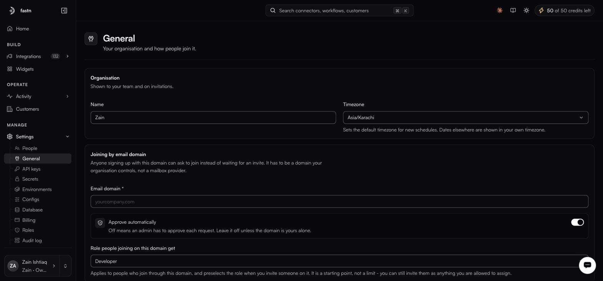

# General

**Settings → General**

<figure><figcaption>The role selector only preselects what a joiner gets; it is not a ceiling.</figcaption></figure>

### Organisation

| Field        | Notes                                                                                              |
| ------------ | ---------------------------------------------------------------------------------------------------- |
| **Name**     | Shown to your team and on invitations.                                                              |
| **Timezone** | Sets the default timezone for new schedules. Dates elsewhere are shown in your own timezone.        |


The timezone here is the default offered when creating a [schedule trigger](../build/triggers/README.md), not a global rewrite. A schedule keeps whatever timezone it was saved with.


### Joining by email domain

Anyone signing up with this domain can ask to join instead of waiting for an invite.

| Field                                  | Notes                                                                                                              |
| -------------------------------------- | -------------------------------------------------------------------------------------------------------------------- |
| **Email domain \***                    | Required. Placeholder `yourcompany.com`. Must be a domain your organisation controls, not a mailbox provider.        |
| **Approve automatically**              | Off means an admin approves each request. Leave it off unless the domain is yours alone.                            |
| **Role people joining on this domain get** | A default role selector. Which roles it offers was not captured with the dropdown open — open it and check rather than assuming. Whatever it is set to is a starting point, not a limit: you can still invite someone as anything you are allowed to assign. |


Never set a mailbox provider here. Auto-approve on a shared domain means anyone with an address there can join your workspace.


### Saving

The two sections above are what this page is documented to hold. Anything further down it — including how edits are committed — has not been captured, so save and discard the way the screen tells you to rather than the way this page describes.
