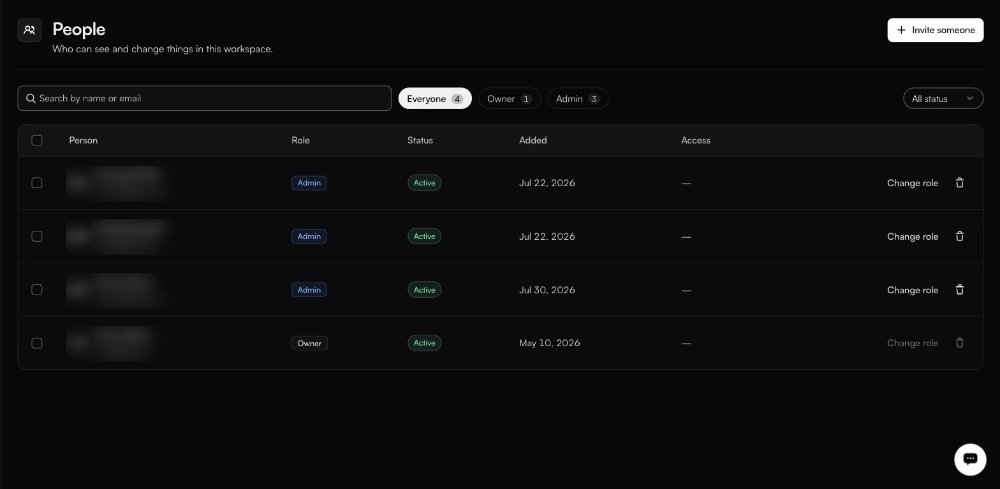

# People

**Settings → People**

<figure><figcaption>Change role is greyed out on the Owner's own row.</figcaption></figure>

| Column     | Notes                                                            |
| ---------- | ------------------------------------------------------------------ |
| **Person** | Name and email.                                                  |
| **Role**   | Their assigned role. **Change role** edits it.                   |
| **Status** | **Active** in every observed row. See [Statuses](#statuses) below. |
| **Added**  | When they joined.                                                |
| **Access** | Any scoping beyond the role. It showed `—` in every observed row. |

**Search by name or email** narrows the list. Filter chips carry a count per role — Everyone, Owner, Admin and so on — and the dropdown on the right filters by status. Each row carries a checkbox; no bulk-action control was visible alongside them.

### Inviting someone

**Invite someone** sends an invitation to an email address with a role attached. Until they accept, they appear with status **Invited**.

If you have set up [domain joining](general.md), people on that domain can request access instead of waiting for an invite, and the role you configured there is preselected when you invite them.

### Changing a role

**Change role** on any row. What you may assign is bounded by your own role — you cannot grant more than you hold.

**Change role** is disabled on the Owner's own row, so the Owner's role cannot be reassigned from this screen. There is exactly one Owner per organisation.

### Removing someone

The trash icon removes a person from the workspace. Their audit-log history stays, so *who did what* remains answerable after they leave.


API keys are workspace credentials rather than personal ones, so do not assume that removing a person revokes the keys they created. Confirm on [API keys](api-keys.md) and rotate anything they had access to.


### Statuses

**Active** is the only status observed in the product. The rest are the values the filter dropdown offers; treat their exact meanings as provisional until you have seen one.

| Status        | Meaning                                       |
| ------------- | ----------------------------------------------- |
| **Active**    | Signed up and usable. Confirmed.               |
| **Invited**   | Invitation sent, not yet accepted. Provisional. |
| **Disabled**  | Cannot sign in. Provisional.                   |
| **Suspended** | Access withdrawn pending a decision. Provisional. |

What each role can actually do is on the next page.

[Roles](roles.md)
