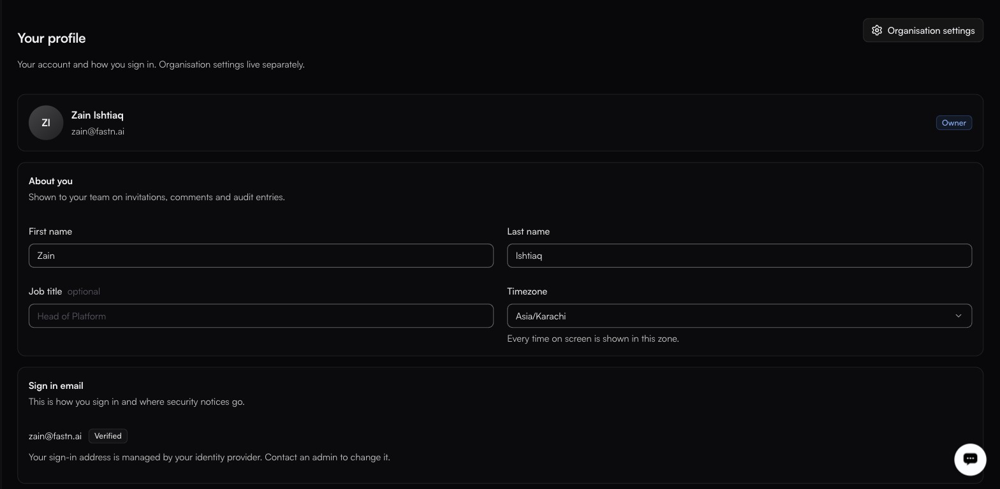

# Your profile

The profile row at the bottom of the left rail, or `/profile`

<figure><figcaption></figcaption></figure>

This page is about you, not the organisation. The **Organisation settings** link crosses over to [General](general.md).

### About you

Shown to your team on invitations, comments and audit entries.

| Field         | Notes                                                        |
| ------------- | -------------------------------------------------------------- |
| **First name** | Required.                                                    |
| **Last name**  | Required.                                                    |
| **Job title**  | Optional.                                                    |
| **Timezone**   | The full IANA list. Every time on screen is shown in this zone. |


Your profile timezone changes how timestamps are *displayed* to you. It does not change when a [schedule trigger](../build/triggers/README.md) fires — a schedule keeps the timezone it was saved with.


### Sign in email

Your sign-in address, and where security notices go. It shows a **Verified** badge once confirmed.

Where sign-in is managed by an identity provider, the address is read-only and the page says so — an admin changes it, not you.

### Security

Three rows, each showing its current state — **Not set up** until you configure it, with 2FA also flagged **Recommended**.

| Control                       | Notes                                                                              |
| ----------------------------- | ------------------------------------------------------------------------------------ |
| **Two factor authentication** | **Recommended**, and **Not set up** by default. A code from an authenticator app, in addition to your magic link or passkey. |
| **Passkeys**                  | **Not set up** by default. Sign in with Face ID, a fingerprint or a hardware key.    |
| **Password**                  | Sign-in is passwordless — magic links and passkeys. There is no password to set or change. |


There is no password on a fastn account, so a second factor is not a backstop behind one — it is the second thing in front of an account that otherwise rests on access to an inbox or a device. If your account is an Owner or Admin, it can change anything in the organisation. Set one up.


### Where you are signed in

Every active session, with its **IP** address, newest marked **Most recent**.

| Button          | Effect                                                                                     |
| --------------- | -------------------------------------------------------------------------------------------- |
| **Sign out**    | Ends that one session. It sits on each row.                                                 |
| **Everywhere**  | Ends all of them. Use if you have lost a device or think someone else has access.           |

Sign out anything you do not recognise, then check the [audit log](audit-log.md) for `auth.login` entries from the same address.

### Switching organisation

The account card at the bottom of the left rail switches between organisations you belong to. Everything else in the dashboard — connectors, workflows, customers, settings — is scoped to whichever one is selected.
